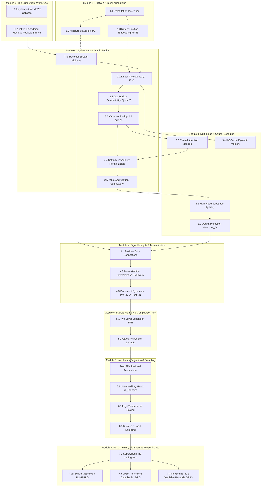
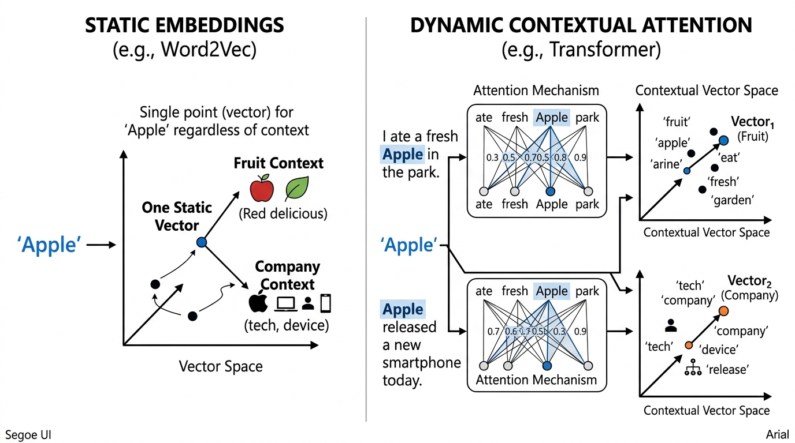
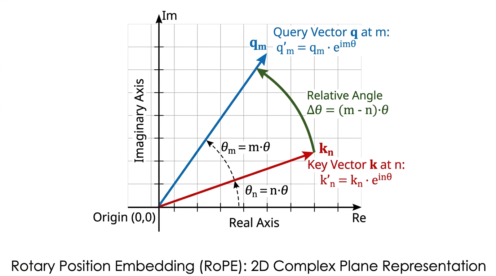
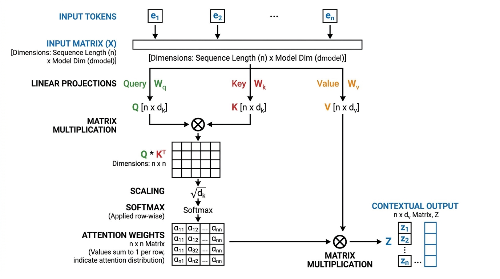
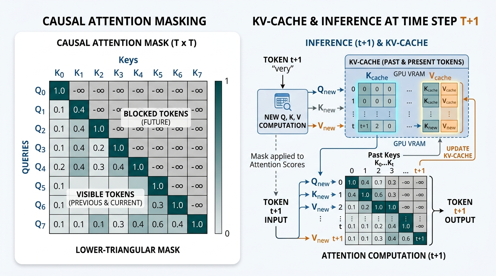
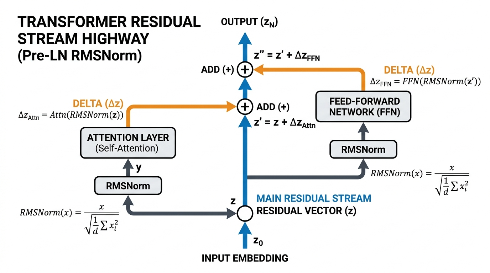
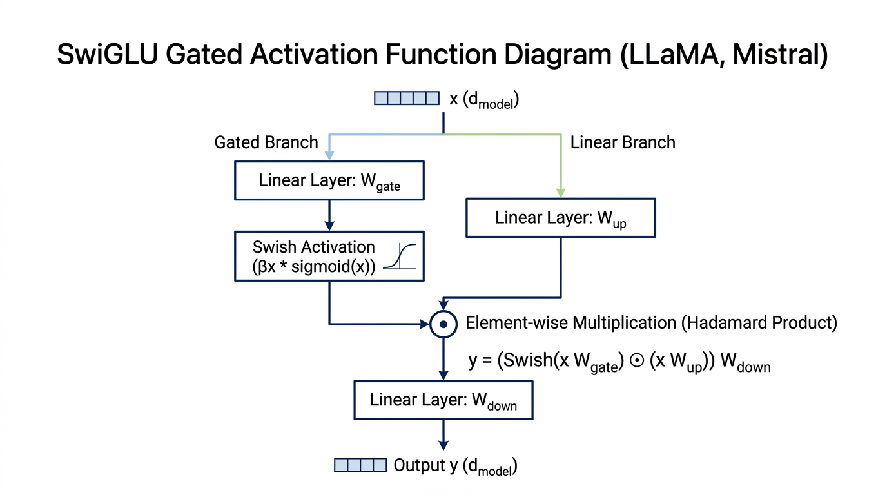
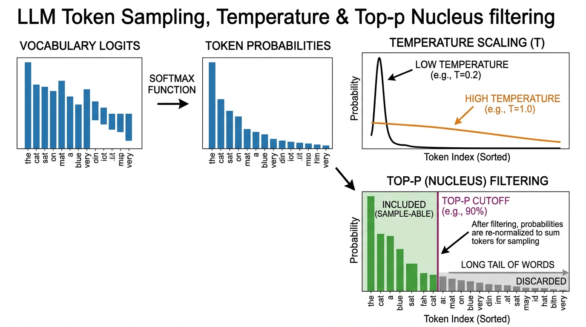
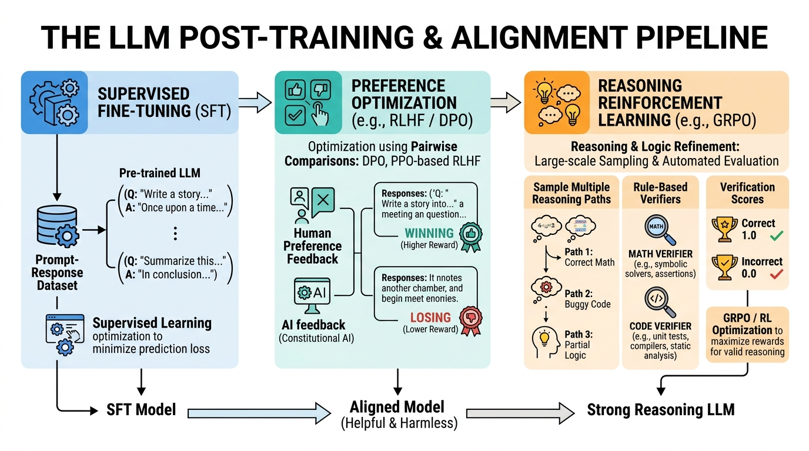

# 🧠 Transformers: From Scratch
> **An Irreducible, First-Principles Guide to Modern LLM Architecture & Post-Training**

---

## 📌 Overview

Most Transformer tutorials present the architecture as a single monolithic block diagram. In contrast, **Transformers: From Scratch** breaks down modern Large Language Models into **23 irreducible atomic pieces** across **8 core modules**—from raw static Word2Vec dictionary embeddings to modern reasoning reinforcement learning (GRPO / DeepSeek-R1 / OpenAI o1).

Every single atomic piece adheres strictly to an unyielding 4-part pedagogical contract:
1. 💡 **`Why?` Block:** Explains the exact mathematical or functional necessity, its architectural role, and what specific LLM behavior breaks if omitted.
2. 📖 **`Definition & Architecture`:** Formal explanation grounded in top-tier literature (Vaswani et al., RoFormer, LLaMA, Chinchilla, DPO, GRPO) paired with high-resolution visual diagrams.
3. 📐 **`Mathematics & Working`:** Exact formulas with **every variable explicitly defined**, concluded with a **2-sentence plain-lingo summary** explaining the mechanical intuition.
4. 🌍 **`Real-World & NLP Behaviors` (2 Examples):** Concrete production NLP case studies, failure modes, and industry engineering practices.

---

## 🗺️ Complete Architecture Dependency Graph

---

## 📚 Curriculum & Module Breakdown

### [Module 0: The Bridge from Word2Vec](Transformers_From_Scratch.md#module-0-the-bridge-from-word2vec-to-dynamic-representations)
* **0.1 Word2Vec's Polysemy Collapse:** Why static dictionaries fail when `"apple"` can mean fruit or technology; how dynamic contextual attention constructs sentence-specific vector trajectories.
* **0.2 Token Embedding Lookup ($W_E$) & Residual Stream:** Projecting discrete integer vocabulary tokens into $\mathbb{R}^{d_{model}}$, introducing the persistent vector accumulator.

### [Module 1: Spatial & Order Foundations](Transformers_From_Scratch.md#module-1-spatial--order-foundations-why-transformers-need-position)
* **1.1 Permutation Invariance of Set Operations:** Proof that raw attention treats input sequences as unordered sets (`"dog bites man"` = `"man bites dog"` without positional bias).
* **1.2 Absolute Sinusoidal Positional Encoding (Vaswani 2017):** Trigonometric wavelength spectrums ranging from local bigram transitions to macro-document pacing.
* **1.3 Rotary Position Embedding (RoPE):** Complex 2D coordinate plane rotation where inner products depend strictly on relative displacement $(m - n)$, enabling context extrapolation to 128K+ tokens.

### [Module 2: Self-Attention Dissected](Transformers_From_Scratch.md#module-2-self-attention-dissected-the-core-router)
* **2.1 The Three Projections ($W_Q, W_K, W_V$):** Decoupling token roles into Searcher ($Q$), Matcher ($K$), and Payload ($V$) to unlock asymmetric, directional syntactic routing.
* **2.2 Raw Compatibility Scoring ($Q K^T$):** Pairwise inner-product affinity metrics.
* **2.3 Variance Scaling Factor ($1/\sqrt{d_k}$):** Statistical proof of dot-product variance expansion and how dividing by $\sqrt{d_k}$ prevents Softmax saturation and zero-gradient collapse.
* **2.4 Softmax Probability Normalization:** Row-stochastic probability simplex generation.
* **2.5 Weighted Value Aggregation ($\text{Softmax} \times V$):** Barycentric interpolation assembling the final contextualized token representation.

### [Module 3: Multi-Head & Causal Decoding](Transformers_From_Scratch.md#module-3-multi-head-architecture--causal-decoding)
* **3.1 Multi-Head Subspace Splitting ($h$ Heads):** Tracking simultaneous orthogonal linguistic features (syntax, coreference, factual induction).
* **3.2 Output Linear Projection ($W_O$):** Cross-head reconciliation and residual stream dimension matching.
* **3.3 Causal Triangular Attention Masking:** Upper-triangular $-\infty$ masking preventing future token cheating in autoregressive generation.
* **3.4 The KV-Cache Mechanism:** Caching historical Keys and Values in VRAM to drop decode step compute from $O(N^2)$ to $O(1)$.

### [Module 4: Signal Integrity & Normalization](Transformers_From_Scratch.md#module-4-signal-integrity--normalization-the-residual-highway--stability)
* **4.1 Residual Skip Connections ($x + \text{Sublayer}(x)$):** The uninterrupted identity highway that solves vanishing gradients across 32–80 layers.
* **4.2 Layer Normalization vs. RMSNorm:** Why dropping the mean $\mu$ and bias terms in RMSNorm optimizes GPU memory bandwidth without sacrificing training stability.
* **4.3 Pre-LN Architecture:** Preserving clean residual signals to enable training without fragile warmup schedules.

### [Module 5: Factual Memory & Computation (FFN)](Transformers_From_Scratch.md#module-5-factual-memory--computation-the-feed-forward-network--ffn)
* **5.1 Two-Layer FFN Expansion ($W_1, W_2$):** Expanding into $4\times d_{model}$ as an associative key-value memory bank storing world facts.
* **5.2 Modern Gated Activation (SwiGLU):** Multiplicative gating ($\text{Swish}(x W_{\text{gate}}) \odot x W_{\text{up}}$) for smooth, continuous feature selection.

### [Module 6: Token Emission & Sampling](Transformers_From_Scratch.md#module-6-token-emission--sampling-from-residual-vector-to-text)
* **6.1 The Unembedding Head ($W_U$) & Logits:** Projecting the final hidden state back to vocabulary size $|\mathcal{V}|$.
* **6.2 Temperature Scaling ($T$):** Contrast control adjusting distribution entropy between deterministic precision ($T=0.2$) and creative diversity ($T=1.0$).
* **6.3 Nucleus (Top-$p$) & Top-$k$ Sampling:** Dynamic cumulative probability thresholds that eliminate the long tail of nonsensical words without entering repetitive greedy loops.

### [Module 7: Post-Training, Alignment & Reasoning RL](Transformers_From_Scratch.md#module-7-post-training-alignment--reasoning-rl)
* **7.1 Supervised Fine-Tuning (SFT):** Masked instruction tuning transforming document predictors into obedient assistants.
* **7.2 Reward Modeling & RLHF (PPO):** Bradley-Terry human preference models with KL-divergence regularization.
* **7.3 Direct Preference Optimization (DPO):** Closed-form implicit reward substitution eliminating separate reward models and PPO training instability.
* **7.4 Reasoning RL & Verifiable Rewards (GRPO / DeepSeek-R1 / o1):** Rule-based automated verifiers and group-relative policy updates creating autonomous self-verification, backtracking, and long chain-of-thought reasoning.

---

## 🎨 Visual Architectural Gallery

All architectural figures were generated via **Google's Nano Banana 2 (Gemini 3.1 Flash Image)** to ensure clear, high-contrast, professional textbook clarity:

| Concept | Architectural Figure |
|---|---|
| **0.1 Word2Vec vs. Transformer** |  |
| **1.3 Rotary Position Embedding (RoPE)** |  |
| **2.1 Self-Attention Dataflow** |  |
| **3.4 Causal Masking & KV-Cache** |  |
| **4.1 Residual Stream & Pre-LN RMSNorm** |  |
| **5.2 SwiGLU Gated Activation** |  |
| **6.2 Temperature & Top-p Sampling** |  |
| **7.4 Reasoning RL & Verifiable Rewards** |  |

---

## 📖 Downloads & Formats

* **Complete PDF (63 Pages):** [Download `Transformers_From_Scratch.pdf`](Transformers_From_Scratch.pdf)
* **Interactive HTML Edition:** Open [`index.html`](index.html) in any browser (typeset with Bookerly font, KaTeX vector equations, and embedded figures).
* **Raw Markdown Source:** Read [`Transformers_From_Scratch.md`](Transformers_From_Scratch.md).

---

## 📄 License
This repository is released under the [MIT License](LICENSE).
