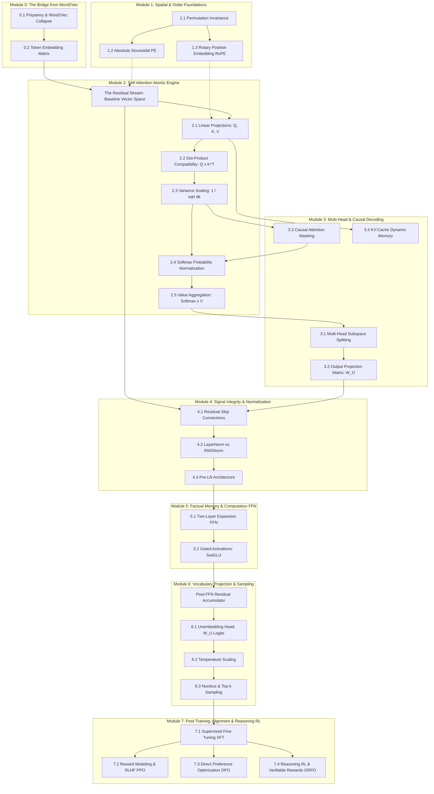

# Transformers: The Atomic Dissection
*An Irreducible, First-Principles Guide to LLM Architecture & Post-Training*
**Author:** Mike (for Nilesh)

---

## 🗺️ Complete Architecture Dependency Graph



---


# Module 0: The Bridge from Word2Vec
*From Static Semantic Dictionaries to Contextual State Spaces*

---

### 0.1 Word2Vec's Polysemy Collapse

#### 💡 Why?
- **Importance:** Static word embedding models (such as Word2Vec and GloVe) enforce a bijective map between each discrete vocabulary token and a single static coordinate vector, forcing all senses and functions of a word into a single spatial coordinate.
- **Functional Role:** Establishes the foundational motivation for the Transformer architecture: token representations must not be static parameters retrieved from disk, but dynamic runtime states that evolve as a function of the entire sequence context.
- **LLM Behavior Affected:** If an LLM relied on static embeddings without context-dependent updates, it would suffer catastrophic polysemy collapse; words with diametrically opposed or domain-specific meanings (e.g., financial "bank" vs. geological "river bank") would project to identical vectors, rendering context-specific reasoning, translation, and ambiguity resolution impossible.

#### 📖 Definition & Architecture
In the static embedding paradigm established by Mikolov et al. (2013a, 2013b), an embedding matrix assigns a static parameter vector $\mathbf{e}(w) \in \mathbb{R}^d$ to each word $w \in \mathcal{V}$. This representation is context-free: whether the input sentence discusses agriculture, investment banking, or aeronautics, the vector coordinate remains invariant.

Natural language is fundamentally polysemous: a single lexical item $w$ typically indexes a discrete set of latent senses $\mathcal{S}(w) = \{s_1, s_2, \dots, s_K\}$. Because Word2Vec trains a single vector via Skip-Gram negative sampling or Continuous Bag of Words (CBOW) over a broad corpus, the resulting embedding collapses to a probability-weighted centroid of all its historical occurrences:
$$\mathbf{e}_{\text{static}}(w) \approx \sum_{k=1}^K P(s_k \mid w) \mathbf{u}_{s_k}$$
where $\mathbf{u}_{s_k}$ denotes the ideal latent subspace representation of sense $s_k$. When two senses are orthogonal or contradictory, vector addition pulls the static embedding into an intermediate vacuum that accurately represents neither meaning.

The Transformer architecture solves this architectural bottleneck by decoupling the **token identity** from the **contextual token state**. While the network begins with a static lookup coordinate, successive Self-Attention layers calculate affinity scores across all surrounding tokens, dynamically shifting the vector along semantic trajectories.

```
+-------------------------------------------------------------------------------+
|                        STATIC EMBEDDING COLLAPSE (Word2Vec)                   |
|                                                                               |
|   Sense A: Financial Institution ("bank") ───\                               |
|                                               +──► [ e_bank in R^d ]          |
|   Sense B: River Embankment ("bank")      ───/     (Single averaged centroid) |
|                                                                               |
|   "He deposited money in the bank"   ───► e_bank (No contextual distinction)   |
|   "The river overflowed the bank"    ───► e_bank (No contextual distinction)   |
+-------------------------------------------------------------------------------+
                                        │
                                        ▼
+-------------------------------------------------------------------------------+
|                   TRANSFORMER DYNAMIC CONTEXTUAL TRAJECTORY                   |
|                                                                               |
|   [Context: "deposited", "money"] ──► Self-Attention ──► Shifts toward        |
|                                                          Finance Subspace     |
|                                                                               |
|   [Context: "river", "overflowed"] ─► Self-Attention ──► Shifts toward        |
|                                                          Hydrology Subspace   |
+-------------------------------------------------------------------------------+
```

#### 📐 The Mathematics & Working
In Word2Vec, the lookup function $\mathbf{e}_{\text{static}}: \mathcal{V} \to \mathbb{R}^d$ satisfies:
$$\mathbf{e}_{\text{static}}(w) = \mathbf{w} \quad \forall \, c \in \mathcal{C}$$

In a Transformer, the contextualized representation $\mathbf{h}_i^{(\ell)} \in \mathbb{R}^{d_{\text{model}}}$ at sequence position $i$ and layer $\ell$ is formulated as:
$$\mathbf{h}_i^{(0)} = \mathbf{e}_i + \mathbf{p}_i$$
$$\mathbf{h}_i^{(\ell)} = \mathbf{h}_i^{(\ell-1)} + \sum_{j=1}^N \alpha_{ij}^{(\ell)} \left( \mathbf{h}_j^{(\ell-1)} W_V^{(\ell)} \right)$$
$$\alpha_{ij}^{(\ell)} = \frac{\exp\left( \frac{(\mathbf{h}_i^{(\ell-1)} W_Q^{(\ell)}) (\mathbf{h}_j^{(\ell-1)} W_K^{(\ell)})^\top}{\sqrt{d_k}} \right)}{\sum_{m=1}^N \exp\left( \frac{(\mathbf{h}_i^{(\ell-1)} W_Q^{(\ell)}) (\mathbf{h}_m^{(\ell-1)} W_K^{(\ell)})^\top}{\sqrt{d_k}} \right)}$$

* $\mathcal{V}$: Discrete vocabulary set of size $V$.
* $\mathcal{C}$: Set of all possible surrounding textual context windows.
* $\mathbf{w} \in \mathbb{R}^d$: Static weight vector assigned to word $w$.
* $\mathbf{h}_i^{(\ell)} \in \mathbb{R}^{d_{\text{model}}}$: Contextualized activation vector of the token at position $i$ in layer $\ell$.
* $\mathbf{e}_i \in \mathbb{R}^{d_{\text{model}}}$: Initial static token embedding retrieved from the embedding matrix.
* $\mathbf{p}_i \in \mathbb{R}^{d_{\text{model}}}$: Positional encoding vector injected at position $i$.
* $N$: Total number of tokens in the input context window.
* $\alpha_{ij}^{(\ell)} \in \mathbb{R}$: Scalar attention weight measuring the semantic relevance of token $j$ to token $i$ at layer $\ell$.
* $W_Q^{(\ell)}, W_K^{(\ell)} \in \mathbb{R}^{d_{\text{model}} \times d_k}$: Query and Key projection parameter matrices at layer $\ell$.
* $W_V^{(\ell)} \in \mathbb{R}^{d_{\text{model}} \times d_v}$: Value projection parameter matrix at layer $\ell$.
* $d_k, d_v$: Dimensionality of the attention projection heads.

Word2Vec forces every word to occupy one unmoving coordinate in space, forcing conflicting meanings of a word to cancel each other out into a generic average. The Transformer uses attention weights to pull semantic information from neighboring words, dynamically steering the word's vector toward its exact situational meaning.

#### 🌍 Real-World & NLP Behaviors (2 Examples)
- **Financial vs. Ecological Disambiguation:** In the sentence *"The company had to bank on emergency federal credit after the river breached the northern bank"*, the token `"bank"` occurs twice with entirely distinct meanings. A static embedding model produces identical vectors for both instances, blinding downstream layers. A Transformer attends to `"credit"` and `"federal"` for the first occurrence, routing its representation into a finance-associated subspace, while attending to `"river"` and `"breached"` for the second, routing it into a geological/hydrological subspace.
- **Syntactic Category Shift (Noun vs. Verb Conversion):** In *"The complex houses married soldiers"*, the word `"houses"` acts as a transitive verb, and `"complex"` acts as an adjective modifying a noun phrase. Static models strongly bias `"houses"` toward its dominant noun centroid (residential buildings), frequently causing parse errors. A Transformer computes strong syntactic affinity between the subject noun phrase and the verb position, projecting `"houses"` into an action-predicate subspace that allows accurate causal and grammatical generation.

---

### 0.2 Token Embedding Matrix & The Residual Stream

#### 💡 Why?
- **Importance:** Digital hardware computes over continuous numerical tensors, whereas natural language consists of discrete, categorical tokens. The token embedding matrix defines the foundational coordinate mapping from discrete token IDs to the continuous geometric space where all representation learning occurs.
- **Functional Role:** Instantiates the initial input vectors $\mathbf{x}_0$ and establishes the **Residual Stream**—the shared communication bus running through every Transformer layer upon which self-attention heads and feed-forward networks perform additive read-and-write operations.
- **LLM Behavior Affected:** Omission of a continuous embedding lookup makes gradient-based backpropagation impossible, as discrete tokens lack defined derivatives. Without preserving this vector space via an uncorrupted residual stream, deep layers overwrite or destroy earlier lexical information, causing catastrophic vanishing of prompt tokens across 32+ layers.

#### 📖 Definition & Architecture
Let $\mathcal{V}$ be a finite, ordered vocabulary of size $V$ produced by a subword tokenizer (e.g., BPE, WordPiece). A discrete token is indexed by an integer $t \in \{0, 1, \dots, V - 1\}$. This discrete index can be represented as an indicator one-hot row vector $\mathbf{t} \in \{0, 1\}^V$, where $\mathbf{t}_k = 1$ if $k = t$ and $0$ otherwise.

The token embedding matrix $W_E \in \mathbb{R}^{V \times d_{\text{model}}}$ stores $V$ distinct $d_{\text{model}}$-dimensional learnable row vectors. Projecting a token ID into dense vector space is formulated as a linear matrix multiplication:
$$\mathbf{e} = \mathbf{t} W_E$$
In practice, machine learning frameworks optimize this sparse linear algebra into an $\mathcal{O}(1)$ row-indexing operation: $\mathbf{e} = W_E[t, :]$.

Following Vaswani et al. (2017), the retrieved row vector is scaled by $\sqrt{d_{\text{model}}}$ prior to the injection of positional encodings. This scaling ensures that the expected Euclidean norm of the token representation matches downstream attention scaling and prevents the positional vector norm from dominating the lexical content:
$$\mathbf{x}_i^{(0)} = \sqrt{d_{\text{model}}} \cdot \mathbf{e}_i + \mathbf{p}_i$$

As conceptualized by Elhage et al. (2021) in *A Mathematical Framework for Transformer Circuits*, $\mathbf{x}_i^{(0)}$ initializes the **Residual Stream**. Unlike classical sequential networks (e.g., LSTMs) where the hidden state is repeatedly transformed by non-linear matrix multiplications that warp coordinates at every step, the Transformer residual stream maintains a continuous linear highway:
$$\mathbf{x}_i^{(\ell)} = \mathbf{x}_i^{(\ell-1)} + \Delta \mathbf{x}_{i, \text{attn}}^{(\ell)} + \Delta \mathbf{x}_{i, \text{mlp}}^{(\ell)}$$
Layers communicate by reading from the stream via projection matrices and writing updates back via additive vector accumulation.

```
Token ID: 4125 ("quantum")
        │
        ▼ (One-hot indicator vector)
[ 0, 0, ..., 1 (index 4125), ..., 0 ]  x  [ W_E (V x d_model) ]
                                          │
                                          ▼ (Direct Row Indexing)
              [ -0.042, 0.819, 0.120, ..., 0.541 ] in R^{d_model}
                                          │
                                          ▼  x sqrt(d_model) + Positional Signal
============================= RESIDUAL STREAM =============================
 Layer 0 State:  x_i^(0) ────────────────────────────────────────────────►
                            │                               ▲
                         (Read)                          (Write)
                            ▼                               │
                     [ Multi-Head Attention ] ──► Delta x_attn^(1)
                            │                               ▲
                         (Read)                          (Write)
                            ▼                               │
                     [ Feed-Forward MLP ]    ──► Delta x_mlp^(1)
                            │                               ▲
                            ▼                               │
 Layer 1 State:  x_i^(1) = x_i^(0) + Delta x_attn^(1) + Delta x_mlp^(1) ──►
===========================================================================
```

#### 📐 The Mathematics & Working
The embedding lookup and initial residual stream injection are defined by:
$$\mathbf{e}_i = \mathbf{t}_i W_E = W_E[t_i, :]$$
$$\mathbf{x}_i^{(0)} = \sqrt{d_{\text{model}}} \cdot \mathbf{e}_i + \mathbf{p}_i$$
The propagation across $L$ layers through the continuous residual stream is:
$$\mathbf{x}_i^{(\ell)} = \mathbf{x}_i^{(\ell-1)} + f_{\text{attn}}^{(\ell)}\left(\text{LN}(\mathbf{x}_{1:N}^{(\ell-1)})\right)_i + f_{\text{MLP}}^{(\ell)}\left(\text{LN}(\mathbf{x}_i^{(\ell-1), \prime})\right)$$
where $\mathbf{x}_i^{(\ell-1), \prime} = \mathbf{x}_i^{(\ell-1)} + f_{\text{attn}}^{(\ell)}\left(\text{LN}(\mathbf{x}_{1:N}^{(\ell-1)})\right)_i$.

* $V$: Size of the tokenizer vocabulary (e.g., 32,000 to 128,256).
* $d_{\text{model}}$: Hidden state dimension of the Transformer (e.g., 4096 in LLaMA-3-8B).
* $W_E \in \mathbb{R}^{V \times d_{\text{model}}}$: Learnable token embedding parameter matrix.
* $t_i \in \{0, \dots, V-1\}$: Discrete token integer ID at sequence position $i$.
* $\mathbf{t}_i \in \{0, 1\}^V$: One-hot indicator vector corresponding to token ID $t_i$.
* $\mathbf{e}_i \in \mathbb{R}^{d_{\text{model}}}$: Dense unscaled embedding vector for token $i$.
* $\mathbf{p}_i \in \mathbb{R}^{d_{\text{model}}}$: Positional encoding vector injected at index $i$.
* $\mathbf{x}_i^{(\ell)} \in \mathbb{R}^{d_{\text{model}}}$: Continuous residual stream activation vector at layer $\ell$.
* $\text{LN}$: Layer Normalization (or RMSNorm) operator.
* $f_{\text{attn}}^{(\ell)}$: Multi-head attention sub-layer at depth $\ell$.
* $f_{\text{MLP}}^{(\ell)}$: Multi-layer perceptron (feed-forward) sub-layer at depth $\ell$.
* $N$: Total length of the input token sequence.

The token embedding matrix functions like an enormous dictionary that translates every discrete word ID into a high-dimensional spatial coordinate. This coordinate enters the residual stream, an additive vector highway that allows later attention and feed-forward layers to read the original token and add new layers of meaning without erasing the original word identity.

#### 🌍 Real-World & NLP Behaviors (2 Examples)
- **Subword Compositionality in BPE Tokenization:** When encountering rare, technical, or neologistic terms like `"unconstitutional"`, modern tokenizers split the string into subwords: `["un", "constitut", "ional"]`. $W_E$ maps each subword to an individual row vector. Because $W_E$ is trained on billions of tokens, the vector for `"un"` occupies a direction corresponding to negation, while `"ional"` aligns with adjective formation. As these enter the residual stream, self-attention composes these disparate vectors into a unified lexical concept before semantic reasoning occurs.
- **Weight Tying with Output Unembedding ($W_U = W_E^\top$):** In architectures utilizing weight tying (Press & Wolf, 2017), such as GPT-2 and Gemma, the input embedding matrix $W_E$ is directly reused at the final layer as the unembedding matrix $W_U = W_E^\top$ to project the final residual state back into vocabulary logit space: $\mathbf{z} = \mathbf{x}^{(L)} W_E^\top$. This geometric constraint enforces a strict duality: if two words share similar semantics, their input vectors must be close in Euclidean space, and a residual state pointing in that direction will assign high generation probability to both words simultaneously.

---

# Module 1: Spatial & Order Foundations
*Attention is Permutation-Invariant*

---

### 1.1 Permutation Invariance of Set Operations

#### 💡 Why?
- **Importance:** The core mathematical operator of the Transformer—scaled dot-product attention—operates entirely on pairwise inner products and weighted sums, possessing zero intrinsic awareness of sequence order, temporal causality, or relative distance.
- **Functional Role:** Formally exposes why Transformers, in their bare mathematical formulation, treat sequences as unordered bags of tokens (sets), proving why external positional signals are mathematically mandatory to model natural language syntax.
- **LLM Behavior Affected:** If positional encodings were omitted, an LLM would compute identical representations for sentences containing identical words in different orders; `"dog bites man"` and `"man bites dog"` would yield the exact same multiset of hidden states, rendering grammatical parsing, temporal reasoning, code execution, and causal text generation completely non-functional.

#### 📖 Definition & Architecture
In classical sequential neural architectures such as Recurrent Neural Networks (RNNs) and LSTMs, sequential order is an architectural primitive:
$$\mathbf{h}_t = \sigma(W_h \mathbf{h}_{t-1} + W_x \mathbf{x}_t + \mathbf{b})$$
The recurrent computation is strictly non-commutative because state $\mathbf{h}_t$ depends causally on its predecessor $\mathbf{h}_{t-1}$. 

In contrast, the Transformer processes all $N$ tokens in parallel via matrix multiplication. Let $X \in \mathbb{R}^{N \times d_{\text{model}}}$ denote the input matrix where row $i$ represents token vector $\mathbf{x}_i$. The standard scaled dot-product attention mechanism is defined as:
$$\text{Attn}(X) = \text{softmax}\left( \frac{(X W_Q)(X W_K)^\top}{\sqrt{d_k}} \right) (X W_V)$$

Let $\mathbf{P} \in \{0, 1\}^{N \times N}$ be an arbitrary permutation matrix, defined such that $\mathbf{P} \mathbf{P}^\top = \mathbf{I}$ and $\mathbf{P} \mathbf{1} = \mathbf{1}$. When the input sequence is permuted such that $\widetilde{X} = \mathbf{P} X$, the queries, keys, and values undergo an identical row permutation:
$$\widetilde{Q} = \mathbf{P} X W_Q = \mathbf{P} Q, \quad \widetilde{K} = \mathbf{P} X W_K = \mathbf{P} K, \quad \widetilde{V} = \mathbf{P} X W_V = \mathbf{P} V$$
Computing the attention weights yields:
$$\widetilde{A} = \text{softmax}\left( \frac{\mathbf{P} Q (\mathbf{P} K)^\top}{\sqrt{d_k}} \right) = \text{softmax}\left( \frac{\mathbf{P} Q K^\top \mathbf{P}^\top}{\sqrt{d_k}} \right) = \mathbf{P} \text{softmax}\left( \frac{Q K^\top}{\sqrt{d_k}} \right) \mathbf{P}^\top = \mathbf{P} A \mathbf{P}^\top$$
Multiplying by the values:
$$\text{Attn}(\widetilde{X}) = \widetilde{A} \widetilde{V} = (\mathbf{P} A \mathbf{P}^\top)(\mathbf{P} V) = \mathbf{P} A (\mathbf{P}^\top \mathbf{P}) V = \mathbf{P} (A V) = \mathbf{P} \text{Attn}(X)$$

This mathematical equality proves that self-attention is strictly **permutation equivariant**: permuting the input sequence merely permutes the corresponding rows of the output matrix without altering any interaction score. If the output rows are pooled or compared independently of row order, the operation is **permutation invariant**. Without an injected positional signal, the network cannot distinguish where a word appears in time or space.

```
+-------------------------------------------------------------------------------+
|                       RECURRENT (RNN) SEQUENTIAL BIAS                         |
|                                                                               |
|   x_1 ("Dog") ──► [Cell 1] ──h_1──► [Cell 2] ──h_2──► [Cell 3]                |
|                                        ▲                 ▲                    |
|   x_2 ("bites") ───────────────────────┘                 │                    |
|   x_3 ("man")   ─────────────────────────────────────────┘                    |
|   --> Architectural time-arrow enforces order intrinsically.                  |
+-------------------------------------------------------------------------------+

+-------------------------------------------------------------------------------+
|                     TRANSFORMER PARALLEL SET OPERATION                        |
|                                                                               |
|   X = [ x_dog; x_bites; x_man ]                                               |
|                                                                               |
|         Q = X W_Q           K = X W_K                   V = X W_V             |
|             │                   │                           │                 |
|             └─────────► [ Q K^T / sqrt(d_k) ] ◄─────────────┘                 |
|                                 │                                             |
|                                 ▼                                             |
|                             [Softmax]                                         |
|                                 │                                             |
|                                 ▼                                             |
|                           Attention Matrix A                                  |
|                                 │                                             |
|                                 ▼                                             |
|                               A x V                                           |
|                                                                               |
|   Permute rows of X ──► Rows of A x V permute identically.                    |
|   --> Zero knowledge of whether "dog" was token #1 or token #3!               |
+-------------------------------------------------------------------------------+
```

#### 📐 The Mathematics & Working
The permutation equivariance condition for self-attention is formally stated as:
$$\text{Attn}(\mathbf{P} X) = \mathbf{P} \cdot \text{Attn}(X) \quad \forall \, \mathbf{P} \in \mathcal{P}_N$$
where the attention operator is:
$$\text{Attn}(X) = \text{softmax}\left( \frac{X W_Q W_K^\top X^\top}{\sqrt{d_k}} \right) X W_V$$

* $X \in \mathbb{R}^{N \times d_{\text{model}}}$: Input sequence activation matrix containing $N$ token vectors.
* $N$: Sequence length (number of tokens).
* $d_{\text{model}}$: Channel dimension of the hidden representation.
* $\mathcal{P}_N$: Set of all $N \times N$ permutation matrices.
* $\mathbf{P} \in \mathcal{P}_N$: Binary orthogonal matrix containing exactly one 1 in each row and column.
* $W_Q, W_K \in \mathbb{R}^{d_{\text{model}} \times d_k}$: Linear projection matrices mapping tokens to Query and Key spaces.
* $W_V \in \mathbb{R}^{d_{\text{model}} \times d_v}$: Linear projection matrix mapping tokens to Value space.
* $d_k$: Dimensional scaling factor preventing dot products from growing excessively large in high dimensions.
* $\text{softmax}(\cdot)$: Row-wise normalized exponential function.

Raw self-attention computes connections between words purely by comparing their content, treating an entire paragraph like an unordered collection of tiles dumped out of a box. Because rearranging the tiles simply scrambles the rows of the final answer without changing any internal calculation, the model cannot tell the difference between words that are side-by-side and words that are miles apart.

#### 🌍 Real-World & NLP Behaviors (2 Examples)
- **Agent-Patient Inversion in Semantic Parsing:** Consider the sentences *"The cat hunted the mouse"* versus *"The mouse hunted the cat"*. Both sentences contain the identical bag of words: `{"The", "cat", "hunted", "the", "mouse"}`. Without an explicit positional signal, the unpermuted attention scores between `"hunted"` and `"cat"` are mathematically identical in both cases. The model cannot identify whether `"cat"` is the agent (predator) or the patient (prey), causing catastrophic failures in question answering and semantic role labeling.
- **Assignment Logic in Source Code Generation:** In programming languages, order dictates dataflow. The statement `x = y` assigns the value of variable `y` into `x`, whereas `y = x` assigns `x` into `y`. Without positional awareness, an attention layer computes identical self-attention affinities between the variable names and the assignment operator `=` regardless of token position, making it impossible for a code-generation LLM to maintain variable scope or write syntactically correct software.

---

### 1.2 Absolute Sinusoidal Positional Encoding

#### 💡 Why?
- **Importance:** Vaswani et al. (2017) introduced absolute sinusoidal positional encodings to inject deterministic, zero-parameter sequential order directly into the Transformer architecture, breaking permutation invariance without requiring learned lookup tables.
- **Functional Role:** Adds a unique, continuous, high-dimensional coordinate vector to each token embedding prior to layer 0, encoding both absolute sequence position ($pos$) and enabling linear transformations to represent relative offsets ($pos + k$).
- **LLM Behavior Affected:** Enables the model to attend to tokens based on their position in the sequence (e.g., attending to the immediate previous token, the first token of a sentence, or a delimiter). If omitted, the model cannot distinguish between sequences with identical word distributions; if implemented with insufficient frequency resolution, the model fails to track distance and degrades over long context spans.

#### 📖 Definition & Architecture
Vaswani et al. (2017) recognized that an ideal positional encoding scheme must satisfy three criteria:
1. It must output a unique vector $\mathbf{p}_{pos}$ for every integer position $pos \in [0, N-1]$.
2. The distance between positions $pos$ and $pos + k$ must be consistent regardless of absolute position $pos$.
3. The function must generalize to sequence lengths longer than those observed during training.

To achieve this, the authors defined **Sinusoidal Positional Encoding** using a geometric progression of sinusoidal frequencies across the hidden dimension indices. For a token at index $pos$ and dimension channel $2i$ (even) and $2i + 1$ (odd):
$$PE_{(pos, 2i)} = \sin\left( \frac{pos}{10000^{2i / d_{\text{model}}}} \right)$$
$$PE_{(pos, 2i+1)} = \cos\left( \frac{pos}{10000^{2i / d_{\text{model}}}} \right)$$
where $i \in \{0, 1, \dots, \frac{d_{\text{model}}}{2} - 1\}$.

The angular frequency for dimension pair $i$ is defined as:
$$\omega_i = \frac{1}{10000^{2i / d_{\text{model}}}}$$
The corresponding wavelength $\lambda_i = \frac{2\pi}{\omega_i} = 2\pi \cdot 10000^{2i / d_{\text{model}}}$ forms a geometric progression:
- At channel $i = 0$: $\lambda_0 = 2\pi \approx 6.28$ tokens (ultra-high frequency, tracking fine-grained adjacent token transitions).
- At channel $i = \frac{d_{\text{model}}}{2} - 1$: $\lambda \approx 20000\pi \approx 62,831$ tokens (ultra-low frequency, tracking broad macro-structural document pacing).

A crucial mathematical property of this formulation is the **Linear Shift Property**: for any fixed offset $k$, $PE_{pos + k}$ can be computed as a direct linear transformation of $PE_{pos}$. Using standard trigonometric addition theorems:
$$\sin(\omega_i(pos + k)) = \sin(\omega_i pos)\cos(\omega_i k) + \cos(\omega_i pos)\sin(\omega_i k)$$
$$\cos(\omega_i(pos + k)) = \cos(\omega_i pos)\cos(\omega_i k) - \sin(\omega_i pos)\sin(\omega_i k)$$

In matrix form, the 2D subspace corresponding to frequency channel $i$ undergoes an orthogonal rotation by angle $\omega_i k$:
$$\begin{bmatrix} PE_{(pos+k, 2i)} \\ PE_{(pos+k, 2i+1)} \end{bmatrix} = \begin{bmatrix} \cos(\omega_i k) & \sin(\omega_i k) \\ -\sin(\omega_i k) & \cos(\omega_i k) \end{bmatrix} \begin{bmatrix} PE_{(pos, 2i)} \\ PE_{(pos, 2i+1)} \end{bmatrix}$$
This guarantees that the self-attention mechanism can learn to attend by relative position using simple bilinear projections.

```
Dimension Index (2i, 2i+1)
      │
Low   │  i=0 (High freq, lambda = 6 tokens)   ~~/\~~/\~~/\~~/\~~/\~~/\~~
Index │  i=1                                  ~~~/\~~~~/\~~~~/\~~~~/\~~~
      │  i=2                                  ~~~~~/\~~~~~~~~/\~~~~~~~~~
High  │  ...                                  ~~~~~~~~~~~~~~~~~~~~~~~~~~
Index ▼  i=d/2-1 (Low freq, lambda = 62,831)  \________________________/
      ──────────────────────────────────────────────────────────────────►
      Position pos: 0      1      2      3      4      ...      N

      Token Embedding e_pos  : [  0.42, -0.19,  0.88, ...,  0.15 ]
                                            + (Element-wise Addition)
      Sinusoidal Vector PE_pos: [  0.00,  1.00,  0.84, ...,  0.01 ]
                                            │
                                            ▼
      Residual Stream x_pos^(0): [  0.42,  0.81,  1.72, ...,  0.16 ]
```

#### 📐 The Mathematics & Working
The absolute sinusoidal positional encoding vector $PE_{pos} \in \mathbb{R}^{d_{\text{model}}}$ is defined element-wise by:
$$PE_{(pos, 2i)} = \sin(\omega_i \cdot pos), \quad PE_{(pos, 2i+1)} = \cos(\omega_i \cdot pos)$$
where the frequency parameter is:
$$\omega_i = 10000^{-\frac{2i}{d_{\text{model}}}}$$
The relative shift operator is given by the block-diagonal linear transformation:
$$\mathbf{p}_{pos+k} = M_k \mathbf{p}_{pos}$$
where $M_k \in \mathbb{R}^{d_{\text{model}} \times d_{\text{model}}}$ is a block-diagonal matrix composed of $2 \times 2$ rotation blocks:
$$M_k^{(i)} = \begin{bmatrix} \cos(\omega_i k) & \sin(\omega_i k) \\ -\sin(\omega_i k) & \cos(\omega_i k) \end{bmatrix}$$

* $pos \in \{0, 1, \dots, N-1\}$: Discrete sequence index of the token.
* $i \in \{0, 1, \dots, \frac{d_{\text{model}}}{2} - 1\}$: Index of the frequency sub-channel.
* $2i, 2i+1$: Even and odd coordinate indices within the $d_{\text{model}}$-dimensional vector.
* $d_{\text{model}}$: Total dimensionality of the model hidden state.
* $\omega_i \in \mathbb{R}$: Angular frequency associated with channel $i$.
* $k \in \mathbb{Z}$: Integer positional displacement between two tokens.
* $M_k \in \mathbb{R}^{d_{\text{model}} \times d_{\text{model}}}$: Block-diagonal orthogonal transformation matrix encoding relative offset $k$.
* $\mathbf{p}_{pos} \in \mathbb{R}^{d_{\text{model}}}$: Full positional encoding vector injected at sequence position $pos$.

Sinusoidal encoding gives each word position a unique mathematical signature built from dozens of overlapping sine and cosine waves running from fast ripples to slow ocean swells. Because these waves obey exact rotation formulas, the network can easily calculate the distance between any two words simply by taking their dot product.

#### 🌍 Real-World & NLP Behaviors (2 Examples)
- **Local Syntactic Agreement vs. Global Discourse Tracking:** In German or Russian, case markers and adjective-noun agreements occur within short distances (1–3 tokens), whereas verb clauses in subordinate sentences can be separated by dozens of tokens. Sinusoidal encoding enables the model to allocate high-frequency dimensions (where $\lambda$ is small) to track local syntactic dependencies (e.g., immediate modifier-noun agreement) while low-frequency dimensions preserve absolute chapter-level or paragraph-level narrative pacing without aliasing.
- **Failure in Length Extrapolation (The Absolute Position Barrier):** When early models trained with absolute sinusoidal encodings (like original Transformer-Base or learned absolute embeddings in GPT-3) were evaluated on sequences longer than their training window (e.g., evaluating on 4096 tokens after training on 2048), performance collapsed catastrophically. The query-key dot products at positions $pos > 2048$ generated vector values outside the training manifold, causing attention logits to blow up and demonstrating that simply *adding* absolute coordinates directly into token embeddings pollutes semantic representations at scale.

---

### 1.3 Rotary Position Embedding (RoPE)

#### 💡 Why?
- **Importance:** Rotary Position Embedding (Su et al., 2021) is the dominant positional mechanism across modern frontier and open-weight architectures (LLaMA 1/2/3, Mistral, Qwen, Gemma 2, DeepSeek-V2/V3). It resolves the core flaw of absolute positional addition by implementing relative positional encoding through complex orthogonal rotations.
- **Functional Role:** Instead of adding positional vectors to token embeddings in the residual stream, RoPE rotates the projected Query ($\mathbf{q}$) and Key ($\mathbf{k}$) vectors in 2D coordinate sub-planes prior to the attention dot-product, ensuring the resulting inner product $\langle R_m \mathbf{q}, R_n \mathbf{k} \rangle$ is a function strictly of the relative distance $(m - n)$.
- **LLM Behavior Affected:** Preserves the $L_2$ norm of Query and Key vectors (since rotation is an orthogonal isometric transformation), eliminates positional noise pollution from the residual stream, induces a natural decay of attention weights over distance via the Riemann-Lebesgue lemma, and enables context-window extension to hundreds of thousands of tokens via frequency interpolation.

#### 📖 Definition & Architecture
In absolute additive encoding, adding $\mathbf{p}_m$ and $\mathbf{p}_n$ to the input vectors expands the query-key dot product into four entangled terms:
$$\mathbf{q}_m^\top \mathbf{k}_n = (\mathbf{x}_m + \mathbf{p}_m) W_Q W_K^\top (\mathbf{x}_n + \mathbf{p}_n)^\top = \mathbf{x}_m W_Q W_K^\top \mathbf{x}_n^\top + \mathbf{x}_m W_Q W_K^\top \mathbf{p}_n^\top + \mathbf{p}_m W_Q W_K^\top \mathbf{x}_n^\top + \mathbf{p}_m W_Q W_K^\top \mathbf{p}_n^\top$$
This entangles semantic content with positional coordinates, forcing the network to waste capacity disentangling cross-terms.

Su et al. (2021) formulated **RoFormer** by seeking an operation that injects positional coordinates into Query $\mathbf{q}_m$ and Key $\mathbf{k}_n$ such that their inner product depends *exclusively* on the relative displacement $m - n$:
$$\langle f_q(\mathbf{x}_m, m), f_k(\mathbf{x}_n, n) \rangle = g(\mathbf{x}_m, \mathbf{x}_n, m - n)$$

By framing the problem over the 2D plane and leveraging complex numbers, Euler's formula provides a natural solution. Let a 2D vector $\mathbf{x} = [x_1, x_2]^\top$ be represented as a complex number $z = x_1 + i x_2$. Rotating $z$ by an angle proportional to position $m$ is equivalent to multiplying by $e^{i m \theta}$:
$$R_{\theta, m} z = (x_1 + i x_2) e^{i m \theta} = (x_1 \cos(m\theta) - x_2 \sin(m\theta)) + i (x_1 \sin(m\theta) + x_2 \cos(m\theta))$$
In real matrix form, this corresponds to the $2 \times 2$ orthogonal rotation matrix:
$$R_{\theta, m} = \begin{bmatrix} \cos(m\theta) & -\sin(m\theta) \\ \sin(m\theta) & \cos(m\theta) \end{bmatrix}$$

For a $d$-dimensional space (where $d$ is the head dimension $d_k$), the vector is partitioned into $d/2$ independent two-dimensional sub-planes. Each pair of dimensions $(2i, 2i+1)$ is assigned a distinct base frequency $\theta_i = b^{-2(i-1)/d}$, where $b$ is the base (typically 10,000, or 500,000 in LLaMA-3). The full transformation matrix $\mathbf{R}_{\Theta, m}^d$ is a block-diagonal orthogonal matrix:
$$\mathbf{R}_{\Theta, m}^d = \text{diag}\left( R_{\theta_1, m}, R_{\theta_2, m}, \dots, R_{\theta_{d/2}, m} \right)$$

When computing the self-attention score between query at position $m$ and key at position $n$:
$$\langle \mathbf{R}_{\Theta, m}^d \mathbf{q}_m, \mathbf{R}_{\Theta, n}^d \mathbf{k}_n \rangle = (\mathbf{R}_{\Theta, m}^d \mathbf{q}_m)^\top (\mathbf{R}_{\Theta, n}^d \mathbf{k}_n) = \mathbf{q}_m^\top (\mathbf{R}_{\Theta, m}^d)^\top \mathbf{R}_{\Theta, n}^d \mathbf{k}_n$$
Because rotation matrices form an abelian group under addition, $(\mathbf{R}_{\Theta, m}^d)^\top = \mathbf{R}_{\Theta, -m}^d$, which gives:
$$(\mathbf{R}_{\Theta, m}^d)^\top \mathbf{R}_{\Theta, n}^d = \mathbf{R}_{\Theta, -m}^d \mathbf{R}_{\Theta, n}^d = \mathbf{R}_{\Theta, n - m}^d$$
Thus:
$$\langle \mathbf{R}_{\Theta, m}^d \mathbf{q}_m, \mathbf{R}_{\Theta, n}^d \mathbf{k}_n \rangle = \mathbf{q}_m^\top \mathbf{R}_{\Theta, n - m}^d \mathbf{k}_n$$
The dot product depends purely on the relative distance $n - m$. Furthermore, RoPE is applied **only** to Query and Key projections; Value vectors ($\mathbf{v}$) and the residual stream remain completely untouched.

```
       Query vector at pos m                       Key vector at pos n
        q_m = [ q_0, q_1 ]                          k_n = [ k_0, k_1 ]
                │                                           │
                ▼                                           ▼
         Rotate by m * theta                         Rotate by n * theta
                │                                           │
                ▼                                           ▼
        R_{theta, m} q_m                            R_{theta, n} k_n
                \                                           /
                 \                                         /
                  ▼                                       ▼
        Inner Product: < R_{theta, m} q_m,  R_{theta, n} k_n >
                                      │
                                      ▼
                      Angle difference = (m - n) * theta!
          --> Absolute positions m and n cancel out completely.
          --> Only relative displacement (m - n) determines attention.

+-------------------------------------------------------------------------------+
|                       2D SUBSPACE ROTATION GEOMETRY                           |
|                                                                               |
|                             ^ Im                                              |
|                             │      R_{theta, m} q                             |
|                             │         /                                       |
|                             │        /  Angle = m * theta                     |
|                             │       /                                         |
|                             │      /  ) relative angle = (m - n) * theta      |
|                             │     /                                           |
|                             │    /                                            |
|                             │   /------ R_{theta, n} k                        |
|                             │  /       / Angle = n * theta                    |
|                             └─/───────/──────────────► Re                     |
|                                                                               |
|   Preserves vector norm: ||R q||_2 = ||q||_2  (Orthogonal isometry!)          |
+-------------------------------------------------------------------------------+
```

#### 📐 The Mathematics & Working
The rotary transformation applied to query vector $\mathbf{q}_m \in \mathbb{R}^{d_k}$ and key vector $\mathbf{k}_n \in \mathbb{R}^{d_k}$ is:
$$\widetilde{\mathbf{q}}_m = \mathbf{R}_{\Theta, m}^d \mathbf{q}_m, \quad \widetilde{\mathbf{k}}_n = \mathbf{R}_{\Theta, n}^d \mathbf{k}_n$$
where $\mathbf{R}_{\Theta, m}^d \in \mathbb{R}^{d_k \times d_k}$ is defined as:
$$\mathbf{R}_{\Theta, m}^d = \begin{bmatrix}
\cos(m\theta_1) & -\sin(m\theta_1) & 0 & 0 & \cdots & 0 & 0 \\
\sin(m\theta_1) & \cos(m\theta_1)  & 0 & 0 & \cdots & 0 & 0 \\
0 & 0 & \cos(m\theta_2) & -\sin(m\theta_2) & \cdots & 0 & 0 \\
0 & 0 & \sin(m\theta_2) & \cos(m\theta_2)  & \cdots & 0 & 0 \\
\vdots & \vdots & \vdots & \vdots & \ddots & \vdots & \vdots \\
0 & 0 & 0 & 0 & \cdots & \cos(m\theta_{d_k/2}) & -\sin(m\theta_{d_k/2}) \\
0 & 0 & 0 & 0 & \cdots & \sin(m\theta_{d_k/2}) & \cos(m\theta_{d_k/2})
\end{bmatrix}$$
with frequency scale:
$$\theta_i = b^{-\frac{2(i-1)}{d_k}}, \quad i \in \left\{1, 2, \dots, \frac{d_k}{2}\right\}$$
The relative attention dot product is:
$$\widetilde{\mathbf{q}}_m^\top \widetilde{\mathbf{k}}_n = \mathbf{q}_m^\top \mathbf{R}_{\Theta, n - m}^d \mathbf{k}_n$$

* $\mathbf{q}_m \in \mathbb{R}^{d_k}$: Query vector produced at sequence position $m$ by linear projection $\mathbf{x}_m W_Q$.
* $\mathbf{k}_n \in \mathbb{R}^{d_k}$: Key vector produced at sequence position $n$ by linear projection $\mathbf{x}_n W_K$.
* $m, n \in \{0, 1, \dots, N-1\}$: Discrete sequence positions of the query and key tokens.
* $m - n \in \mathbb{Z}$: Relative displacement between query token and key token.
* $d_k$: Channel dimension of an individual attention head.
* $i$: Index of the 2D rotary sub-plane ($1 \le i \le d_k / 2$).
* $\theta_i$: Frequency assigned to the $i$-th sub-plane.
* $b$: Frequency base hyperparameter ($b = 10,000$ in standard RoFormer/LLaMA-1; $b = 500,000$ in LLaMA-3).
* $\mathbf{R}_{\Theta, m}^d$: Orthogonal block-diagonal matrix rotating each coordinate pair by angle $m\theta_i$.
* $\widetilde{\mathbf{q}}_m, \widetilde{\mathbf{k}}_n$: Position-rotated query and key vectors fed into the scaled dot-product attention kernel.

RoPE twists every pair of dimensions in the query and key vectors by an angle proportional to their position along the sentence before comparing them. Because the dot product of two rotated vectors depends only on the difference between their rotation angles, the attention score measures the exact relative distance between the words while keeping their vector lengths completely unchanged.

#### 🌍 Real-World & NLP Behaviors (2 Examples)
- **Needle In A Haystack (NIAH) Long-Context Retrieval:** In long-context evaluations (e.g., retrieving a single sentence hidden inside a 128,000-token document), models with additive positional encodings suffer severe degradation because distant tokens produce high-variance positional noise that drowns out the needle. RoPE naturally attenuates attention weights as $|m - n|$ increases (long-term decay) while allowing the model to sharply match queries and keys across huge offsets via frequency alignment, enabling models like LLaMA-3 and Qwen-2 to achieve 100% retrieval accuracy across 128k context windows.
- **Context Extension via RoPE Frequency Scaling (YaRN & RoPE Base Scaling):** When scaling LLaMA from its native 4k context window to 32k or 128k tokens, unseen positions $m > 4096$ generate out-of-distribution rotation angles in high-frequency dimensions. Instead of full retraining, practitioners apply RoPE scaling (such as Linear Interpolation or YaRN): they decrease the base frequencies $\theta_i$ by scaling factor $s$ (e.g., $\theta_i' = \theta_i / s$ or adjusting the base $b$ from 10,000 to 500,000). Because RoPE's relative geometry is continuous, the network interprets a 128k context as if it were a high-density 4k context, extending sequence capacity with minimal fine-tuning compute.


# Module 2: Self-Attention Dissected (The Core Router)

Self-attention is the fundamental routing primitive of the Transformer architecture (Vaswani et al., 2017). Unlike static recurrent units or local convolutional receptive fields, self-attention constructs dynamic, data-dependent connectivity graphs across all sequence positions simultaneously. In this module, we dissect the mathematical mechanics of the scaled dot-product attention engine into five constituent atomic stages.

---

### 2.1 The Three Projections ($W_Q, W_K, W_V$)

#### 💡 Why?
- **Decoupled Functional Roles**: In natural language, a token's identity as a searcher (what it is looking for), as an indexable target (what properties it advertises to others), and as an informational payload (what semantic content it actually transmits) are distinct semantic concepts. A single static embedding vector cannot simultaneously serve all three functional objectives without catastrophic representational interference.
- **Architectural Role**: The projection matrices $W_Q, W_K, W_V \in \mathbb{R}^{d_{\text{model}} \times d_k}$ (or $d_v$) linearly project raw token representations into three specialized representational geometric subspaces: Queries ($Q$), Keys ($K$), and Values ($V$).
- **Failure Mode Without Projections**: If an architecture computes attention directly on raw embeddings $X$ as $X X^T X$, the affinity matrix is symmetric along the diagonal and strictly dominated by vector magnitude and static lexical similarity. The model loses asymmetric routing (e.g., a verb seeking its direct object cannot distinguish its search query from its advertised key), collapsing directional grammar and syntactic role assignment.

#### 📖 Definition & Architecture
Vaswani et al. (2017) formalized attention as mapping a query and a set of key-value pairs to an output. Given an input sequence matrix $X \in \mathbb{R}^{N \times d_{\text{model}}}$, where $N$ denotes sequence length and $d_{\text{model}}$ is the residual stream dimension, the model learns three separate weight parameter matrices:
1. **Query Matrix ($W_Q$)**: Projects $X$ into queries $Q$, representing the informational deficit or search profile of each token position.
2. **Key Matrix ($W_K$)**: Projects $X$ into keys $K$, representing the addressable semantic catalog of each token position.
3. **Value Matrix ($W_V$)**: Projects $X$ into values $V$, containing the substantive semantic payload extracted if a key is successfully matched.

```
       Input Token Representations X  [N x d_model]
             |-------------------|-------------------|
             |                   |                   |
             v                   v                   v
     [Linear: W_Q]       [Linear: W_K]       [Linear: W_V]
             |                   |                   |
             v                   v                   v
        Queries Q             Keys K              Values V
       [N x d_k]           [N x d_k]           [N x d_v]
```

```xml
<svg viewBox="0 0 700 240" xmlns="http://www.w3.org/2000/svg">
  <defs>
    <marker id="arrow" viewBox="0 0 10 10" refX="6" refY="5" markerWidth="6" markerHeight="6" orient="auto-start-reverse">
      <path d="M 0 1.5 L 8 5 L 0 8.5 z" fill="#4B5563"/>
    </marker>
  </defs>
  <rect x="230" y="20" width="240" height="40" rx="8" fill="#EEF2F6" stroke="#94A3B8" stroke-width="2"/>
  <text x="350" y="45" font-family="monospace" font-size="14" font-weight="bold" fill="#1E293B" text-anchor="middle">Input Matrix X [N × d_model]</text>

  <line x1="280" y1="60" x2="130" y2="110" stroke="#64748B" stroke-width="2" marker-end="url(#arrow)"/>
  <line x1="350" y1="60" x2="350" y2="110" stroke="#64748B" stroke-width="2" marker-end="url(#arrow)"/>
  <line x1="420" y1="60" x2="570" y2="110" stroke="#64748B" stroke-width="2" marker-end="url(#arrow)"/>

  <!-- Weights -->
  <rect x="60" y="110" width="140" height="40" rx="6" fill="#DBEAFE" stroke="#3B82F6" stroke-width="2"/>
  <text x="130" y="135" font-family="monospace" font-size="13" font-weight="bold" fill="#1E40AF" text-anchor="middle">W_Q [d_model × d_k]</text>

  <rect x="280" y="110" width="140" height="40" rx="6" fill="#DCFCE7" stroke="#22C55E" stroke-width="2"/>
  <text x="350" y="135" font-family="monospace" font-size="13" font-weight="bold" fill="#166534" text-anchor="middle">W_K [d_model × d_k]</text>

  <rect x="500" y="110" width="140" height="40" rx="6" fill="#FEF3C7" stroke="#F59E0B" stroke-width="2"/>
  <text x="570" y="135" font-family="monospace" font-size="13" font-weight="bold" fill="#92400E" text-anchor="middle">W_V [d_model × d_v]</text>

  <line x1="130" y1="150" x2="130" y2="190" stroke="#3B82F6" stroke-width="2" marker-end="url(#arrow)"/>
  <line x1="350" y1="150" x2="350" y2="190" stroke="#22C55E" stroke-width="2" marker-end="url(#arrow)"/>
  <line x1="570" y1="150" x2="570" y2="190" stroke="#F59E0B" stroke-width="2" marker-end="url(#arrow)"/>

  <!-- Outputs -->
  <rect x="50" y="190" width="160" height="36" rx="6" fill="#EFF6FF" stroke="#3B82F6" stroke-width="1.5"/>
  <text x="130" y="213" font-family="monospace" font-size="12" fill="#1E40AF" text-anchor="middle">Queries Q = X · W_Q</text>

  <rect x="270" y="190" width="160" height="36" rx="6" fill="#F0FDF4" stroke="#22C55E" stroke-width="1.5"/>
  <text x="350" y="213" font-family="monospace" font-size="12" fill="#166534" text-anchor="middle">Keys K = X · W_K</text>

  <rect x="490" y="190" width="160" height="36" rx="6" fill="#FFFBEB" stroke="#F59E0B" stroke-width="1.5"/>
  <text x="570" y="213" font-family="monospace" font-size="12" fill="#92400E" text-anchor="middle">Values V = X · W_V</text>
</svg>
```

#### 📐 The Mathematics & Working
The projections are linear affine mappings without bias terms (in modern standard LLMs such as LLaMA and Mistral):

$$Q = X W_Q$$
$$K = X W_K$$
$$V = X W_V$$

- $X \in \mathbb{R}^{N \times d_{\text{model}}}$: Input matrix containing $N$ token sequence vectors of dimensionality $d_{\text{model}}$.
- $W_Q \in \mathbb{R}^{d_{\text{model}} \times d_k}$: Query projection parameter weight matrix.
- $W_K \in \mathbb{R}^{d_{\text{model}} \times d_k}$: Key projection parameter weight matrix.
- $W_V \in \mathbb{R}^{d_{\text{model}} \times d_v}$: Value projection parameter weight matrix (typically $d_k = d_v = d_{\text{model}} / h$).
- $Q \in \mathbb{R}^{N \times d_k}$: Query matrix where row $i$ represents query vector $q_i$.
- $K \in \mathbb{R}^{N \times d_k}$: Key matrix where row $j$ represents key vector $k_j$.
- $V \in \mathbb{R}^{N \times d_v}$: Value matrix where row $j$ represents value vector $v_j$.

**2-Sentence Plain Lingo**:
The three projections transform each token vector into three separate roles: an inquiry asking what information is needed, an address tag announcing what information is present, and a content payload containing the actual message. By separating these roles through distinct learned matrices, a word can search for one specific grammatical relation without being forced to broadcast that same relationship as its own identity.

#### 🌍 Real-World & NLP Behaviors (2 Examples)
- **Example 1: Asymmetric Subject-Verb Routing**: In *"The chef who prepared the dishes was exhausted"*, the singular verb *"was"* must resolve its long-distance grammatical agreement with *"chef"* rather than the plural noun *"dishes"*. Through $W_Q$, *"was"* emits a query seeking a singular syntactic head subject, while *"chef"* emits a key via $W_K$ matching that search criteria; the value payload $V$ from *"chef"* transfers the singular semantic agreement feature into *"was"*.
- **Example 2: Anaphora / Coreference Resolution**: In *"The trophy didn't fit into the brown suitcase because it was too large"*, the pronoun *"it"* must bind to *"trophy"*. The pronoun's query $q_{\text{"it"}}$ specifically searches for physical dimensions in preceding noun keys, matching the key $k_{\text{"trophy"}}$ (which advertises physical bulk), allowing *"it"* to absorb the semantic properties of the trophy rather than the suitcase.

---

### 2.2 Raw Compatibility Scoring ($Q K^T$)

#### 💡 Why?
- **Dynamic Content-Based Routing**: To route information adaptively across a sequence, the model must measure pairwise relevance between all tokens dynamically rather than using static topological distance.
- **Architectural Role**: The matrix product $S = Q K^T$ calculates the unscaled dot-product similarity (raw affinity logits) between every query vector $q_i$ and every key vector $k_j$, yielding an $N \times N$ dense connectivity matrix.
- **Failure Mode Without Dot-Product Affinity**: Without an inner-product compatibility metric, the network would require either feed-forward additive networks for every pair (Bahdanau attention, which has an $O(N^2 d)$ parameter and memory footprint that does not vectorize into high-throughput tensor cores) or fixed graph adjacencies. Removing pairwise scoring collapses the model into position-invariant pooling where tokens cannot selectively attend to specific syntactic dependencies.

#### 📖 Definition & Architecture
In inner-product spaces, the dot product between two unit-normalized vectors represents the cosine of the angle between them; for unnormalized vectors, it scales with both directional alignment and magnitude. When query vector $q_i$ is multiplied by key vector $k_j^T$, the scalar output $s_{i,j} = \langle q_i, k_j \rangle = \sum_{m=1}^{d_k} q_{i,m} k_{j,m}$ serves as an unnormalized affinity metric.

When batched over the entire sequence of length $N$:
- $Q$ has dimensions $N \times d_k$.
- $K^T$ has dimensions $d_k \times N$.
- The resulting matrix $S = Q K^T$ has dimensions $N \times N$, where entry $(i, j)$ represents the raw score of how strongly token $i$ attends to token $j$.

```
     Queries Q [N x d_k]           Keys Transposed K^T [d_k x N]
      [  q_1  ]                      [  |     |         |    ]
      [  q_2  ]          x           [ k_1   k_2  ...  k_N   ]
      [  ...  ]                      [  |     |         |    ]
      [  q_N  ]
                         ||
                         \/
              Affinity Matrix S = Q K^T [N x N]
              Row i, Column j: s_{i,j} = q_i · k_j
```

#### 📐 The Mathematics & Working
The raw compatibility scoring operation is defined as:

$$S_{\text{raw}} = Q K^T$$

Or element-wise for any sequence pair $(i, j)$:

$$s_{i,j} = q_i k_j^T = \sum_{m=1}^{d_k} q_{i,m} k_{j,m}$$

- $Q \in \mathbb{R}^{N \times d_k}$: Sequence query tensor containing $N$ queries of dimension $d_k$.
- $K \in \mathbb{R}^{N \times d_k}$: Sequence key tensor containing $N$ keys of dimension $d_k$.
- $K^T \in \mathbb{R}^{d_k \times N}$: Transposed key tensor.
- $S_{\text{raw}} \in \mathbb{R}^{N \times N}$: Square affinity matrix of raw, unnormalized compatibility scores (attention logits).
- $s_{i,j} \in \mathbb{R}$: Scalar dot-product similarity score between query $i$ and key $j$.
- $d_k$: Hidden dimension of the key/query vector space.

**2-Sentence Plain Lingo**:
The model calculates the affinity between every pair of words by multiplying each word's query vector against every other word's key vector using matrix multiplication. The higher the resulting dot-product number, the more strongly the searching word believes the target word holds the context it requires.

#### 🌍 Real-World & NLP Behaviors (2 Examples)
- **Example 1: Prepositional Phrase Attachment**: In the sentence *"She saw the man with a telescope"*, the phrase *"with a telescope"* can modify *"saw"* (instrument of seeing) or *"man"* (holding a telescope). The dot product $q_{\text{"with"}} \cdot k_{\text{"saw"}}^T$ versus $q_{\text{"with"}} \cdot k_{\text{"man"}}^T$ determines which interpretation dominates based on semantic context learned in pre-training.
- **Example 2: Polysemy Disambiguation**: For the ambiguous word *"bank"* in *"He deposited money along the river bank"*, the query for *"bank"* computes positive dot products against both the financial key *"deposited"* and the geographical key *"river"*; whichever contextual signal produces a larger inner product pushes the representation toward its correct semantic cluster.

---

### 2.3 Variance Scaling Factor ($1 / \sqrt{d_k}$)

#### 💡 Why?
- **Preventing Gradient Vanishing**: As the projection dimension $d_k$ grows large, the dot product between random independent zero-mean unit-variance vectors grows proportionally in variance ($\text{Var}(q \cdot k) = d_k$), yielding large absolute magnitudes.
- **Architectural Role**: Dividing the raw logits by $\sqrt{d_k}$ stabilizes the variance of the dot products back to $1.0$, keeping the input to the subsequent softmax function within regions with non-zero gradients.
- **Failure Mode Without Scaling**: Without the $1/\sqrt{d_k}$ factor, for typical LLM dimensions such as $d_k = 128$, dot products easily reach magnitudes of $\pm 30$ to $\pm 50$. Feeding logits of this magnitude into the softmax function pushes it into extreme saturation, where the largest element receives an attention probability of $1.0$ and all others $0.0$, driving the softmax derivative to zero ($\frac{\partial \text{softmax}}{\partial z} \to 0$) and halting backpropagation during training.

#### 📖 Definition & Architecture
Vaswani et al. (2017) observed that while dot-product attention is faster and more space-efficient in practice than additive attention due to optimized matrix multiplication code (BLAS/GEMM), it underperforms for large values of $d_k$ unless properly scaled.

Assuming the components of $q \in \mathbb{R}^{d_k}$ and $k \in \mathbb{R}^{d_k}$ are independent random variables with mean $\mathbb{E}[q_m] = \mathbb{E}[k_m] = 0$ and unit variance $\text{Var}(q_m) = \text{Var}(k_m) = 1$:
- The expectation of their product is $\mathbb{E}[q_m k_m] = 0$.
- The variance of their product is $\text{Var}(q_m k_m) = \mathbb{E}[q_m^2 k_m^2] - (\mathbb{E}[q_m k_m])^2 = 1 \cdot 1 - 0 = 1$.
- The dot product $q \cdot k = \sum_{m=1}^{d_k} q_m k_m$ is the sum of $d_k$ independent random variables, giving $\mathbb{E}[q \cdot k] = 0$ and $\text{Var}(q \cdot k) = \sum_{m=1}^{d_k} 1 = d_k$.
- The standard deviation is therefore $\sigma = \sqrt{d_k}$.

Scaling by $\tau = \frac{1}{\sqrt{d_k}}$ renormalizes the variance: $\text{Var}\left(\frac{q \cdot k}{\sqrt{d_k}}\right) = \frac{1}{d_k} \text{Var}(q \cdot k) = \frac{d_k}{d_k} = 1.0$.

```
 Unscaled Dot Products (d_k = 128)          Scaled Dot Products
 Variance = d_k = 128                       Variance = 1.0
 Std Dev ≈ 11.31                            Std Dev = 1.0
   Logits spread: [-35, +35]                  Logits spread: [-3.0, +3.0]
              |                                          |
              v                                          v
      Softmax Saturation!                        Healthy Softmax!
      One-hot hard routing.                      Smooth distributions.
      Gradients vanish (~0).                     Robust gradient flow.
```

#### 📐 The Mathematics & Working
The scaled logit matrix $S$ is expressed as:

$$S = \frac{Q K^T}{\sqrt{d_k}}$$

Element-wise:

$$s_{i,j} = \frac{\sum_{m=1}^{d_k} q_{i,m} k_{j,m}}{\sqrt{d_k}}$$

Under the statistical assumption:

$$q_{i,m}, k_{j,m} \sim \text{i.i.d. } \mathcal{N}(0, 1) \implies \mathbb{E}[s_{i,j}] = 0, \quad \text{Var}(s_{i,j}) = 1$$

- $S \in \mathbb{R}^{N \times N}$: Scaled affinity matrix of attention logits.
- $Q \in \mathbb{R}^{N \times d_k}$: Query matrix.
- $K^T \in \mathbb{R}^{d_k \times N}$: Transposed key matrix.
- $d_k$: Dimensionality of the key projection subspace per head.
- $\sqrt{d_k}$: The square root of the head dimension acting as a variance temperature divisor.

**2-Sentence Plain Lingo**:
Multiplying high-dimensional vectors adds up dozens of numbers, causing the total score to blow up to extreme values that would freeze the model's learning process. Dividing the result by the square root of the vector length shrinks the numbers back into a safe range where gradients can flow freely.

#### 🌍 Real-World & NLP Behaviors (2 Examples)
- **Example 1: Initial Training Convergence of Large LLMs**: In early pretraining iterations of models like LLaMA-3 ($d_k = 128$), omitting $\sqrt{d_k}$ results in immediate loss spikes and gradient underflow within the first 100 optimizer steps, because unscaled initial logits push softmax outputs to exact $0$ and $1$ floating-point limits.
- **Example 2: Multi-Token Soft Focus in Machine Translation**: When translating an idiomatic phrase like *"kick the bucket"* into another language, the model must distribute attention across all three words concurrently. The variance scaling factor prevents the attention from collapsing onto a single token (e.g., exclusively *"bucket"*), allowing the model to blend the combined semantic meaning of the entire idiom.

---

### 2.4 Softmax Normalization

#### 💡 Why?
- **Probabilistic Convex Combination**: Raw scaled affinity scores are unbounded real values ($-\infty$ to $+\infty$). To construct a valid convex combination of value vectors, attention scores must form a strict probability simplex across keys for each query.
- **Architectural Role**: Applying row-wise softmax normalizes the affinity scores such that $\sum_{j=1}^N A_{i,j} = 1.0$ and $A_{i,j} \ge 0$ for all $i, j$.
- **Failure Mode Without Softmax**: If unnormalized scores were used, sequence outputs would fluctuate wildly in magnitude depending on sequence length $N$ and token activation norms, leading to exploding or vanishing residual stream activations. Sigmoid normalization fails because it allows all tokens to be simultaneously ignored or saturated without forcing a competitive trade-off across context positions.

#### 📖 Definition & Architecture
The softmax function exponentiates each scaled logit and divides it by the sum of exponentiated logits across the key dimension (row-wise across the columns of the $N \times N$ matrix).

For numerical stability in hardware implementations (avoiding floating-point overflow when computing $e^{s_{i,j}}$), modern runtime kernels (such as FlashAttention by Dao et al., 2022) utilize the mathematically equivalent online safe softmax:

$$m_i = \max_j (s_{i,j}), \quad \text{softmax}(s_i)_j = \frac{\exp(s_{i,j} - m_i)}{\sum_{l=1}^N \exp(s_{i,l} - m_i)}$$

This guarantees that the maximum exponent is $\exp(0) = 1$, preventing IEEE 754 float16/bfloat16 overflow while preserving exact probability ratios.

```
 Scaled Logits Row i:    [  1.2,   3.8,  -0.5,   2.1  ]
                                    |
                        Subtract Max (3.8) & Exp
                                    |
 Exponentiated:          [ 0.074, 1.000, 0.014, 0.183 ]  --> Sum = 1.271
                                    |
                            Divide by Sum
                                    |
 Attention Weights A:    [ 0.058, 0.787, 0.011, 0.144 ]  --> Sum = 1.000 (Simplex)
```

#### 📐 The Mathematics & Working
The attention weight matrix $A \in \mathbb{R}^{N \times N}$ is formulated as:

$$A = \text{softmax}\left(\frac{Q K^T}{\sqrt{d_k}}\right)$$

Element-wise for row $i$ and column $j$:

$$A_{i,j} = \frac{\exp\left(\frac{q_i k_j^T}{\sqrt{d_k}}\right)}{\sum_{l=1}^N \exp\left(\frac{q_i k_l^T}{\sqrt{d_k}}\right)}$$

Subject to the probability simplex constraints:

$$\forall i, j: \quad 0 \le A_{i,j} \le 1, \quad \text{and} \quad \sum_{j=1}^N A_{i,j} = 1.0$$

- $A \in \mathbb{R}^{N \times N}$: The row-stochastic attention weight matrix (each row forms a probability distribution).
- $A_{i,j}$: The scalar probability mass allocated by token $i$ to token $j$.
- $q_i \in \mathbb{R}^{d_k}$: Query vector of token $i$.
- $k_j \in \mathbb{R}^{d_k}$: Key vector of token $j$.
- $N$: Sequence length (number of tokens in the context window).

**2-Sentence Plain Lingo**:
The softmax operation turns arbitrary compatibility numbers into a percentage-based budget that sums up to exactly one hundred percent for each word. This forces the model to make trade-offs by deciding exactly what fraction of its attention budget to allocate to each word in the sentence.

#### 🌍 Real-World & NLP Behaviors (2 Examples)
- **Example 1: Long-Context Distraction / Needle-in-a-Haystack**: In a 32,000-token context window, if many irrelevant tokens have slightly positive dot products, the softmax denominator accumulates a large sum $\sum \exp(s)$, which can dilute the probability weight assigned to a single relevant "needle" fact down from $0.95$ to $0.05$.
- **Example 2: Syntactic Tree Induction in Transformer Heads**: Probing studies (e.g., Clark et al., 2019, *What Does BERT Look At?*) show that specific attention heads use the softmax distribution to simulate discrete syntactic dependency pointers: a head specialized for direct objects will place over $90\%$ of its softmax probability mass on the noun governed by a transitive verb.

---

### 2.5 Weighted Value Aggregation

#### 💡 Why?
- **Synthesizing Context-Enriched Representations**: Attention scores alone are merely routing weights; they carry no semantic content. The network must physically extract and mix token features to produce updated representations.
- **Architectural Role**: The final stage of scaled dot-product attention computes the matrix product $Z = A V$, which takes a linear combination of all value vectors $v_j$ weighted by their attention probabilities $A_{i,j}$.
- **Failure Mode Without Value Aggregation**: If an architecture directly returned the attention matrix $A$ or summed queries and keys, it would only have access to relational connectivity graphs without an updated contextualized embedding. Without weighted value aggregation, token vectors remain frozen in their static, context-free initial states.

#### 📖 Definition & Architecture
Vaswani et al. (2017) complete the scaled dot-product attention equation with the value multiplication:

$$\text{Attention}(Q, K, V) = \text{softmax}\left(\frac{Q K^T}{\sqrt{d_k}}\right) V = A V$$

For any given token $i$, its output vector $z_i$ is a barycentric point (convex combination) inside the convex hull spanned by the set of all value vectors $\{v_1, v_2, \dots, v_N\}$. 

If token $i$ attends $90\%$ to token $j$ and $10\%$ to token $k$, the resulting representation $z_i$ is composed of $0.90 v_j + 0.10 v_k$. This contextual representation is subsequently passed to the multi-head projection or residual add-and-norm pipeline.

```
 Attention Weights A [N x N]           Values V [N x d_v]       Output Z [N x d_v]
 [ A_{1,1} A_{1,2} ... A_{1,N} ]       [ --- v_1 --- ]          [ --- z_1 --- ]
 [ A_{2,1} A_{2,2} ... A_{2,N} ]   x   [ --- v_2 --- ]    =     [ --- z_2 --- ]
 [   ...     ...   ...   ...   ]       [     ...     ]          [     ...     ]
 [ A_{N,1} A_{N,2} ... A_{N,N} ]       [ --- v_N --- ]          [ --- z_N --- ]

                 z_i = sum_{j=1}^N ( A_{i,j} * v_j )
```

#### 📐 The Mathematics & Working
The weighted aggregation is computed by matrix multiplication:

$$Z = A V = \text{softmax}\left(\frac{Q K^T}{\sqrt{d_k}}\right) V$$

Or vectorially for each token position $i$:

$$z_i = \sum_{j=1}^N A_{i,j} v_j$$

- $A \in \mathbb{R}^{N \times N}$: Normalized attention probability matrix ($\sum_j A_{i,j} = 1$).
- $V \in \mathbb{R}^{N \times d_v}$: Value matrix, where row $j$ is the value vector $v_j \in \mathbb{R}^{d_v}$.
- $Z \in \mathbb{R}^{N \times d_v}$: Output matrix of contextualized token representations, where row $i$ is $z_i \in \mathbb{R}^{d_v}$.
- $A_{i,j}$: The scalar attention weight of token $i$ on token $j$.
- $v_j$: The value representation of token $j$.
- $z_i$: The context-aggregated output vector for position $i$.

**2-Sentence Plain Lingo**:
The model uses the percentage scores from the softmax step to mix together the actual content payloads of every word in the sentence. Each word ends up with a newly updated meaning built from a custom recipe of information collected across the entire text.

#### 🌍 Real-World & NLP Behaviors (2 Examples)
- **Example 1: Contextual Word Sense Specialization**: In *"Apple released the new M4 MacBook Pro"*, the initial embedding for *"Apple"* contains features of both a fruit and a corporation. Through value aggregation, *"Apple"* places high attention weight on *"MacBook"* and *"released"*, pulling their value vectors into its own representation and shifting its residual state toward technology and commerce.
- **Example 2: Cross-Lingual Feature Alignment**: In neural machine translation models, a target token attending across the encoder's source sequence aggregates value vectors from the foreign language sentence, pulling grammatical gender, tense, and number directly into the decoder's next-token predictive state.

---

# Module 3: Multi-Head & Causal Decoding

While single scaled dot-product attention can route information across sequence positions, a single head is limited to computing an average across a single distribution, preventing simultaneous tracking of different semantic phenomena. Furthermore, generative language modeling requires that representations strictly respect temporal causality. In this module, we dissect the mechanics of multi-head subspace splitting, output recombining, causal autoregressive masking, and the stateful KV-cache acceleration mechanism.

---

### 3.1 Multi-Head Subspace Splitting ($h$ Parallel Heads)

#### 💡 Why?
- **Multiple Simultaneous Interaction Channels**: In language, tokens interact across multiple orthogonal linguistic levels at the exact same time (e.g., syntactic dependency, semantic coreference, factual associations, and rhythmic or positional cadence). A single attention head can only construct one probability distribution per token, forcing an undesirable averaging across competing dependencies.
- **Architectural Role**: Multi-Head Attention linearly projects queries, keys, and values $h$ times with different learned parameter matrices into lower-dimensional subspaces ($d_k = d_{\text{model}} / h$). Each head independently computes scaled dot-product attention in parallel, enabling the network to focus on information from different representation subspaces at different positions.
- **Failure Mode Without Multi-Head Splitting**: If a model uses a single full-dimensional attention head with dimension $d_{\text{model}}$, its attention weights average out all contextual influences into a single blurred centroid. The model cannot simultaneously track who did what to whom (subject-verb-object) while resolving pronoun antecedents, causing an immediate drop in grammatical precision and compositionality.

#### 📖 Definition & Architecture
Vaswani et al. (2017) defined Multi-Head Attention as running $h$ attention heads in parallel. Rather than performing a single attention function with $d_{\text{model}}$-dimensional queries, keys, and values, the model projects the queries, keys, and values $h$ times with separate, learned linear projections to $d_k, d_k,$ and $d_v$ dimensions respectively:

$$\text{head}_i = \text{Attention}(Q W_i^Q, K W_i^K, V W_i^V)$$

Where each head operates on vectors of reduced dimension $d_k = d_v = d_{\text{model}} / h$. This ensures that the total computational cost of multi-head attention is identical to single-head attention with full dimensionality $d_{\text{model}}$, while multiplying the model's expressive representational bandwidth by $h$.

```
                        Input Representation X [N x d_model]
                                          |
        +---------------------------------+---------------------------------+
        |                                 |                                 |
        v                                 v                                 v
   [Head 1 Projections]              [Head 2 Projections]             [Head h Projections]
  W_1^Q, W_1^K, W_1^V               W_2^Q, W_2^K, W_2^V               W_h^Q, W_h^K, W_h^V
        |                                 |                                 |
        v                                 v                                 v
   Attention(Q_1, K_1, V_1)          Attention(Q_2, K_2, V_2)          Attention(Q_h, K_h, V_h)
     [N x (d_model/h)]                 [N x (d_model/h)]                 [N x (d_model/h)]
        |                                 |                                 |
        +---------------------------------+---------------------------------+
                                          |
                                          v
                         Concatenation [N x d_model]
                                          |
                                          v
                              Output Projection W^O
```

#### 📐 The Mathematics & Working
The multi-head attention splitting is formalized as:

$$\text{MultiHead}(Q, K, V) = \text{Concat}(\text{head}_1, \text{head}_2, \dots, \text{head}_h) W^O$$

Where each individual head is computed as:

$$\text{head}_i = \text{Attention}(X W_i^Q, X W_i^K, X W_i^V) = \text{softmax}\left(\frac{(X W_i^Q)(X W_i^K)^T}{\sqrt{d_k}}\right) (X W_i^V)$$

- $X \in \mathbb{R}^{N \times d_{\text{model}}}$: Input sequence tensor.
- $h$: Number of parallel attention heads (e.g., $h = 32$ in LLaMA-7B, $h = 64$ in LLaMA-70B).
- $d_{\text{model}}$: Dimensionality of the model's main residual stream.
- $d_k = d_{\text{model}} / h$: Subspace dimensionality per attention head.
- $W_i^Q \in \mathbb{R}^{d_{\text{model}} \times d_k}$: Query projection matrix for head $i$.
- $W_i^K \in \mathbb{R}^{d_{\text{model}} \times d_k}$: Key projection matrix for head $i$.
- $W_i^V \in \mathbb{R}^{d_{\text{model}} \times d_v}$: Value projection matrix for head $i$.
- $\text{head}_i \in \mathbb{R}^{N \times d_v}$: The output tensor of the $i$-th attention head.

**2-Sentence Plain Lingo**:
Instead of having one single observer analyze the entire sentence, the model divides its thinking space into multiple parallel experts who each look at the sentence through different lenses. One expert can track who is performing the action, while another simultaneously monitors when and where the action takes place.

#### 🌍 Real-World & NLP Behaviors (2 Examples)
- **Example 1: Specialized Syntactic and Positional Induction**: In empirical attention analysis of GPT-class architectures, Head 1 in Layer 3 consistently acts as a "previous-token head" (attending strictly to position $i-1$), while Head 7 in the same layer tracks punctuation boundaries, and Head 12 specializes in tracking syntactic parent-child dependencies.
- **Example 2: Multi-Hop Question Answering**: When answering *"Where was the author of 'Hamlet' born?"*, one attention head binds *"author of 'Hamlet'"* to *"William Shakespeare"*, while a parallel attention head simultaneously tracks the location query linking *"born"* to *"Stratford-upon-Avon"*.

---

### 3.2 Output Linear Projection ($W_O$)

#### 💡 Why?
- **Subspace Integration and Dimensional Re-alignment**: The raw output of multi-head attention is a simple concatenation of $h$ separate low-dimensional head vectors. The model needs a parameterized mechanism to synthesize, mix, and reconcile the parallel observations made by each head before reinjecting them into the main residual stream.
- **Architectural Role**: The output projection matrix $W^O \in \mathbb{R}^{d_{\text{model}} \times d_{\text{model}}}$ linearly projects the concatenated head outputs back into the residual stream space, allowing cross-head communication and feature blending.
- **Failure Mode Without Output Projection**: Concatenation without projection leaves the heads partitioned in isolated coordinate slices without cross-head feature interaction. Furthermore, if head dimensions do not sum to $d_{\text{model}}$ (or in architectures with asymmetric value dimensions), the output cannot be added back into the residual stream via identity skip connections ($X + \text{MHA}(X)$).

#### 📖 Definition & Architecture
After each of the $h$ heads produces its output tensor $\text{head}_i \in \mathbb{R}^{N \times d_v}$, the vectors are concatenated along the feature dimension to form a composite tensor:

$$H_{\text{concat}} = [\text{head}_1 \,\|\, \text{head}_2 \,\|\, \dots \,\|\, \text{head}_h] \in \mathbb{R}^{N \times (h \cdot d_v)}$$

Assuming $h \cdot d_v = d_{\text{model}}$, this concatenated matrix has shape $N \times d_{\text{model}}$.

The linear transformation $W^O \in \mathbb{R}^{d_{\text{model}} \times d_{\text{model}}}$ is applied as a matrix multiplication:

$$Z_{\text{out}} = H_{\text{concat}} W^O$$

This operation can be interpreted as a set of linear combinations that blend features discovered in Head $A$ with features discovered in Head $B$, producing a unified, coherent update vector suitable for addition to the residual stream.

```
 Head 1: [N x d_v]   Head 2: [N x d_v]  ...  Head h: [N x d_v]
        \                 |                 /
         \                |                /
          v               v               v
   Concatenated Matrix H_concat: [N x (h * d_v)] = [N x d_model]
                                  |
                                  v
                   Projection Matrix W^O [d_model x d_model]
                                  |
                                  v
                   Final MHA Output: [N x d_model]
                                  |
                                  v
                    Add to Residual Connection: X + Z_out
```

#### 📐 The Mathematics & Working
The output linear projection is expressed as:

$$Z_{\text{out}} = \left( \bigoplus_{i=1}^h \text{head}_i \right) W^O = [\text{head}_1 \,\|\, \text{head}_2 \,\|\, \dots \,\|\, \text{head}_h] W^O$$

Equivalently, expressing $W^O$ as $h$ partitioned submatrices $W^O = \begin{bmatrix} W_1^O \\ W_2^O \\ \vdots \\ W_h^O \end{bmatrix}$ where each $W_i^O \in \mathbb{R}^{d_v \times d_{\text{model}}}$:

$$Z_{\text{out}} = \sum_{i=1}^h \text{head}_i W_i^O$$

- $\text{head}_i \in \mathbb{R}^{N \times d_v}$: Output activation tensor from the $i$-th attention head.
- $\|$ or $\bigoplus$: Concatenation along the feature (channel) dimension.
- $W^O \in \mathbb{R}^{(h \cdot d_v) \times d_{\text{model}}}$: Output linear projection weight parameter tensor.
- $W_i^O \in \mathbb{R}^{d_v \times d_{\text{model}}}$: The specific slice of $W^O$ acting on the $i$-th head.
- $Z_{\text{out}} \in \mathbb{R}^{N \times d_{\text{model}}}$: Recombined multi-head output matrix matched to the residual stream dimensionality.

**2-Sentence Plain Lingo**:
Once all the separate attention heads finish their individual analyses, their answers are lined up side by side and passed through a final mixing matrix. This step synthesizes all their separate observations into a single unified summary that fits directly back into the main network highway.

#### 🌍 Real-World & NLP Behaviors (2 Examples)
- **Example 1: Cross-Head Feature Cancellation and Conflict Resolution**: When Head 2 flags a token as a potential noun and Head 5 flags it as a participle adjective, $W^O$ contains learned negative and positive cross-terms that reconcile the ambiguity before the representation enters the Feed-Forward Layer (FFN).
- **Example 2: Residual Stream Alignment in Instruction Tuning**: In residual-stream interpretability studies (e.g., Elhage et al., 2021, *A Mathematical Framework for Transformer Circuits*), $W^O$ is shown to write specific directional updates into the residual stream that directly activate down-stream MLP neurons corresponding to instruction execution.

---

### 3.3 Causal Triangular Attention Masking

#### 💡 Why?
- **Preserving Autoregressive Causality**: Autoregressive language models generate text sequentially from left to right. The probability of the next token $x_{t+1}$ must depend strictly on the historical context $x_{\le t}$ and cannot condition on future tokens $x_{> t}$.
- **Architectural Role**: In parallel training mode, where the entire ground-truth sequence is fed into the model simultaneously, causal masking applies an additive mask $M$ to the attention logits prior to softmax, setting all upper-triangular entries (future positions) to $-\infty$.
- **Failure Mode Without Causal Masking**: Without the causal mask, token $x_t$ can attend directly to token $x_{t+1}$ during training. This creates trivial information leakage ("cheating"), causing training loss to collapse to near zero while rendering the model completely incapable of generating text autoregressively at inference time.

#### 📖 Definition & Architecture
During training, Transformers process all $N$ tokens in parallel using matrix multiplication. To maintain the autoregressive property $P(x_1, \dots, x_N) = \prod_{t=1}^N P(x_t \mid x_{<t})$, the attention matrix must be strictly lower triangular.

The causal mask matrix $M \in \mathbb{R}^{N \times N}$ is defined as:

$$M_{i,j} = \begin{cases} 0 & \text{if } j \le i \\ -\infty & \text{if } j > i \end{cases}$$

When added to the scaled affinity matrix $S = \frac{Q K^T}{\sqrt{d_k}}$, any position with $-\infty$ evaluates to exactly zero under the softmax exponential:

$$\exp(-\infty) = 0$$

Consequently, token $i$ assigns zero probability mass to any token at index $j > i$.

```
     Raw Scaled Logits S                  Causal Mask M                 Masked Logits (S + M)
   [ s_{1,1} s_{1,2} s_{1,3} ]        [   0   -inf  -inf ]         [ s_{1,1}  -inf   -inf  ]
   [ s_{2,1} s_{2,2} s_{2,3} ]   +    [   0     0   -inf ]    =    [ s_{2,1}  s_{2,2} -inf ]
   [ s_{3,1} s_{3,2} s_{3,3} ]        [   0     0     0  ]         [ s_{3,1}  s_{3,2} s_{3,3}]
                                                                               |
                                                                         Softmax(S + M)
                                                                               |
                                                                               v
                                                                   Lower-Triangular Weights A
                                                                   [ 1.0     0.0     0.0   ]
                                                                   [ a_{2,1} a_{2,2} 0.0   ]
                                                                   [ a_{3,1} a_{3,2} a_{3,3}]
```

```xml
<svg viewBox="0 0 620 220" xmlns="http://www.w3.org/2000/svg">
  <defs>
    <style>
      .cell-text { font-family: monospace; font-size: 13px; text-anchor: middle; }
      .header-text { font-family: sans-serif; font-size: 13px; font-weight: bold; text-anchor: middle; }
    </style>
  </defs>
  
  <text x="140" y="25" class="header-text" fill="#1E293B">Attention Mask M</text>
  <!-- 4x4 Grid for M -->
  <!-- Row 1 -->
  <rect x="50" y="40" width="45" height="35" fill="#DCFCE7" stroke="#86EFAC"/>
  <text x="72.5" y="62" class="cell-text" fill="#166534">0</text>
  <rect x="95" y="40" width="45" height="35" fill="#FEE2E2" stroke="#FCA5A5"/>
  <text x="117.5" y="62" class="cell-text" fill="#991B1B">-∞</text>
  <rect x="140" y="40" width="45" height="35" fill="#FEE2E2" stroke="#FCA5A5"/>
  <text x="162.5" y="62" class="cell-text" fill="#991B1B">-∞</text>
  <rect x="185" y="40" width="45" height="35" fill="#FEE2E2" stroke="#FCA5A5"/>
  <text x="207.5" y="62" class="cell-text" fill="#991B1B">-∞</text>
  <!-- Row 2 -->
  <rect x="50" y="75" width="45" height="35" fill="#DCFCE7" stroke="#86EFAC"/>
  <text x="72.5" y="97" class="cell-text" fill="#166534">0</text>
  <rect x="95" y="75" width="45" height="35" fill="#DCFCE7" stroke="#86EFAC"/>
  <text x="117.5" y="97" class="cell-text" fill="#166534">0</text>
  <rect x="140" y="75" width="45" height="35" fill="#FEE2E2" stroke="#FCA5A5"/>
  <text x="162.5" y="97" class="cell-text" fill="#991B1B">-∞</text>
  <rect x="185" y="75" width="45" height="35" fill="#FEE2E2" stroke="#FCA5A5"/>
  <text x="207.5" y="97" class="cell-text" fill="#991B1B">-∞</text>
  <!-- Row 3 -->
  <rect x="50" y="110" width="45" height="35" fill="#DCFCE7" stroke="#86EFAC"/>
  <text x="72.5" y="132" class="cell-text" fill="#166534">0</text>
  <rect x="95" y="110" width="45" height="35" fill="#DCFCE7" stroke="#86EFAC"/>
  <text x="117.5" y="132" class="cell-text" fill="#166534">0</text>
  <rect x="140" y="110" width="45" height="35" fill="#DCFCE7" stroke="#86EFAC"/>
  <text x="162.5" y="132" class="cell-text" fill="#166534">0</text>
  <rect x="185" y="110" width="45" height="35" fill="#FEE2E2" stroke="#FCA5A5"/>
  <text x="207.5" y="132" class="cell-text" fill="#991B1B">-∞</text>
  <!-- Row 4 -->
  <rect x="50" y="145" width="45" height="35" fill="#DCFCE7" stroke="#86EFAC"/>
  <text x="72.5" y="167" class="cell-text" fill="#166534">0</text>
  <rect x="95" y="145" width="45" height="35" fill="#DCFCE7" stroke="#86EFAC"/>
  <text x="117.5" y="167" class="cell-text" fill="#166534">0</text>
  <rect x="140" y="145" width="45" height="35" fill="#DCFCE7" stroke="#86EFAC"/>
  <text x="162.5" y="167" class="cell-text" fill="#166534">0</text>
  <rect x="185" y="145" width="45" height="35" fill="#DCFCE7" stroke="#86EFAC"/>
  <text x="207.5" y="167" class="cell-text" fill="#166534">0</text>

  <!-- Arrow -->
  <text x="290" y="115" font-family="sans-serif" font-size="22" fill="#64748B" text-anchor="middle">➔</text>
  <text x="290" y="135" font-family="monospace" font-size="11" fill="#64748B" text-anchor="middle">softmax</text>

  <!-- Softmax Probabilities -->
  <text x="470" y="25" class="header-text" fill="#1E293B">Attention Matrix A</text>
  <!-- Row 1 -->
  <rect x="380" y="40" width="45" height="35" fill="#DBEAFE" stroke="#93C5FD"/>
  <text x="402.5" y="62" class="cell-text" fill="#1E40AF">1.0</text>
  <rect x="425" y="40" width="45" height="35" fill="#F8FAFC" stroke="#CBD5E1"/>
  <text x="447.5" y="62" class="cell-text" fill="#94A3B8">0.0</text>
  <rect x="470" y="40" width="45" height="35" fill="#F8FAFC" stroke="#CBD5E1"/>
  <text x="492.5" y="62" class="cell-text" fill="#94A3B8">0.0</text>
  <rect x="515" y="40" width="45" height="35" fill="#F8FAFC" stroke="#CBD5E1"/>
  <text x="537.5" y="62" class="cell-text" fill="#94A3B8">0.0</text>
  <!-- Row 2 -->
  <rect x="380" y="75" width="45" height="35" fill="#DBEAFE" stroke="#93C5FD"/>
  <text x="402.5" y="97" class="cell-text" fill="#1E40AF">0.4</text>
  <rect x="425" y="75" width="45" height="35" fill="#DBEAFE" stroke="#93C5FD"/>
  <text x="447.5" y="97" class="cell-text" fill="#1E40AF">0.6</text>
  <rect x="470" y="75" width="45" height="35" fill="#F8FAFC" stroke="#CBD5E1"/>
  <text x="492.5" y="97" class="cell-text" fill="#94A3B8">0.0</text>
  <rect x="515" y="75" width="45" height="35" fill="#F8FAFC" stroke="#CBD5E1"/>
  <text x="537.5" y="97" class="cell-text" fill="#94A3B8">0.0</text>
  <!-- Row 3 -->
  <rect x="380" y="110" width="45" height="35" fill="#DBEAFE" stroke="#93C5FD"/>
  <text x="402.5" y="132" class="cell-text" fill="#1E40AF">0.2</text>
  <rect x="425" y="110" width="45" height="35" fill="#DBEAFE" stroke="#93C5FD"/>
  <text x="447.5" y="132" class="cell-text" fill="#1E40AF">0.5</text>
  <rect x="470" y="110" width="45" height="35" fill="#DBEAFE" stroke="#93C5FD"/>
  <text x="492.5" y="132" class="cell-text" fill="#1E40AF">0.3</text>
  <rect x="515" y="110" width="45" height="35" fill="#F8FAFC" stroke="#CBD5E1"/>
  <text x="537.5" y="132" class="cell-text" fill="#94A3B8">0.0</text>
  <!-- Row 4 -->
  <rect x="380" y="145" width="45" height="35" fill="#DBEAFE" stroke="#93C5FD"/>
  <text x="402.5" y="167" class="cell-text" fill="#1E40AF">0.1</text>
  <rect x="425" y="145" width="45" height="35" fill="#DBEAFE" stroke="#93C5FD"/>
  <text x="447.5" y="167" class="cell-text" fill="#1E40AF">0.3</text>
  <rect x="470" y="145" width="45" height="35" fill="#DBEAFE" stroke="#93C5FD"/>
  <text x="492.5" y="167" class="cell-text" fill="#1E40AF">0.2</text>
  <rect x="515" y="145" width="45" height="35" fill="#DBEAFE" stroke="#93C5FD"/>
  <text x="537.5" y="167" class="cell-text" fill="#1E40AF">0.4</text>
</svg>
```

#### 📐 The Mathematics & Working
The causally masked attention equation is:

$$A_{\text{causal}} = \text{softmax}\left(\frac{Q K^T}{\sqrt{d_k}} + M\right)$$

Where the masking tensor $M \in \mathbb{R}^{N \times N}$ is:

$$M_{i,j} = \begin{cases} 0 & \text{if } j \le i \\ -\infty & \text{if } j > i \end{cases}$$

Computing the probability mass for $j > i$:

$$A_{i,j} = \frac{\exp(s_{i,j} + (-\infty))}{\sum_{l \le i} \exp(s_{i,l}) + \sum_{l > i} \exp(-\infty)} = \frac{0}{\sum_{l \le i} \exp(s_{i,l}) + 0} = 0$$

- $A_{\text{causal}} \in \mathbb{R}^{N \times N}$: Strictly lower-triangular attention probability matrix.
- $Q, K \in \mathbb{R}^{N \times d_k}$: Sequence query and key matrices.
- $M \in \mathbb{R}^{N \times N}$: Upper-triangular causal masking matrix.
- $i$: Query position (the current token index).
- $j$: Key position (the candidate token being attended to).
- $-\infty$: Large negative floating-point sentinel value (typically $-10^4$ in fp16 or $-10^9$ in fp32).

**2-Sentence Plain Lingo**:
The causal mask blocks future words by adding negative infinity to their connection scores before running the softmax calculation. This forces future probabilities to become exact zeros, ensuring that a word can only ever look backward at what has already been said.

#### 🌍 Real-World & NLP Behaviors (2 Examples)
- **Example 1: Next-Token Prediction in Autoregressive Generation**: In GPT-4 or Claude, when generating the continuation for *"The capital of France is"*, the token *"is"* must predict *"Paris"* strictly based on the prefix tokens; the causal mask guarantees that no downstream text can bleed backward to ruin the predictive distribution.
- **Example 2: Prefix Caching vs Bidirectional Prefix**: In encoder-decoder or PrefixLM models (such as T5 or PaLM Prefix), the attention mask is adapted: the prompt tokens use bidirectional attention ($M_{i,j} = 0$ for all prompt tokens), while the generated tokens strictly enforce the causal lower-triangular mask, showcasing how mask manipulation alters generative modes.

---

### 3.4 The KV-Cache Mechanism

#### 💡 Why?
- **Eliminating Redundant Autoregressive Computation**: During autoregressive text generation, tokens are sampled one by one. In a naive implementation, generating token $t+1$ requires passing all historical tokens $x_1, \dots, x_t$ through the entire network, recomputing identical Query, Key, and Value vectors for all past tokens at every generation step.
- **Architectural Role**: The Key-Value (KV) Cache stores the precomputed Key and Value projection tensors of historical tokens in high-bandwidth GPU memory (HBM/SRAM). When generating the next token, the model only computes $Q, K, V$ for the single newest token $x_t$, concatenates its $K_t$ and $V_t$ to the cache, and computes attention against the cached keys and values.
- **Computational Complexity Shift**:
  - *Without KV Cache*: Generating $T$ new tokens takes $\sum_{t=1}^T O(t^2) = O(T^3)$ operations, with $O(t)$ compute per step for matrix projections.
  - *With KV Cache*: Generating token $t$ requires only $1$ query vector $q_t \in \mathbb{R}^{1 \times d_k}$, reducing the projection compute from $O(t \cdot d_{\text{model}}^2)$ to $O(1 \cdot d_{\text{model}}^2)$ per step. Total cumulative generation complexity drops from $O(T^2)$ projection compute to $O(T)$, transforming per-token decoding into a constant-compute step bounded only by memory bandwidth.

#### 📖 Definition & Architecture
Let $K_{<t} \in \mathbb{R}^{(t-1) \times d_k}$ and $V_{<t} \in \mathbb{R}^{(t-1) \times d_v}$ denote the cached keys and values accumulated from step $1$ to $t-1$ across all layers.

At step $t$:
1. The model takes only the newest token vector $x_t \in \mathbb{R}^{1 \times d_{\text{model}}}$.
2. It projects $x_t$ into single row vectors:
   $$q_t = x_t W_Q, \quad k_t = x_t W_K, \quad v_t = x_t W_V$$
3. It appends $k_t$ and $v_t$ to the cached states:
   $$K_{\le t} = \begin{bmatrix} K_{<t} \\ k_t \end{bmatrix} \in \mathbb{R}^{t \times d_k}, \quad V_{\le t} = \begin{bmatrix} V_{<t} \\ v_t \end{bmatrix} \in \mathbb{R}^{t \times d_v}$$
4. It computes the attention vector for the current token:
   $$z_t = \text{softmax}\left(\frac{q_t K_{\le t}^T}{\sqrt{d_k}}\right) V_{\le t} \in \mathbb{R}^{1 \times d_v}$$

```
================ NAIVE INFERENCE (No Cache) ===============
 Step t:
  Pass tokens [x_1, x_2, ..., x_t] through full network
  Compute Q, K, V for ALL t tokens  --> O(t * d_model^2) FLOPs!
  Discard everything, repeat for step t+1.

================ OPTIMIZED INFERENCE (KV-Cache) ============
 GPU HBM:
  Cached Keys:   K_{<t} = [ k_1, k_2, ..., k_{t-1} ]  [ (t-1) x d_k ]
  Cached Values: V_{<t} = [ v_1, v_2, ..., v_{t-1} ]  [ (t-1) x d_v ]

 Step t:
  Input: ONLY token x_t [1 x d_model]
  Compute: q_t = x_t W_Q,  k_t = x_t W_K,  v_t = x_t W_V  --> O(1 * d_model^2) FLOPs!
  
  Update Cache:
   K_{<=t} = Concat( K_{<t}, k_t )
   V_{<=t} = Concat( V_{<t}, v_t )
  
  Attention:
   q_t [1 x d_k]  x  K_{<=t}^T [d_k x t]  -->  Attn Logits [1 x t]
   Softmax( Logits / sqrt(d_k) )         -->  Attn Weights [1 x t]
   Attn Weights [1 x t]  x  V_{<=t} [t x d_v] -->  Output z_t [1 x d_v]
```

#### 📐 The Mathematics & Working
At decode step $t$, the state update and attention calculation are defined as:

$$q_t = x_t W_Q \in \mathbb{R}^{1 \times d_k}$$

$$K_{\le t} = [K_{\le t-1} \,;\, x_t W_K] \in \mathbb{R}^{t \times d_k}$$

$$V_{\le t} = [V_{\le t-1} \,;\, x_t W_V] \in \mathbb{R}^{t \times d_v}$$

$$z_t = \text{softmax}\left(\frac{q_t K_{\le t}^T}{\sqrt{d_k}}\right) V_{\le t} \in \mathbb{R}^{1 \times d_v}$$

The memory footprint consumed by the KV cache across all layers and heads is:

$$\text{Memory}_{\text{KV}} = 2 \times n_{\text{layers}} \times n_{\text{heads\_kv}} \times d_k \times L \times \text{bytes\_per\_elem}$$

- $x_t \in \mathbb{R}^{1 \times d_{\text{model}}}$: Input activation vector for the newly generated token at step $t$.
- $q_t \in \mathbb{R}^{1 \times d_k}$: Single query vector generated at current step $t$.
- $K_{\le t} \in \mathbb{R}^{t \times d_k}$: Historical key matrix up to and including time step $t$.
- $V_{\le t} \in \mathbb{R}^{t \times d_v}$: Historical value matrix up to and including time step $t$.
- $z_t \in \mathbb{R}^{1 \times d_v}$: Contextualized output vector for the generated token at step $t$.
- $n_{\text{layers}}$: Total number of Transformer decoder layers.
- $n_{\text{heads\_kv}}$: Number of KV heads (equal to $h$ in Multi-Head Attention, or $h / g$ in Grouped-Query Attention).
- $L$: Current context sequence length in tokens.
- $\text{bytes\_per\_elem}$: Precision byte size (e.g., $2$ for FP16/BF16, $1$ for FP8).

**2-Sentence Plain Lingo**:
Instead of recomputing the memory representations of every past word each time a new word is generated, the model saves the completed keys and values in GPU memory. When writing the next word, it only needs to calculate a single new query and compare it against the saved past states.

#### 🌍 Real-World & NLP Behaviors (2 Examples)
- **Example 1: Interactive Streaming Chat Latency**: Without a KV-cache, generating a 500-token response would cause output generation to slow down exponentially with each emitted word, turning a sub-second response into a multi-second delay; with a KV-cache, the time-to-first-token (TTFT) and inter-token latency (ITL) remain virtually constant per token.
- **Example 2: GPU Memory Bottlenecks & PagedAttention (vLLM)**: In production LLM serving, a 70B parameter model serving a batch of requests with 8k context lengths consumes tens of gigabytes of GPU VRAM exclusively for the KV cache; techniques like PagedAttention (Kwon et al., 2023) and Grouped-Query Attention (GQA, Ainslie et al., 2023) directly address this physical memory footprint.


# Module 4: Signal Integrity & Normalization (The Residual Highway & Stability)

---

### 4.1 Residual Skip Connections ($x + \text{Sublayer}(x)$)

#### 💡 Why?
* **Importance:** In deep networks (32 to 128 layers), stacking non-linear matrix multiplications causes backpropagation gradients to either decay exponentially to zero (vanishing gradients) or explode to infinity.
* **Functional Role:** Provides a direct, uninterrupted identity highway from the input embedding table all the way to the final output unembedding head.
* **LLM Behavior Affected:** Allows the Transformer to be interpreted as a persistent *Residual Stream*—a central memory canvas where layers do not rewrite the entire token from scratch, but rather read from the stream, perform small additive updates ($\Delta x$), and write back to it.

#### 📖 Definition & Architecture
Introduced in ResNet (He et al., 2016) and adopted universally in Transformers (Vaswani et al., 2017), each sub-layer (Self-Attention or FFN) outputs a delta adjustment that is added directly to its input:
$$\mathbf{x}_{\text{out}} = \mathbf{x}_{\text{in}} + \text{Sublayer}(\mathbf{x}_{\text{in}})$$

During backpropagation, the gradient of the loss $\mathcal{L}$ with respect to the input is:
$$\frac{\partial \mathcal{L}}{\partial \mathbf{x}_{\text{in}}} = \frac{\partial \mathcal{L}}{\partial \mathbf{x}_{\text{out}}} \cdot \left( \mathbf{I} + \frac{\partial \text{Sublayer}(\mathbf{x}_{\text{in}})}{\partial \mathbf{x}_{\text{in}}} \right) = \frac{\partial \mathcal{L}}{\partial \mathbf{x}_{\text{out}}} + \frac{\partial \mathcal{L}}{\partial \mathbf{x}_{\text{out}}} \frac{\partial \text{Sublayer}}{\partial \mathbf{x}_{\text{in}}}$$

Notice the identity term $\mathbf{I}$: even if the sublayer's gradient completely vanishes ($\frac{\partial \text{Sublayer}}{\partial \mathbf{x}_{\text{in}}} \approx 0$), the error gradient flows backwards completely unimpeded through the $+1$ identity path!

```
                    Residual Stream Highway
             ───────────────────────────────────────► (+) ────────► Layer Output
                                ▲                      │
                                │                      │
                        Identical Copy                 │
                                │                      │
             ───────────┬───────┘                      │
                        │                              │
                        ▼                              │
                 [ Sub-Layer ]                         │
                 (Attention or FFN)                    │
                        │                              │
                        ▼                              │
                  Delta Vector Δx ─────────────────────┘
```

#### 📐 The Mathematics & Working
$$\mathbf{x}^{(l)} = \mathbf{x}^{(l-1)} + f(\mathbf{x}^{(l-1)})$$
* $\mathbf{x}^{(l-1)} \in \mathbb{R}^{N \times d_{model}}$: Input residual stream state entering layer $l$.
* $f(\cdot)$: The sublayer transformation (Multi-Head Attention or Feed-Forward Network).
* $\mathbf{x}^{(l)} \in \mathbb{R}^{N \times d_{model}}$: Updated residual stream state passed to layer $l+1$.

**2-Sentence Working:**
Instead of forcing each layer to generate a brand new token vector from scratch, the architecture keeps the original vector intact and merely adds the layer's new edits on top of it. This creates a friction-free express lane that lets error signals travel thousands of steps backwards during training without fading away.

#### 🌍 Real-World & NLP Behaviors (2 Examples)
1. **Preservation of Lexical Identity:** A token's fundamental dictionary identity (e.g., that it is the word `"Einstein"`) can survive unchanged through 80 layers of a 70B model because early layers don't overwrite it; they merely append subtle relational facts onto its residual vector.
2. **Layer Pruning Robustness:** Because layers compute additive deltas rather than total transformations, researchers have shown that deleting 1 or 2 middle layers from a 32-layer LLaMA model causes surprisingly little performance degradation compared to non-residual networks.

---

### 4.2 Layer Normalization vs. RMSNorm

#### 💡 Why?
* **Importance:** As vectors pass through dozens of successive residual additions ($x + \Delta x_1 + \Delta x_2 + \dots$), their numerical magnitudes naturally drift and expand, causing floating-point overflow and unstable weight updates.
* **Functional Role:** Normalizes activation vectors across their feature channels to ensure zero mean and unit variance (LayerNorm) or unit root-mean-square magnitude (RMSNorm), followed by a learnable scaling parameter.
* **LLM Behavior Affected:** Eliminates internal covariate shift across layers, keeping activation distributions numerically stable and enabling high learning rates during pre-training.

#### 📖 Definition & Architecture
Unlike Batch Normalization (which normalizes across the batch dimension and fails on dynamic text sequences), **Layer Normalization** (Ba et al., 2016) normalizes across the hidden feature dimension $d_{model}$ independently for each individual token:
$$\text{LN}(\mathbf{x}) = \frac{\mathbf{x} - \mu}{\sqrt{\sigma^2 + \epsilon}} \odot \gamma + \beta$$
Where $\mu = \frac{1}{d} \sum x_i$ and $\sigma^2 = \frac{1}{d} \sum (x_i - \mu)^2$.

Modern frontier models (LLaMA, Mistral, Gemma, Qwen) replace LayerNorm with **RMSNorm** (Zhang & Sennrich, 2019). RMSNorm demonstrates that shifting activations by the mean $\mu$ contributes nothing to training stability; only scaling by the root-mean-square matters:
$$\text{RMSNorm}(\mathbf{x}) = \frac{\mathbf{x}}{\text{RMS}(\mathbf{x})} \odot \gamma, \quad \text{where } \text{RMS}(\mathbf{x}) = \sqrt{\frac{1}{d} \sum_{i=1}^d x_i^2 + \epsilon}$$
By dropping mean calculation and the bias term $\beta$, RMSNorm reduces GPU memory reads/writes by ~10–50% per normalization layer with zero loss in training quality.

```
LayerNorm:  Vector x ──► [Subtract Mean μ] ──► [Divide by StdDev σ] ──► [Scale by γ + Shift by β]
RMSNorm:    Vector x ────────────────────────► [Divide by RMS(x)]  ──► [Scale by γ]  (Faster! No bias!)
```

#### 📐 The Mathematics & Working
$$\bar{x}_i = \frac{x_i}{\sqrt{\frac{1}{d}\sum_{j=1}^d x_j^2 + \epsilon}} \cdot \gamma_i$$
* $x_i$: The $i$-th coordinate of the token vector $\mathbf{x} \in \mathbb{R}^{d_{model}}$.
* $d$: Total hidden dimension $d_{model}$ (e.g. 4096).
* $\epsilon$: Small constant (e.g. $10^{-6}$) preventing division by zero.
* $\gamma_i$: Learnable gain parameter restoring representational flexibility.

**2-Sentence Working:**
The model calculates the average power across all coordinates of a single word's vector and divides the vector by that number to keep its length strictly in check. It then multiplies the result by a learned volume dial so important features can still stand out when needed.

#### 🌍 Real-World & NLP Behaviors (2 Examples)
1. **Precision Stability in FP16 / BF16 Training:** When training models with 16-bit floating point precision, unnormalized vectors quickly exceed the maximum representable range ($65,504$ in FP16), resulting in `NaN` (Not a Number) training crashes. RMSNorm keeps numbers strictly bounded near $[-3, 3]$.
2. **Inference Latency Optimization:** In production LLM inference frameworks (like TensorRT-LLM and vLLM), RMSNorm kernels are fused directly into attention and FFN matrix multiplications, shaving critical milliseconds off token generation times.

---

### 4.3 Pre-LN vs. Post-LN Architecture

#### 💡 Why?
* **Importance:** The exact placement of normalization relative to the residual stream determines whether a 32-layer Transformer can train stably from step zero or immediately suffer from gradient explosion.
* **Functional Role:** Dictates whether normalization is applied *after* residual addition (**Post-LN**, original 2017 Transformer) or applied on the sublayer branch *before* residual addition (**Pre-LN**, modern LLMs).
* **LLM Behavior Affected:** Pre-LN guarantees that the residual highway remains pristine and unnormalized, allowing 100+ layer models to be trained smoothly with large learning rates without needing sensitive warmup schedules.

#### 📖 Definition & Architecture
* **Post-LN (Original Transformer):**
  $$\mathbf{x}^{(l)} = \text{Norm}(\mathbf{x}^{(l-1)} + \text{Sublayer}(\mathbf{x}^{(l-1)}))$$
  Because $\text{Norm}$ wraps the entire sum, the gradient flowing back through the residual connection is multiplied by $\frac{1}{\sigma}$ at every single layer. Across 30 layers, gradients decay exponentially near the input embedding, causing the first layers to barely train unless protected by hundreds of warm-up steps.

* **Pre-LN (LLaMA, GPT-3, Mistral standard):**
  $$\mathbf{x}^{(l)} = \mathbf{x}^{(l-1)} + \text{Sublayer}(\text{Norm}(\mathbf{x}^{(l-1)}))$$
  Here, the residual highway passes through completely untouched ($\mathbf{x}^{(l-1)} + \dots$). Normalization only acts on the side branch right before entering Attention or FFN!

```
[Post-LN Architecture (2017)]
x_in ──► [ + ] ──► [ LayerNorm ] ──────────────► x_out  (Norm sits directly ON highway; gradients degrade)
          ▲
          │
      [Sublayer]

[Pre-LN Architecture (Modern LLMs)]
x_in ──────────────────────► [ + ] ────────────► x_out  (Highway is 100% UNTOUCHED! Perfect gradient flow)
          │                   ▲
          ▼                   │
    [ LayerNorm ] ──► [ Sublayer ]
```

#### 📐 The Mathematics & Working
$$\mathbf{x}^{(l)} = \mathbf{x}^{(l-1)} + \text{FFN}(\text{RMSNorm}(\mathbf{x}^{(l-1)}))$$
* $\mathbf{x}^{(l-1)}$: Clean, unnormalized residual state.
* $\text{RMSNorm}(\mathbf{x}^{(l-1)})$: Normalized temporary copy sent only into the sublayer.
* $\text{FFN}(\cdot)$: The feed-forward non-linear network.

**2-Sentence Working:**
Instead of washing and resizing the main information highway at every toll booth, the model makes a temporary normalized copy of the data and feeds that copy into the processing engine. The resulting output is then added straight back onto the raw, uninterrupted highway.

#### 🌍 Real-World & NLP Behaviors (2 Examples)
1. **Zero-Warmup Training Stability:** Models using Post-LN frequently diverge into `NaN` losses if the learning rate is raised before step 10,000. Pre-LN models can start training with aggressive learning rates almost immediately without destabilizing.
2. **Deep Stacking Feasibility:** When scaling from 12 layers (BERT-base) to 80 layers (LLaMA-3 70B), Pre-LN is the mathematical prerequisite that prevents gradients from vanishing before they reach the bottom 10 layers.

---

# Module 5: Factual Memory & Computation (The Feed-Forward Network / FFN)

---

### 5.1 The Two-Layer FFN Expansion ($W_1, W_2$)

#### 💡 Why?
* **Importance:** Self-Attention only *moves* and *routes* information between existing tokens in the prompt; it performs zero point-wise feature synthesis or permanent factual recall.
* **Functional Role:** Operates as a position-wise non-linear associative memory bank that stores world knowledge and facts learned during pre-training.
* **LLM Behavior Affected:** When an LLM answers *"The capital of France is Paris"*, the factual association between `"France"` and `"Paris"` is primarily stored and triggered inside the FFN weight matrices, not in the attention heads.

#### 📖 Definition & Architecture
Geva et al. (2021) demonstrated that the two-layer Feed-Forward Network acts as a **Key-Value Associative Memory**:
$$\text{FFN}(\mathbf{x}) = \sigma(\mathbf{x} W_1 + \mathbf{b}_1) W_2 + \mathbf{b}_2$$
1. **The First Layer ($W_1 \in \mathbb{R}^{d_{model} \times d_{ff}}$):** Projects the vector into a significantly wider intermediate dimension $d_{ff}$ (typically $4 \times d_{model}$, or $\frac{8}{3} d_{model}$ in modern models). Each neuron in this layer acts as a *Key detector* that fires when specific conceptual patterns (e.g. "European country", "astrophysics equation", "legal disclaimer") appear in the token.
2. **The Non-Linear Activation ($\sigma$):** Introduces non-linearity (e.g. ReLU, GeLU, Swish), ensuring the model can represent complex non-linear functions rather than collapsing into a single matrix.
3. **The Second Layer ($W_2 \in \mathbb{R}^{d_{ff} \times d_{model}}$):** Acts as the *Value generator*, projecting the activated memories back into the residual stream dimension, injecting concrete factual details into the token.

```
Residual Vector x (d_model = 4096)
               │
               ▼
     [ Linear Expansion W_1 ]
               │
               ▼
   Wider Hidden Layer (d_ff = 14336)  <── Fires on conceptual patterns (Key Detectors)
               │
               ▼
      [ Activation Function σ ]
               │
               ▼
     [ Linear Projection W_2 ]        <── Emits semantic payload (Value Generators)
               │
               ▼
Output Vector (d_model = 4096) ──► Added to Residual Stream
```

#### 📐 The Mathematics & Working
$$\mathbf{y} = \sigma(\mathbf{x} W_{\text{gate}}) W_{\text{down}}$$
* $\mathbf{x} \in \mathbb{R}^{1 \times d_{model}}$: Input token vector.
* $W_{\text{gate}} \in \mathbb{R}^{d_{model} \times d_{ff}}$: Expansion matrix mapping to the wider intermediate dimension.
* $\sigma(\cdot)$: Non-linear activation function.
* $W_{\text{down}} \in \mathbb{R}^{d_{ff} \times d_{model}}$: Contraction matrix mapping back to residual dimension.

**2-Sentence Working:**
The model takes the word vector and blows it up into a four-times wider array where thousands of individual concept detectors can scan it and light up. Whichever detectors fire then pour their stored factual knowledge back down into the word's normal vector size.

#### 🌍 Real-World & NLP Behaviors (2 Examples)
1. **Factual Knowledge Storage (Model Editing / ROME):** Research using Rank-One Model Editing (ROME) proved that facts like *"Eiffel Tower is located in Paris"* are stored directly in the FFN weights of middle-to-late layers; modifying specific rows of $W_2$ directly alters the model's factual beliefs without breaking language fluency.
2. **Reasoning Step Synthesis:** While Attention gathers the premises from across the prompt, the FFN executes the intermediate logical transformation (e.g., performing a single step of arithmetic or applying a grammatical conjugation rule).

---

### 5.2 Modern Gated Activation: SwiGLU (Shazeer, 2020)

#### 💡 Why?
* **Importance:** Traditional activation functions (like standard ReLU or GeLU) act elementwise on a single linear transformation, offering limited control over which features pass through.
* **Functional Role:** SwiGLU (Swish Gated Linear Unit) splits the expansion into two parallel paths: a content branch and a gating branch that dynamically controls information flow via multiplicative gating.
* **LLM Behavior Affected:** Replaces simple thresholding with continuous smooth multiplicative control, providing substantially lower perplexity and higher reasoning benchmarks across all modern open-weight LLMs (LLaMA, Mistral, Gemma, DeepSeek).

#### 📖 Definition & Architecture
Introduced by Noam Shazeer (2020), SwiGLU combines the Swish activation function ($\text{Swish}(x) = x \cdot \text{sigmoid}(\beta x)$) with a Gated Linear Unit (GLU):
$$\text{SwiGLU}(\mathbf{x}) = \left( \text{Swish}(\mathbf{x} W_{\text{gate}}) \odot (\mathbf{x} W_{\text{up}}) \right) W_{\text{down}}$$

Notice how the architecture uses three weight matrices instead of two:
1. $W_{\text{gate}} \in \mathbb{R}^{d_{model} \times d_{ff}}$: Learns the soft multiplicative gate values between $0.0$ and $1.0$.
2. $W_{\text{up}} \in \mathbb{R}^{d_{model} \times d_{ff}}$: Learns the candidate feature representation.
3. $W_{\text{down}} \in \mathbb{R}^{d_{ff} \times d_{model}}$: Recombines the gated features back into $d_{model}$.

To keep total parameter count identical to traditional $4\times$ FFNs, modern models set $d_{ff} \approx \frac{8}{3} d_{model}$ (e.g., in LLaMA-3 8B: $d_{model} = 4096$, $d_{ff} = 14336$).

```
Input x (d_model = 4096)
       ├───► [ x W_gate ] ──► [ Swish Act ] ──┐
       │                                       ▼
       │                                     [ ⊙ ] Multiplicative Gate
       │                                       ▲
       └───► [ x W_up   ] ────────────────────┘
                                               │
                                               ▼
                                      [ x W_down ] ──► Output (d_model = 4096)
```

#### 📐 The Mathematics & Working
$$\mathbf{h}_{\text{ffn}} = \left( (\mathbf{x} W_{\text{gate}} \cdot \text{sigmoid}(\mathbf{x} W_{\text{gate}})) \odot (\mathbf{x} W_{\text{up}}) \right) W_{\text{down}}$$
* $\odot$: Elementwise Hadamard product.
* $\text{sigmoid}(z) = \frac{1}{1 + e^{-z}}$: Smooth probability gate.
* $W_{\text{gate}}, W_{\text{up}}, W_{\text{down}}$: The three learned linear projections of the SwiGLU block.

**2-Sentence Working:**
Instead of abruptly shutting off negative numbers with a hard switch, the model computes both a proposed thought and a smooth dial that controls how much of that thought should be allowed through. Multiplying the thought by its dial lets the network dynamically amplify or silence individual concepts with extreme precision.

#### 🌍 Real-World & NLP Behaviors (2 Examples)
1. **Dynamic Suppression of Hallucination:** If the candidate vector $W_{\text{up}}$ produces an uncertain or conflicting fact, the gating branch $W_{\text{gate}}$ can multiply it by a value near zero, suppressing the invalid detail before it enters the residual stream.
2. **Gradient Flow During Backprop:** Because Swish has smooth, non-zero derivatives for negative values (unlike ReLU which is strictly zero for $x < 0$), neurons in SwiGLU almost never suffer from "dead neuron" syndrome during training on trillions of tokens.


# Module 6: Token Emission & Sampling (From Residual Vector to Text)

---

### 6.1 The Unembedding Head ($W_U$) & Logits

#### 💡 Why?
* **Importance:** After passing through all 32–80 layers, the token's final representation is an abstract continuous vector in $\mathbb{R}^{d_{model}}$. It must be mapped back into discrete human vocabulary words.
* **Functional Role:** Multiplies the final normalized hidden vector by the Unembedding Matrix $W_U \in \mathbb{R}^{d_{model} \times V}$ (often transposed with $W_E$, known as *weight tying*) to produce an unnormalized score (logit) for every single word in the vocabulary.
* **LLM Behavior Affected:** Determines the model's raw next-token prediction preferences before any probability sampling or temperature scaling is applied.

#### 📖 Definition & Architecture
Let $\mathbf{h}_{\text{final}} \in \mathbb{R}^{1 \times d_{model}}$ be the final residual vector of the last token in the sequence (after final RMSNorm). The Unembedding matrix $W_U$ contains $V$ column vectors, where each column $\mathbf{w}_i$ represents the ideal vector profile for token $i$ in the vocabulary:
$$z_i = \mathbf{h}_{\text{final}} \cdot \mathbf{w}_i$$

The resulting vector $\mathbf{z} \in \mathbb{R}^{V}$ contains $V$ real numbers called **Logits**. Higher logit values mean the model considers that token more plausible as the immediate continuation.

```xml
<svg viewBox="0 0 650 200" xmlns="http://www.w3.org/2000/svg">
  <rect x="20" y="70" width="180" height="50" rx="8" fill="#EEF2F6" stroke="#94A3B8" stroke-width="2"/>
  <text x="110" y="100" font-family="sans-serif" font-size="13" font-weight="bold" fill="#1E293B" text-anchor="middle">h_final [1 x 4096]</text>
  <line x1="200" y1="95" x2="260" y2="95" stroke="#4B5563" stroke-width="2" marker-end="url(#arrow)"/>
  <rect x="260" y="40" width="150" height="110" rx="8" fill="#FEF3C7" stroke="#F59E0B" stroke-width="2"/>
  <text x="335" y="85" font-family="sans-serif" font-size="13" font-weight="bold" fill="#92400E" text-anchor="middle">W_U Head</text>
  <text x="335" y="110" font-family="monospace" font-size="11" fill="#B45309" text-anchor="middle">[4096 x 128,000]</text>
  <line x1="410" y1="95" x2="470" y2="95" stroke="#4B5563" stroke-width="2"/>
  <rect x="470" y="60" width="160" height="70" rx="8" fill="#ECFDF5" stroke="#10B981" stroke-width="2"/>
  <text x="550" y="90" font-family="sans-serif" font-size="12" font-weight="bold" fill="#065F46" text-anchor="middle">Vocab Logits z</text>
  <text x="550" y="112" font-family="monospace" font-size="11" fill="#047857" text-anchor="middle">["the": 14.2, ...]</text>
</svg>
```

#### 📐 The Mathematics & Working
$$\mathbf{z} = \text{RMSNorm}(\mathbf{h}_{\text{final}}) W_U$$
* $\mathbf{z} \in \mathbb{R}^{1 \times V}$: Raw output logit vector across vocabulary $V$.
* $\mathbf{h}_{\text{final}} \in \mathbb{R}^{1 \times d_{model}}$: Final residual stream state for the current token position.
* $W_U \in \mathbb{R}^{d_{model} \times V}$: Unembedding projection parameter matrix.

**2-Sentence Working:**
The model takes the final mathematical summary vector of the sentence and compares it against every single word in its dictionary using dot products. The higher the resulting score for a word, the more confident the model is that this word should come next.

#### 🌍 Real-World & NLP Behaviors (2 Examples)
1. **Weight Tying ($W_U = W_E^T$):** In models like Gemma and smaller GPTs, $W_U$ shares the exact same memory weights as the input embedding matrix $W_E$. This saves hundreds of millions of parameters and enforces that a word's input meaning matches its output meaning.
2. **Next-Token Loss (Cross-Entropy):** During pre-training, calculating the cross-entropy loss between these output logits and the actual ground-truth next token on the webpage is the sole objective that trains all billions of model parameters.

---

### 6.2 Temperature Scaling ($T$) & Entropy

#### 💡 Why?
* **Importance:** Directly converting logits to probabilities with standard Softmax often produces either overly repetitive outputs or randomly chaotic text.
* **Functional Role:** Divides the logits by a positive scalar $T$ (temperature) before applying Softmax, controlling the entropy (sharpness vs. flatness) of the probability distribution.
* **LLM Behavior Affected:** 
  * $T \to 0$ (Low Temperature): Sharpens distribution toward a deterministic choice; ideal for math, code, and exact factual recall.
  * $T > 1$ (High Temperature): Flattens distribution, boosting probabilities of less common tokens; ideal for creative brainstorming and storytelling.

#### 📖 Definition & Architecture
The modified Softmax formula with temperature scaling is:
$$P(\text{token}_i) = \frac{\exp(z_i / T)}{\sum_{j=1}^V \exp(z_j / T)}$$
* When $T = 1.0$: Standard probability distribution.
* When $T \to 0$ (e.g. $T = 0.1$): The difference between the highest logit ($14.2 / 0.1 = 142$) and second-highest ($12.8 / 0.1 = 128$) becomes astronomical ($\Delta = 14$), pushing $P(\text{top}) \to 99.99\%$.
* When $T \to \infty$ (e.g. $T = 5.0$): Differences between logits compress toward zero ($14.2 / 5 \approx 2.84, 12.8 / 5 \approx 2.56$), flattening the probabilities toward a uniform random draw.

```
Logits: [ "code": 10.0,  "script": 8.0,  "banana": 2.0 ]

T = 0.2 (Cold):  ──► [ "code": 99.9%, "script": 0.1%,  "banana": 0.0% ]  (Precise, deterministic)
T = 1.0 (Normal):──► [ "code": 87.8%, "script": 11.9%, "banana": 0.3% ]  (Balanced)
T = 3.0 (Hot):   ──► [ "code": 54.0%, "script": 32.0%, "banana": 14.0% ] (High creativity / chaos)
```

#### 📐 The Mathematics & Working
$$P_i(T) = \frac{\exp(z_i / T)}{\sum_{k=1}^V \exp(z_k / T)}$$
* $z_i$: Unnormalized logit for vocabulary token $i$.
* $T \in (0, \infty)$: Temperature hyperparameter.
* $P_i(T)$: Calibrated next-token probability.

**2-Sentence Working:**
Temperature acts like a contrast slider for the model's confidence scores before turning them into probabilities. Turning the temperature down makes the top choice drown out all competitors, while turning it up gives unusual and risky words a fighting chance to be picked.

#### 🌍 Real-World & NLP Behaviors (2 Examples)
1. **Zero-Hallucination Code Generation:** In production coding assistants (like GitHub Copilot), temperature is set near $0.0$ or $0.2$ to prevent the model from inventing non-existent library function names.
2. **Creative Fiction Writing:** In novel generation or poetry, temperature is set around $0.7$ to $1.0$ to inject vocabulary variety and prevent the model from repeating predictable clichés.

---

### 6.3 Nucleus Sampling (Top-$p$) & Top-$k$

#### 💡 Why?
* **Importance:** Even with temperature scaling, the vocabulary tail contains thousands of bizarre, irrelevant, or grammatically nonsensical tokens that still hold tiny non-zero probabilities ($\approx 0.0001\%$).
* **Functional Role:** Truncates the candidate pool before sampling:
  * **Top-$k$:** Retains strictly the top $k$ highest-probability tokens and discards all others.
  * **Top-$p$ (Nucleus):** Dynamically sums probabilities until a cumulative threshold $p$ (e.g., $90\%$) is reached, dynamically expanding or shrinking the candidate pool based on model confidence.
* **LLM Behavior Affected:** Eliminates gibberish and incoherent generation while preserving natural variety, preventing the repetitive loops typical of pure greedy decoding.

#### 📖 Definition & Architecture
Introduced by Holtzman et al. (2019), **Nucleus (Top-$p$) Sampling** dynamically determines the pool size based on the shape of the probability distribution:
1. Sort tokens in descending order of probability: $P_{(1)} \ge P_{(2)} \ge \dots \ge P_{(V)}$.
2. Find the smallest set of tokens $V^{(p)}$ whose cumulative sum reaches $p$:
   $$\sum_{i \in V^{(p)}} P_{(i)} \ge p$$
3. Truncate all remaining tokens outside $V^{(p)}$, set their probabilities to zero, and re-normalize the remaining tokens to sum to $1.0$.

* If the model is **very confident** (e.g., `"The capital of France is [Paris]"`), a single token might hold $92\%$ probability; the nucleus pool shrinks to size **1** (preventing hallucination).
* If the model is **uncertain** (e.g., `"The dog was [happy, playful, barking, sleeping]"`), the probability is spread evenly, and the nucleus pool automatically expands to **20+ tokens**.

```
Tokens sorted by probability:
["Paris": 0.88, "Lyon": 0.05, "Marseille": 0.03, "banana": 0.001, ...]

Target: Top-p = 0.90
1. Accumulate:
   "Paris" (0.88) ──► Sum = 0.88 (< 0.90)
   "Lyon"  (0.05) ──► Sum = 0.93 (>= 0.90! STOP!)
2. Discard everything else! ("Marseille", "banana", etc. cut off!)
3. Re-normalize ["Paris", "Lyon"] to sum to 1.0!
```

#### 📐 The Mathematics & Working
$$P'(w_i) = \begin{cases} \frac{P(w_i)}{\sum_{w_j \in V^{(p)}} P(w_j)} & \text{if } w_i \in V^{(p)} \\ 0 & \text{otherwise} \end{cases}$$
* $V^{(p)}$: The smallest subset of tokens such that $\sum_{w_i \in V^{(p)}} P(w_i) \ge p$.
* $p \in (0, 1]$: Cumulative probability cutoff (typically $0.85$ to $0.95$).

**2-Sentence Working:**
Top-p sampling draws a cutoff line right where the cumulative probability of the most likely words hits 90%, immediately discarding the long tail of bizarre words. It then stretches the remaining sensible candidates so they fill 100% of the wheel and spins to pick the winner.

#### 🌍 Real-World & NLP Behaviors (2 Examples)
1. **Preventing Degenerative Repetition Loops:** Greedy search (always taking token #1) notoriously causes models to enter infinite repetition loops (e.g., *"and the and the and the"*). Top-$p$ sampling ($p=0.9$) introduces just enough organic randomness to break out of repetition cycles.
2. **Dynamic Context Adaptability:** Unlike Top-$k$ (which rigidly forces the model to pick from exactly 50 words even when only 1 word is logically possible), Top-$p$ dynamically collapses to a single word for strict math problems and expands to dozens of words for open-ended conversation.

---

# Module 7: Post-Training, Alignment & Reasoning RL

---

### 7.1 Supervised Fine-Tuning (SFT) & Instruction Tuning

#### 💡 Why?
* **Importance:** A raw base model trained on trillions of internet tokens is merely an unguided text-completer. If prompted with *"Write an essay on photosynthesis"*, it might simply complete it with *"Chapter 4: Plant Biology Exercises for Grade 9"* because it saw that on an educational forum.
* **Functional Role:** Fine-tunes the base model on curated prompt-response pairs ($\mathcal{D} = \{(x_i, y_i)\}$), teaching it the conversational persona, structure, and direct obedience expected of an assistant.
* **LLM Behavior Affected:** Transforms a raw document-predictor into a functional chatbot that follows user instructions, respects formatting requirements (JSON, markdown), and stops generating when the response is complete.

#### 📖 Definition & Architecture
During SFT, the training data consists of explicit two-party dialogues:
* Prompt $x$: `"<|user|> Solve for x: 2x + 4 = 10 <|assistant|>"`
* Target response $y$: `"x = 3"`

Crucially, standard autoregressive loss is computed **only on the target response tokens** ($y$), with the loss on prompt tokens ($x$) masked out to zero:
$$\mathcal{L}_{\text{SFT}}(\theta) = -\sum_{t=1}^{|y|} \log P_\theta(y_t \mid x, y_{<t})$$

```xml
<svg viewBox="0 0 650 140" xmlns="http://www.w3.org/2000/svg">
  <rect x="20" y="40" width="280" height="60" rx="8" fill="#FEE2E2" stroke="#EF4444" stroke-width="2"/>
  <text x="160" y="65" font-family="sans-serif" font-size="12" font-weight="bold" fill="#991B1B" text-anchor="middle">Prompt Tokens x</text>
  <text x="160" y="85" font-family="monospace" font-size="11" fill="#B91C1C" text-anchor="middle">Loss Masked: Weight = 0.0</text>
  <line x1="300" y1="70" x2="350" y2="70" stroke="#4B5563" stroke-width="2"/>
  <rect x="350" y="40" width="280" height="60" rx="8" fill="#DCFCE7" stroke="#22C55E" stroke-width="2"/>
  <text x="490" y="65" font-family="sans-serif" font-size="12" font-weight="bold" fill="#166534" text-anchor="middle">Response Tokens y</text>
  <text x="490" y="85" font-family="monospace" font-size="11" fill="#15803D" text-anchor="middle">Compute Cross-Entropy Loss</text>
</svg>
```

#### 📐 The Mathematics & Working
$$\mathcal{L}_{\text{SFT}} = -\mathbb{E}_{(x, y) \sim \mathcal{D}} \left[ \sum_{t=1}^T \log \pi_\theta(y_t \mid x, y_{<t}) \right]$$
* $(x, y) \sim \mathcal{D}$: High-quality curated instruction dataset.
* $\pi_\theta$: The model parameterized by weights $\theta$.
* $y_t$: Target response token at step $t$.

**2-Sentence Working:**
The model is fed thousands of pristine examples of ideal questions followed by ideal answers, and its weights are updated only on the answer portion. This conditions the model to transition from continuing random web pages to behaving as a helpful, obedient assistant.

#### 🌍 Real-World & NLP Behaviors (2 Examples)
1. **Instruction Following (LIMA / Alpaca):** Research like the LIMA paper ("Less Is More for Alignment") showed that fine-tuning a base model on just 1,000 meticulously curated instruction dialogues is sufficient to unlock clean instruction-following behavior.
2. **Specialized Tool-Calling Formatting:** SFT is used to train models to emit structured JSON function calls (e.g. `{"tool": "weather", "params": {"city": "Paris"}}`) whenever a user asks a real-time question.

---

### 7.2 Reward Modeling & RLHF (PPO)

#### 💡 Why?
* **Importance:** SFT alone suffers from two fundamental limitations: (1) annotator disagreement makes generating perfect demonstrative answers expensive, and (2) cross-entropy loss punishes minor stylistic variations equally with dangerous hallucinations.
* **Functional Role:** Trains a standalone **Reward Model ($R_\phi$)** on human preference rankings (which response is better: $y_w \succ y_l$), and then uses Reinforcement Learning (PPO) to maximize the expected reward of the language model while penalizing drift from the base model.
* **LLM Behavior Affected:** Imbues the model with nuanced human values: helpfulness, truthfulness, refusal of dangerous instructions, and concise tone alignment.

#### 📖 Definition & Architecture
The RLHF pipeline consists of three sequential steps:
1. **Preference Collection:** For prompt $x$, the model generates two responses $(y_w, y_l)$. A human annotator marks $y_w$ as preferred (winner) and $y_l$ as dispreferred (loser).
2. **Reward Model Training (Bradley-Terry Formulation):**
   A scalar reward model $R_\phi(x, y) \in \mathbb{R}$ is trained to score $y_w$ higher than $y_l$:
   $$\mathcal{L}_{RM}(\phi) = -\log \sigma(R_\phi(x, y_w) - R_\phi(x, y_l))$$
3. **PPO Optimization:**
   The policy model $\pi_\theta$ generates responses to maximize the scalar reward $R_\phi(x, y)$, penalized by a **KL-divergence penalty** to prevent it from drifting too far from the reference SFT model $\pi_{\text{ref}}$ (preventing "reward hacking"):
   $$\text{Reward}_{\text{total}} = R_\phi(x, y) - \beta \, \mathbb{D}_{\text{KL}}(\pi_\theta(y \mid x) \,\|\, \pi_{\text{ref}}(y \mid x))$$

```xml
<svg viewBox="0 0 650 180" xmlns="http://www.w3.org/2000/svg">
  <rect x="20" y="60" width="120" height="50" rx="8" fill="#F3F4F6" stroke="#4B5563" stroke-width="2"/>
  <text x="80" y="90" font-family="sans-serif" font-size="12" font-weight="bold" fill="#111827" text-anchor="middle">Prompt x</text>
  <line x1="140" y1="85" x2="200" y2="85" stroke="#4B5563" stroke-width="2"/>
  <rect x="200" y="30" width="160" height="50" rx="8" fill="#DBEAFE" stroke="#3B82F6" stroke-width="2"/>
  <text x="280" y="60" font-family="sans-serif" font-size="12" font-weight="bold" fill="#1E40AF" text-anchor="middle">LLM Policy π_θ</text>
  <rect x="200" y="100" width="160" height="50" rx="8" fill="#FEF3C7" stroke="#F59E0B" stroke-width="2"/>
  <text x="280" y="130" font-family="sans-serif" font-size="12" font-weight="bold" fill="#92400E" text-anchor="middle">Ref Model π_ref</text>
  <line x1="360" y1="55" x2="430" y2="55" stroke="#4B5563" stroke-width="2"/>
  <rect x="430" y="30" width="180" height="50" rx="8" fill="#DCFCE7" stroke="#10B981" stroke-width="2"/>
  <text x="520" y="60" font-family="sans-serif" font-size="12" font-weight="bold" fill="#065F46" text-anchor="middle">Reward Model R_φ</text>
  <line x1="360" y1="125" x2="430" y2="125" stroke="#4B5563" stroke-width="2"/>
  <rect x="430" y="100" width="180" height="50" rx="8" fill="#FEE2E2" stroke="#EF4444" stroke-width="2"/>
  <text x="520" y="130" font-family="sans-serif" font-size="12" font-weight="bold" fill="#991B1B" text-anchor="middle">KL Penalty β * D_KL</text>
</svg>
```

#### 📐 The Mathematics & Working
$$\max_\theta \, \mathbb{E}_{x \sim \mathcal{D}, y \sim \pi_\theta} \left[ R_\phi(x, y) - \beta \log \frac{\pi_\theta(y \mid x)}{\pi_{\text{ref}}(y \mid x)} \right] - \gamma_{\text{entropy}} \mathcal{H}(\pi_\theta)$$
* $R_\phi(x, y)$: Learned scalar reward predicting human approval.
* $\pi_{\text{ref}}$: Frozen reference SFT model preventing catastrophic forgetting.
* $\beta$: Regularization coefficient controlling the strength of the KL leash.

**2-Sentence Working:**
A scoring model acts as a teacher assigning points to the assistant's answers based on human preferences, and the assistant uses trial and error to learn what phrasing earns the highest score. A strict leash tethered to the original model prevents the assistant from finding bizarre verbal tricks that fool the score keeper.

#### 🌍 Real-World & NLP Behaviors (2 Examples)
1. **Safety Refusals:** When asked *"How do I make a bomb?"*, the base model would happily generate instructions. RLHF trains the model that safe refusal responses (`"I cannot help with that"`) receive maximum reward, while dangerous completions receive massive negative penalties.
2. **Conciseness vs. Verbosity (Reward Hacking):** If a reward model unintentionally awards higher scores to longer answers, the PPO policy rapidly discovers this and begins producing bloated, repetitive paragraphs—a classic RLHF failure mode known as length bias.

---

### 7.3 Direct Preference Optimization (DPO - Rafailov et al. 2023)

#### 💡 Why?
* **Importance:** Traditional RLHF via PPO is notoriously unstable, complex, and computationally expensive; it requires loading four giant models into GPU memory simultaneously (Policy model, Reference model, Reward model, and Value critic model).
* **Functional Role:** Mathematically proves that the optimal policy under the Bradley-Terry preference model can be derived in closed form, allowing the language model to be optimized directly on preference pairs $(x, y_w, y_l)$ with a simple classification-style cross-entropy loss—completely eliminating the need for a separate reward model or RL loop.
* **LLM Behavior Affected:** Replaces complex PPO reinforcement learning with stable, deterministic alignment training, now the predominant alignment method for open-source models (LLaMA-3, Zephyr, Mistral).

#### 📖 Definition & Architecture
Rafailov et al. (2023) showed that the implicit reward $r(x, y)$ of any policy $\pi_\theta$ relative to reference $\pi_{\text{ref}}$ can be expressed directly as:
$$r(x, y) = \beta \log \frac{\pi_\theta(y \mid x)}{\pi_{\text{ref}}(y \mid x)}$$

Substituting this implicit reward directly into the Bradley-Terry preference loss yields the **DPO Objective**:
$$\mathcal{L}_{\text{DPO}}(\theta) = -\mathbb{E}_{(x, y_w, y_l)} \left[ \log \sigma \left( \beta \log \frac{\pi_\theta(y_w \mid x)}{\pi_{\text{ref}}(y_w \mid x)} - \beta \log \frac{\pi_\theta(y_l \mid x)}{\pi_{\text{ref}}(y_l \mid x)} \right) \right]$$

The model simply calculates the log-probabilities of both the preferred answer $y_w$ and the dispreferred answer $y_l$ under both the active model and the frozen reference model, and performs standard gradient descent!

```
Dataset: (Prompt x, Preferred y_w, Dispreferred y_l)
                    │
                    ▼
  Compute Log-Ratios: log( π_θ / π_ref ) for both y_w and y_l
                    │
                    ▼
     Delta = Ratio(y_w) - Ratio(y_l)
                    │
                    ▼
     Loss = -log( sigmoid( β * Delta ) )  <── Simple binary cross-entropy!
```

#### 📐 The Mathematics & Working
$$\nabla_\theta \mathcal{L}_{\text{DPO}} = -\beta \, \sigma(\hat{r}_l - \hat{r}_w) \left[ \nabla_\theta \log \pi_\theta(y_w \mid x) - \nabla_\theta \log \pi_\theta(y_l \mid x) \right]$$
* $\hat{r}_w = \beta \log \frac{\pi_\theta(y_w \mid x)}{\pi_{\text{ref}}(y_w \mid x)}$: Implicit reward for the winning response.
* $\hat{r}_l = \beta \log \frac{\pi_\theta(y_l \mid x)}{\pi_{\text{ref}}(y_l \mid x)}$: Implicit reward for the losing response.
* $\beta$: Regularization hyperparameter (controls conservatism).

**2-Sentence Working:**
DPO compares how much the model prefers the good answer versus the bad answer relative to a baseline model, and increases the probability of the good answer while directly pushing down the bad answer. It achieves the exact same results as complex reinforcement learning with the simplicity of standard supervised training.

#### 🌍 Real-World & NLP Behaviors (2 Examples)
1. **Democratization of Model Alignment:** Because DPO only requires two models in VRAM (the training policy and a frozen reference) instead of four, individual developers can align 8B models on consumer hardware in hours.
2. **Format Adherence Enforcement:** In chat systems, DPO effectively suppresses unwanted conversational artifacts (e.g. *"Sure! I can help you with that!"*) by pairing responses containing conversational filler as $y_l$ and direct, concise answers as $y_w$.

---

### 7.4 Reasoning RL & Verifiable Rewards (GRPO / DeepSeek-R1 / o1)

#### 💡 Why?
* **Importance:** Standard RLHF and DPO rely on fuzzy human taste; they fail on complex reasoning tasks (mathematics, formal logic, competitive coding) because humans cannot easily grade multi-step proofs, and reward models suffer from severe reward hacking on long chain-of-thought traces.
* **Functional Role:** Employs **Rule-Based Verifiable Rewards** (checking compiler execution for code or exact answer equality for math) and optimizes the policy via **Group Relative Policy Optimization (GRPO)**, enabling the model to discover self-correction, backtracking, and long-horizon chain-of-thought reasoning autonomously.
* **LLM Behavior Affected:** Produces frontier reasoning models (OpenAI o1, DeepSeek-R1) that spend dynamic "thinking time" (generating thousands of hidden reasoning tokens like *"Wait, let me rethink that..."*) to solve complex problems with superhuman accuracy.

#### 📖 Definition & Architecture
In DeepSeek-R1's GRPO framework:
1. **Group Sampling:** For question $q$, the model samples a group of $G$ candidate reasoning paths $\{o_1, o_2, \dots, o_G\}$.
2. **Verifiable Scoring:** Each output is evaluated by automated ground-truth verifiers (e.g., Python execution unit tests or math symbolic solvers), receiving deterministic reward $r_i \in \{0, 1\}$.
3. **Relative Baseline Normalization:** Instead of training a separate value critic network, the baseline is computed directly as the mean reward of the group:
   $$A_i = \frac{r_i - \text{mean}(\{r_1 \dots r_G\})}{\text{std}(\{r_1 \dots r_G\}) + \epsilon}$$
4. **Emergence of Cognitive Behaviors:** Without any human demonstrations, the reinforcement learning pressure causes the model to naturally develop:
   * **Self-Verification:** Pausing to review intermediate calculations.
   * **Backtracking:** Abandoning flawed logical paths and trying alternate approaches.
   * **Chain-of-Thought Length Expansion:** Thinking longer on hard problems and shorter on trivial questions.

```xml
<svg viewBox="0 0 680 180" xmlns="http://www.w3.org/2000/svg">
  <rect x="20" y="60" width="130" height="50" rx="8" fill="#F3F4F6" stroke="#4B5563" stroke-width="2"/>
  <text x="85" y="90" font-family="sans-serif" font-size="12" font-weight="bold" fill="#111827" text-anchor="middle">Math/Code Q</text>
  <line x1="150" y1="85" x2="200" y2="85" stroke="#4B5563" stroke-width="2"/>
  <rect x="200" y="20" width="180" height="130" rx="8" fill="#EDE9FE" stroke="#8B5CF6" stroke-width="2"/>
  <text x="290" y="45" font-family="sans-serif" font-size="12" font-weight="bold" fill="#5B21B6" text-anchor="middle">Sample G Rollouts</text>
  <text x="290" y="70" font-family="monospace" font-size="11" fill="#6D28D9" text-anchor="middle">o_1: "... ans: 42"</text>
  <text x="290" y="95" font-family="monospace" font-size="11" fill="#6D28D9" text-anchor="middle">o_2: "... ans: 17"</text>
  <text x="290" y="120" font-family="monospace" font-size="11" fill="#6D28D9" text-anchor="middle">o_G: "... ans: 42"</text>
  <line x1="380" y1="85" x2="430" y2="85" stroke="#4B5563" stroke-width="2"/>
  <rect x="430" y="35" width="220" height="100" rx="8" fill="#DCFCE7" stroke="#10B981" stroke-width="2"/>
  <text x="540" y="65" font-family="sans-serif" font-size="12" font-weight="bold" fill="#065F46" text-anchor="middle">Rule-Based Verifiers</text>
  <text x="540" y="90" font-family="monospace" font-size="11" fill="#047857" text-anchor="middle">r_1 = 1.0 (Correct)</text>
  <text x="540" y="110" font-family="monospace" font-size="11" fill="#047857" text-anchor="middle">r_2 = 0.0 (Wrong)</text>
</svg>
```

#### 📐 The Mathematics & Working
$$\mathcal{L}_{\text{GRPO}}(\theta) = -\frac{1}{G} \sum_{i=1}^G \left[ \min\left( \frac{\pi_\theta(o_i \mid q)}{\pi_{\text{old}}(o_i \mid q)} A_i, \, \text{clip}\left(\frac{\pi_\theta(o_i \mid q)}{\pi_{\text{old}}(o_i \mid q)}, 1-\epsilon, 1+\epsilon\right) A_i \right) - \beta \, \mathbb{D}_{\text{KL}}(\pi_\theta \,\|\, \pi_{\text{ref}}) \right]$$
* $G$: Number of parallel reasoning rollouts sampled per question.
* $A_i$: Normalized advantage score computed relative to the peer group.
* $\text{clip}(\dots)$: PPO-style clipping preventing destructive policy updates.

**2-Sentence Working:**
The model generates eight different attempts at solving a math or coding problem, and an automated computer program checks which ones got the exact right answer. The steps that led to the correct answers are rewarded and strengthened, teaching the model to double-check its work and reason through complex problems step-by-step.

#### 🌍 Real-World & NLP Behaviors (2 Examples)
1. **The "Aha Moment" (Autonomous Self-Correction):** During pure RL training of DeepSeek-R1-Zero, researchers observed that models spontaneously started generating phrases like *"Wait, let me double check my previous equation..."* and correcting their own errors mid-generation without ever being trained on human reasoning templates.
2. **Competitive Programming & Math Olympiads:** Verifiable RL allows models to jump from ~20% accuracy to >90% accuracy on competitive coding (Codeforces) and high-school math olympiads (AIME) purely by learning how to self-verify and debug code in their own reasoning stream before emitting the final answer.
