# The Vibe Coder’s Guide to LLMs
*How Transformers Actually Work—From Basic Math to Reasoning AI*
**Written by Nilesh & Mike (Nilesh's personal AI assistant)**

---

## 🗺️ Complete Architecture Dependency Graph

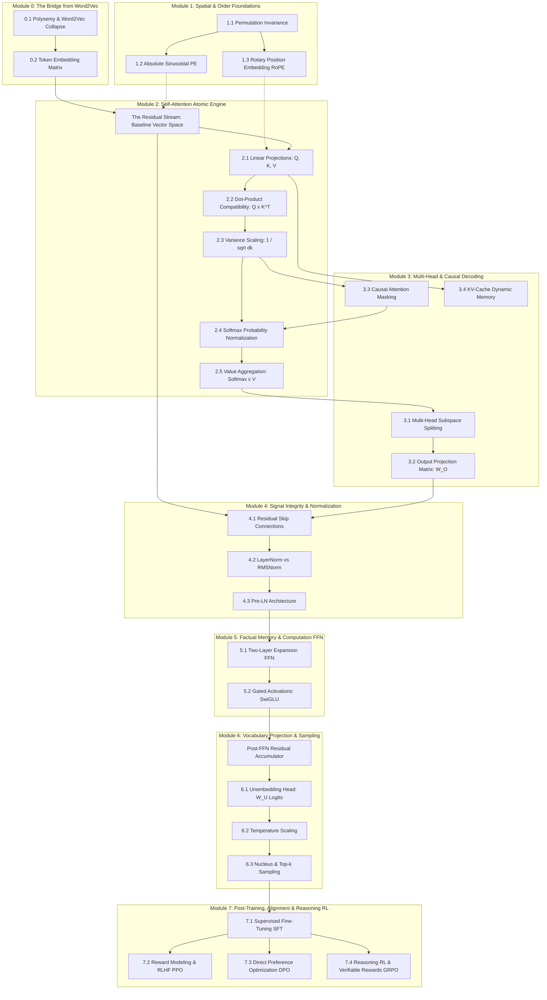

---

# Module 0: The Bridge from Word2Vec
*From Static Semantic Dictionaries to Contextual State Spaces*

---

### 0.1 Word2Vec's Polysemy Collapse

#### 💡 Why?
- **Importance:** Older AI models (like Word2Vec) used a one-to-one matching rule: every single word in the dictionary was assigned exactly one fixed list of numbers (called a **vector**). A vector is simply an ordered list of numbers, like coordinates on a map (e.g., $[x, y]$). By forcing a word to always have the exact same coordinates regardless of the sentence, these older models mushed all the different meanings of a word into one single location.
- **Functional Role:** This shows exactly why the Transformer architecture was invented. A word's mathematical representation cannot be a fixed, unmoving list of numbers saved on a hard drive. It must be a dynamic, living list of numbers that changes and updates itself based on the surrounding words in the sentence. 
- **LLM Behavior Affected:** If modern AI like ChatGPT relied on fixed lists of numbers without updating them based on context, it would suffer from "polysemy collapse" (**polysemy** just means a word having multiple meanings). Words with completely different meanings—like a financial "bank" versus a river "bank"—would be forced to use the exact same list of numbers. The AI would become hopelessly confused and incapable of understanding context, translating languages accurately, or resolving basic ambiguity.

#### 📖 Definition & Architecture
In the older fixed (static) paradigm, a lookup table assigns a fixed list of numbers to every word. This representation is completely blind to context: whether the sentence is talking about planting crops, investing in stocks, or flying airplanes, the numbers for any given word never change.

However, human language is highly flexible. A single word usually has a distinct set of hidden, separate meanings. Because older models try to learn just *one* list of numbers for a word by scanning millions of books, the resulting numbers become a compromised average—a "weighted centroid" (the middle point). If a word has two completely unrelated (or opposite) meanings, averaging their numbers pulls the word into a weird middle-ground that doesn't accurately represent *either* meaning.

The Transformer architecture fixes this structural flaw by separating the **word's basic identity** from its **current context meaning**. The Transformer starts by looking up the basic, fixed list of numbers for a word. But then, it uses "Self-Attention" layers. These layers calculate a matching score between the current word and all the surrounding words in the sentence. Based on these scores, the Transformer mathematically pushes and pulls the word's numbers into a new location that perfectly captures its exact meaning in that specific sentence.


#### 📐 The Mathematics & Working

In older models (Word2Vec), the lookup rule for a word is fixed:
$$\mathbf{e}_{\text{static}}(w) \approx \sum_{k=1}^K P(s_k \mid w) \mathbf{u}_{s_k}$$
$$\mathbf{e}_{\text{static}}(w) = \mathbf{w} \quad \forall \, c \in \mathcal{C}$$

In a Transformer, the numbers are updated dynamically layer by layer:
$$\mathbf{h}_i^{(0)} = \mathbf{e}_i + \mathbf{p}_i$$
$$\mathbf{h}_i^{(\ell)} = \mathbf{h}_i^{(\ell-1)} + \sum_{j=1}^N \alpha_{ij}^{(\ell)} \left( \mathbf{h}_j^{(\ell-1)} W_V^{(\ell)} \right)$$

And those $\alpha$ (attention) matching scores are calculated like this:
$$\alpha_{ij}^{(\ell)} = \frac{\exp\left( \frac{(\mathbf{h}_i^{(\ell-1)} W_Q^{(\ell)}) (\mathbf{h}_j^{(\ell-1)} W_K^{(\ell)})^\top}{\sqrt{d_k}} \right)}{\sum_{m=1}^N \exp\left( \frac{(\mathbf{h}_i^{(\ell-1)} W_Q^{(\ell)}) (\mathbf{h}_m^{(\ell-1)} W_K^{(\ell)})^\top}{\sqrt{d_k}} \right)}$$

**Exhaustive Symbol-by-Symbol Breakdown:**
*   $\mathbf{e}_{\text{static}}$: The fixed (static) mathematical function that looks up the starting list of numbers (vector) for a word.
*   $(w)$: The specific word we are looking up (like "bank").
*   $\approx$: Mathematical symbol for "is approximately equal to".
*   $\sum$: Capital Greek letter Sigma. It stands for "summation", which is a mathematical loop that means "add all of these items together".
*   $k=1$: The start of our counting loop. We start at meaning number 1.
*   $K$: The end of our loop. The total number of different meanings the word has.
*   $P$: Probability. A percentage chance expressed as a decimal between 0 and 1 (e.g., $0.5$ means 50%).
*   $(s_k \mid w)$: "The specific meaning $s_k$, given the word $w$".
*   $\mathbf{u}_{s_k}$: The ideal, perfect list of numbers for that specific meaning.
*   $\mathbf{w}$: The final, fixed list of numbers assigned to the word.
*   $\forall$: Mathematical symbol for "for all" or "for every single one".
*   $\in$: Mathematical symbol for "is an element of" or "belongs to".
*   $c$: A specific text context (the surrounding sentence).
*   $\mathcal{C}$: The set of all possible sentences in the universe. (Together, $\forall c \in \mathcal{C}$ means "No matter what sentence this word is in...").
*   $\mathbf{h}_i^{(0)}$: The starting list of numbers for the word at position $i$ in the sentence, at layer $0$ (the very beginning).
*   $\mathbf{e}_i$: The basic dictionary lookup numbers for the word at position $i$.
*   $\mathbf{p}_i$: A list of numbers representing the word's position (e.g., "I am the 3rd word in the sentence").
*   $\mathbf{h}_i^{(\ell)}$: The updated list of numbers for the word at position $i$, at the current layer $\ell$.
*   $\mathbf{h}_i^{(\ell-1)}$: The previous list of numbers for the word, from the previous layer $(\ell-1)$.
*   $j=1$: The start of a new loop, looking at every word $j$ in the sentence to see how much attention we should pay to it.
*   $N$: The total number of words in the sentence.
*   $\alpha_{ij}^{(\ell)}$: The Greek letter alpha. This is a decimal number between 0 and 1 representing the "attention score" (e.g., 0.90 means "pay 90% attention to this other word"). It measures how relevant word $j$ is to word $i$.
*   $W_V^{(\ell)}, W_Q^{(\ell)}, W_K^{(\ell)}$: Grids of numbers (called matrices) for "Value", "Query", and "Key". These grids are multipliers that transform the word's numbers to help them communicate.
*   $\exp$: The exponential function. It means taking a special mathematical constant $e$ (about $2.718$) and raising it to a power. This guarantees all matching scores become positive numbers greater than zero.
*   $\top$: The "transpose" symbol. It simply means flipping a horizontal row of numbers into a vertical column so that the multiplication lines up correctly.
*   $\sqrt{d_k}$: The square root of the length of the list of numbers. This is a shrinker: it scales large numbers back down so the math doesn't explode and break the computer.
*   $m=1$: Another loop counter used in the bottom of the fraction to add up all the scores together. Dividing by the total sum forces all the attention percentages to perfectly add up to 1.0 (100%).

**2-Sentence Plain-English Logic:**
Older models force a word with multiple meanings into a single average set of numbers, causing it to lose its specific meaning. The Transformer fixes this by starting with a baseline set of numbers, then calculating matching scores with surrounding words, and using those scores to add targeted updates that push the word's numbers toward its exact, correct meaning for that specific sentence.

**Concrete Numerical Toy Example:**
Imagine we have the word "bank". It has two meanings: 
1. A financial institution (ideal numbers: $[10, 0]$)
2. A river edge (ideal numbers: $[0, 10]$)

In the old Word2Vec model, if "bank" is used 50% of the time for money and 50% for rivers, it averages them:
$0.5 \times [10, 0] + 0.5 \times [0, 10]$
Arithmetic:
Left side: $0.5 \times 10 = 5$, $0.5 \times 0 = 0 \rightarrow [5, 0]$
Right side: $0.5 \times 0 = 0$, $0.5 \times 10 = 5 \rightarrow [0, 5]$
Add them together: $[5, 0] + [0, 5] = [5, 5]$. 
The fixed Word2Vec numbers for "bank" are $[5, 5]$. This is a disaster because $[5, 5]$ is a muddy average that means neither "pure money" nor "pure river".

Now, let's use the Transformer model for the sentence: *"river bank"*.
- Our word "bank" starts at $\mathbf{h} = [5, 5]$.
- The Transformer looks at the surrounding word "river". The attention math $\alpha$ calculates a 100% match ($1.0$) between "bank" and "river".
- Because of this match, the Transformer pulls the meaning of "river" to update "bank". Let's say the update calculation outputs $[-5, +5]$.
- The Transformer adds the update to the original state: 
$[5, 5] + [-5, +5]$
Arithmetic: 
First number: $5 + (-5) = 0$
Second number: $5 + 5 = 10$
Result: $[0, 10]$.
The Transformer successfully pushed "bank" from the muddy average of $[5, 5]$ to exactly $[0, 10]$, the pure meaning of a river edge!

#### 🌍 Real-World & NLP Behaviors (2 Examples)
- **Financial vs. Ecological Disambiguation:** Imagine the sentence *"The company had to bank on emergency federal credit after the river breached the northern bank"*. The word "bank" appears twice with completely different meanings. An older static model gives both instances the exact same list of numbers, making the AI blind to the difference. A Transformer looks at the first "bank", notices words like "credit" and "federal", and mathematically updates the first "bank" to mean "finance". For the second "bank", it notices words like "river" and "breached", and updates it to mean "geology/water".
- **Noun vs. Verb Conversion:** In the sentence *"The complex houses married soldiers"*, the word "houses" is an action word (a verb meaning "provides shelter for"), and "complex" is a descriptive word (an adjective for the military base). Older models strongly assume "houses" is a noun (buildings) because that is its most common usage in the training data, leading to severe grammatical confusion. A Transformer calculates how the words structurally relate to each other, notices that "complex" is acting as the subject, and mathematically pushes "houses" away from its default "building" numbers and into a "verb/action" state, allowing it to correctly understand who is doing what.

---

### 0.2 Token Embedding Matrix & The Residual Stream

#### 💡 Why?
- **Importance:** Digital computers and AI hardware cannot process text letters like "A" or "B". They can only do arithmetic on smoothly varying decimal numbers. We need a fundamental translation dictionary to convert discrete word pieces (called **tokens**) into lists of numbers (vectors) so the math can begin. 
- **Functional Role:** This step creates the very first lists of numbers and places them onto the **Residual Stream**. Think of the Residual Stream as a central conveyor belt or highway running through the entire AI model. As the word travels down this highway, every AI layer gets to read the word, calculate new insights, and *add* its new insights onto the conveyor belt without erasing the original word.
- **LLM Behavior Affected:** Without converting words to numbers, AI training (which relies on calculus and finding slopes to improve performance) is mathematically impossible. Furthermore, without the additive Residual Stream highway, a deep AI model with 32+ layers would constantly overwrite its own memory. By the time it reached the final layer, it would completely forget what the first word of your prompt was.

#### 📖 Definition & Architecture
Before entering the model, a tokenizer program chops your sentence into small pieces (tokens) and gives each piece a unique ID number. For example, a vocabulary of 50,000 different pieces means ID numbers range from $0$ to $49,999$. We represent a specific ID number using a "one-hot vector"—which is just a massive list of zeros, with a single `1` placed at the exact slot matching the ID number.

Next, we have the **Token Embedding Matrix**. A **matrix** is simply a 2D grid of numbers, like a spreadsheet with rows and columns. This matrix acts as a giant lookup table. It has one row for every possible word piece in the vocabulary. By multiplying our one-hot vector (the single `1`) against this giant grid, the math perfectly extracts the exact row of numbers corresponding to our word.

Once retrieved, we scale the numbers (multiply them by a specific amount) so they are the correct size, and we add in a position signal so the AI knows where the word is in the sentence. This final result is placed onto the Residual Stream. Unlike older AI models that repeatedly scramble and rewrite the data at every step, the Transformer's Residual Stream is purely additive. It takes the current numbers, figures out new information using attention and reasoning layers, and simply adds the new numbers on top. 

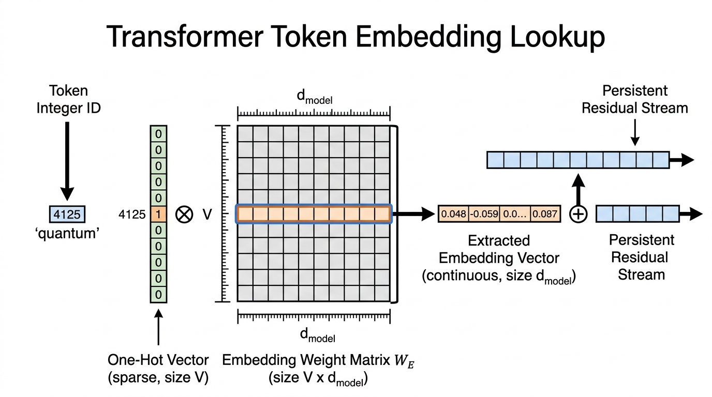

#### 📐 The Mathematics & Working
Here is how we extract the initial numbers and travel down the residual highway:

$$\mathbf{e}_i = \mathbf{t}_i W_E = W_E[t_i, :]$$
$$\mathbf{x}_i^{(0)} = \sqrt{d_{\text{model}}} \cdot \mathbf{e}_i + \mathbf{p}_i$$
$$\begin{aligned}
\mathbf{x}_i^{(\ell)} &= \mathbf{x}_i^{(\ell-1)} + f_{\text{attn}}^{(\ell)}\left(\text{LN}(\mathbf{x}_{1:N}^{(\ell-1)})\right)_i \\
&\quad + f_{\text{MLP}}^{(\ell)}\left(\text{LN}(\mathbf{x}_i^{(\ell-1), \prime})\right)
\end{aligned}$$

**Exhaustive Symbol-by-Symbol Breakdown:**
*   $V$: The total size of our vocabulary dictionary (e.g., 50,000 distinct word pieces).
*   $t_i$: The simple integer ID number for the word piece at position $i$ (like ID number 42).
*   $\mathbf{t}_i$: The "one-hot" vector. A list of 50,000 zeros with a single `1` at slot 42.
*   $W_E$: The Token Embedding Matrix. The massive 2D grid spreadsheet of numbers storing the meanings of all $V$ words.
*   $=$: Mathematical symbol for "equals".
*   $W_E[t_i, :]$: Computer programming shorthand. It means "Go to grid $W_E$, grab row number $t_i$, and take every column in that row (the `:` means 'all columns')."
*   $\mathbf{e}_i$: The raw, unscaled list of numbers we just extracted from the grid.
*   $d_{\text{model}}$: The total number of slots in our list of numbers (the dimension). For example, a list of 4096 numbers.
*   $\sqrt{}$: The square root symbol.
*   $\cdot$: A multiplication dot. We multiply our extracted numbers by $\sqrt{d_{\text{model}}}$.
*   $\mathbf{p}_i$: The position numbers added to tell the AI the word's location (e.g., word #1, word #2).
*   $\mathbf{x}_i^{(0)}$: The starting list of numbers that officially enters the Residual Stream highway at layer 0.
*   $\ell$: The current AI layer we are calculating.
*   $\ell-1$: The previous layer (the state of our numbers before the current update).
*   $\mathbf{x}_i^{(\ell)}$: The new, updated numbers on the highway after passing through layer $\ell$.
*   $+$: The plus sign! The secret to the residual stream: we simply add the new updates to the old numbers.
*   $\text{LN}$: Layer Normalization. A tool that tidies up the numbers (keeping them from getting too big or too small) before doing calculations.
*   $f_{\text{attn}}^{(\ell)}$: The Self-Attention math function at layer $\ell$ (which we covered in section 0.1). It reads the context and provides a new update to add.
*   $f_{\text{MLP}}^{(\ell)}$: The Multi-Layer Perceptron. A standard mini-calculator (feed-forward network) at layer $\ell$ that acts as a reasoning step, providing another update to add.
*   $\mathbf{x}_i^{(\ell-1), \prime}$: The temporary numbers halfway through the layer update (after attention is added, but before the MLP is added).
*   $1:N$: Meaning "look at all words from position 1 to position $N$."

**2-Sentence Plain-English Logic:**
To allow computers to do math on text, we look up a word's ID number in a giant spreadsheet to grab its starting list of numbers. From then on, as the word passes through the AI's layers, new insights are simply added on top of the running total via the "Residual Stream," ensuring the AI never forgets the original word while continuously building deeper meaning.

**Concrete Numerical Toy Example:**
Let's build a miniature AI dictionary with just 3 words (Vocabulary $V = 3$). 
ID 0 = "Apple"
ID 1 = "Banana"
ID 2 = "Cherry"

Our list of numbers for each word will just be 2 slots long ($d_{\text{model}} = 2$).
Our grid $W_E$ looks like this:
Row 0: $[1.1, 2.2]$ (Apple)
Row 1: $[3.3, 4.4]$ (Banana)
Row 2: $[5.5, 6.6]$ (Cherry)

Step 1: Extract "Banana".
Banana's ID is $1$. Its one-hot list is $[0, 1, 0]$.
We multiply this list by our grid:
$0 \times [1.1, 2.2] = [0, 0]$
$1 \times [3.3, 4.4] = [3.3, 4.4]$
$0 \times [5.5, 6.6] = [0, 0]$
Add them up: $[0, 0] + [3.3, 4.4] + [0, 0] = [3.3, 4.4]$. (We successfully extracted Banana's row!).
So, $\mathbf{e} = [3.3, 4.4]$.

Step 2: Scale it.
Our size $d_{\text{model}}$ is $4$ (let's pretend it's 4 for a clean square root). 
The square root of $4$ is $2$.
We multiply: $2 \times [3.3, 4.4]$.
Arithmetic: $2 \times 3.3 = 6.6$, and $2 \times 4.4 = 8.8$.
Result: $[6.6, 8.8]$.

Step 3: Add position.
Let's say the position numbers for being the first word in a sentence are $[0.4, 0.2]$.
We add: $[6.6, 8.8] + [0.4, 0.2]$.
Arithmetic: $6.6 + 0.4 = 7.0$, and $8.8 + 0.2 = 9.0$.
Our starting Residual Stream numbers $\mathbf{x}^{(0)}$ are $[7.0, 9.0]$.

Step 4: Residual Stream Update (The Highway).
Our numbers travel to Layer 1. Layer 1 calculates some attention and reasoning, and decides it wants to add an update of $[1.0, -1.0]$.
We simply add it to our running total!
$[7.0, 9.0] + [1.0, -1.0]$.
Arithmetic: $7.0 + 1.0 = 8.0$, and $9.0 - 1.0 = 8.0$.
Our updated numbers leaving Layer 1 are $[8.0, 8.0]$. The original meaning is safe, just mathematically enhanced!

#### 🌍 Real-World & NLP Behaviors (2 Examples)
- **Splitting Words into Pieces (Subword Compositionality):** When modern AI encounters a rare or made-up word like "unconstitutional", the tokenizer program chops it into smaller, common pieces: `["un", "constitut", "ional"]`. The grid spreadsheet $W_E$ looks up separate numbers for each piece. Because the AI has read billions of pages, the numbers for `"un"` point in a mathematical direction meaning "opposite/negation", and `"ional"` points in a direction meaning "descriptive adjective". As these separate pieces travel together down the Residual Stream highway, the attention layers read them and perfectly add their numbers together, allowing the AI to correctly grasp the full meaning of a word it has never explicitly seen before.
- **Recycling the Dictionary (Weight Tying):** In many famous AI models like GPT-2, the massive starting grid $W_E$ (used to turn words into numbers at the very beginning) is actually recycled at the very end of the AI model to turn the final numbers *back* into words. This trick is called "Weight Tying". It acts as a strict mathematical rule: if two words mean similar things (like "happy" and "joyful"), their starting numbers in the grid must be very close together in space. Because the final layer uses the exact same grid backwards, an AI outputting numbers pointing to that location will assign high probabilities to both "happy" and "joyful" at the same time, giving the AI a robust, generalized vocabulary.

---

# Module 1: Spatial & Order Foundations
*Attention is Permutation-Invariant*

---

### 1.1 Permutation Invariance of Set Operations

#### 💡 Why?
- **Importance:** The core mathematical operator of the Transformer—called "scaled dot-product attention"—calculates connections between words purely by comparing their numbers. However, it possesses zero intrinsic awareness of sequence order, time, or how far apart words are. 
- **Functional Role:** This mathematical reality means that Transformers, in their bare original form, treat sentences like an unordered bag of Scrabble tiles (a set) rather than a sequence. This proves why we absolutely must inject some external "position ticket" into every word so the model can understand grammar and syntax.
- **LLM Behavior Affected:** If we forgot to include positional signals, an AI model would compute the exact same mathematical result for sentences with the same words in different orders. For example, `"dog bites man"` and `"man bites dog"` would produce the exact same final output. This would completely break grammatical parsing, cause catastrophic failures in answering questions, and make it impossible for the model to write working computer code or understand cause and effect.

#### 📖 Definition & Architecture

In older AI designs—like Recurrent Neural Networks (RNNs) and LSTMs—the order of words is built directly into how the machine works. The network reads one word at a time, strictly left-to-right.

Here is the formula for how an RNN processes a word:
$$\mathbf{h}_t = \sigma(W_h \mathbf{h}_{t-1} + W_x \mathbf{x}_t + \mathbf{b})$$

**Exhaustive Symbol-by-Symbol Breakdown:**
* $\mathbf{h}_t$: The current "hidden state"—a vector (an ordered list of numbers like a row in a spreadsheet) summarizing the sentence up to the current word at position $t$.
* $=$: The equals sign, meaning the left side is calculated by the right side.
* $\sigma$: The lowercase Greek letter Sigma. Here it stands for a mathematical curve (an activation function) that squashes any number into a safe range (usually between 0 and 1) so our calculations don't explode to infinity.
* $($ and $)$: Parentheses, meaning we calculate everything inside them first.
* $W_h$: A weight matrix (a 2D grid or spreadsheet of numbers) that we multiply against the previous state. 
* $\mathbf{h}_{t-1}$: The previous hidden state—the summary vector from the word that came just before ($t-1$).
* $+$: Addition operator.
* $W_x$: A weight matrix (a 2D grid of numbers) that we multiply against the current new word.
* $\mathbf{x}_t$: The input vector (list of numbers) representing the current word we are reading at step $t$.
* $\mathbf{b}$: A bias vector—a fixed list of extra numbers we add at the very end to adjust our baseline.

**Plain-English Mechanical Intuition:**
Think of an RNN like a relay race where a runner passes a baton. The new baton ($\mathbf{h}_t$) is created by blending the baton handed from the previous runner ($\mathbf{h}_{t-1}$) with the current runner's fresh energy ($\mathbf{x}_t$), then squashing the result ($\sigma$) to keep it stable.

**Concrete Numerical Toy Example:**
Let's pretend our vectors are just single numbers for ultimate simplicity.
- Previous summary $\mathbf{h}_{t-1} = [2]$. Weight matrix $W_h = [3]$.
- Current word $\mathbf{x}_t = [4]$. Weight matrix $W_x = [1]$.
- Bias $\mathbf{b} = [0]$.
- Multiply previous: $3 \times 2 = 6$.
- Multiply current: $1 \times 4 = 4$.
- Add them up: $6 + 4 + 0 = 10$.
- Squash it (let's say $\sigma$ simply caps numbers at $1$): The result is $1$. The new baton $\mathbf{h}_t$ is $[1]$.

Because an RNN needs $\mathbf{h}_{t-1}$ to calculate $\mathbf{h}_t$, it is strictly locked into time. You cannot process word 3 until you finish word 2. 

In contrast, the Transformer processes all $N$ tokens (words) simultaneously in parallel using giant matrix multiplications. Let's look at the standard Transformer Attention formula:
$$\text{Attn}(X) = \text{softmax}\left( \frac{(X W_Q)(X W_K)^\top}{\sqrt{d_k}} \right) (X W_V)$$

**Exhaustive Symbol-by-Symbol Breakdown:**
* $\text{Attn}$: The Attention function, which determines how much each word should look at every other word.
* $($ and $)$: Parentheses grouping inputs or order of operations.
* $X$: The input matrix (a 2D grid of numbers) where each row is a vector representing one word in our sentence.
* $=$: Equals sign.
* $\text{softmax}$: A mathematical function that takes a list of numbers and turns them into percentages that always perfectly add up to 100% (or 1.0).
* $\frac{\dots}{\dots}$: Division line (a fraction). We calculate the top and divide by the bottom.
* $W_Q$: The Query weight matrix. We multiply $X$ by this grid to ask, "What am I looking for?"
* $W_K$: The Key weight matrix. We multiply $X$ by this grid to say, "What do I contain?"
* $\top$: Transpose symbol. It means flipping a horizontal row of numbers into a vertical column (or vice versa) so that our matrix grid multiplication rules line up correctly.
* $\sqrt{}$: Square root symbol. 
* $d_k$: The dimension size (length of our number lists). We take its square root to shrink massive numbers back down so the percentages don't get permanently stuck at 100% and 0%.
* $W_V$: The Value weight matrix. We multiply $X$ by this grid to say, "If you choose to look at me, here is the actual data I will give you."

**Plain-English Mechanical Intuition:**
Attention is a matchmaking service. Every word fills out a profile of what it wants ($X W_Q$) and a profile of what it offers ($X W_K$), we check how well they match using a dot product, turn those match scores into percentages ($\text{softmax}$), and blend the actual data ($X W_V$) based on those percentages. 

**Concrete Numerical Toy Example:**
Let's ignore the matrices for a moment and just do the matchmaking math for two tiny 1-number words.
- Word 1 Query is $[2]$. Word 2 Key is $[3]$.
- Dot product (multiply matching pairs and add): $2 \times 3 = 6$.
- Divide by $\sqrt{1} = 1$: Score is $6$.
- Put through softmax against other scores (let's say the other score was a $6$ too): The percentage becomes $50\%$ (or $0.5$).
- Multiply by Word 2's Value (let's say it's $[4]$): $0.5 \times 4 = 2$. Word 1 absorbs $2$ units of meaning from Word 2.

Now, let's prove mathematically that this operation has zero awareness of order. We introduce a permutation matrix $\mathbf{P} \in \{0, 1\}^{N \times N}$, which is just a grid of 0s and 1s designed to scramble the rows of $X$.
If we scramble the input sentence $\widetilde{X} = \mathbf{P} X$, our profiles (Queries, Keys, and Values) get scrambled in the exact same way:
$$\widetilde{Q} = \mathbf{P} X W_Q = \mathbf{P} Q$$
$$\widetilde{K} = \mathbf{P} X W_K = \mathbf{P} K$$
$$\widetilde{V} = \mathbf{P} X W_V = \mathbf{P} V$$

**Exhaustive Symbol-by-Symbol Breakdown:**
* $\widetilde{Q}, \widetilde{K}, \widetilde{V}$: The squiggly line on top (called a "tilde") simply means "the scrambled version" of Queries, Keys, and Values.
* $=$: Equals sign.
* $\mathbf{P}$: The permutation matrix (the row-swapping grid).
* $X$: The original input words.
* $W_Q, W_K, W_V$: The weight grids mapping words to Queries, Keys, and Values.
* $Q, K, V$: The original, unscrambled Queries, Keys, and Values.

**Plain-English Mechanical Intuition:**
If you take a spreadsheet of words and swap row 1 with row 2, any math you run independently on each row will just output the results with row 1 and row 2 swapped. 

**Concrete Numerical Toy Example:**
Let $X = \begin{bmatrix} 7 \\ 9 \end{bmatrix}$ (Word 1 is 7, Word 2 is 9). Let $W_Q = [2]$.
Original $Q = X W_Q = \begin{bmatrix} 7 \times 2 \\ 9 \times 2 \end{bmatrix} = \begin{bmatrix} 14 \\ 18 \end{bmatrix}$.
Let's use a swapping grid $\mathbf{P} = \begin{bmatrix} 0 & 1 \\ 1 & 0 \end{bmatrix}$ (this means "put row 2 on top, row 1 on bottom").
Scrambled input $\widetilde{X} = \mathbf{P} X = \begin{bmatrix} 9 \\ 7 \end{bmatrix}$.
Scrambled Query $\widetilde{Q} = \widetilde{X} W_Q = \begin{bmatrix} 9 \times 2 \\ 7 \times 2 \end{bmatrix} = \begin{bmatrix} 18 \\ 14 \end{bmatrix}$.
Notice that $\widetilde{Q}$ is exactly the same as $\mathbf{P} Q$ (just the answers $14$ and $18$ swapped).

Computing the full attention block with scrambled words yields:
$$\widetilde{A} = \text{softmax}\left( \frac{\mathbf{P} Q (\mathbf{P} K)^\top}{\sqrt{d_k}} \right)$$
$$\widetilde{A} = \text{softmax}\left( \frac{\mathbf{P} Q K^\top \mathbf{P}^\top}{\sqrt{d_k}} \right)$$
$$\widetilde{A} = \mathbf{P} \text{softmax}\left( \frac{Q K^\top}{\sqrt{d_k}} \right) \mathbf{P}^\top = \mathbf{P} A \mathbf{P}^\top$$

Multiplying by the scrambled values:
$$\text{Attn}(\widetilde{X}) = \widetilde{A} \widetilde{V} = (\mathbf{P} A \mathbf{P}^\top)(\mathbf{P} V)$$
$$\text{Attn}(\widetilde{X}) = \mathbf{P} A (\mathbf{P}^\top \mathbf{P}) V$$
$$\text{Attn}(\widetilde{X}) = \mathbf{P} (A V) = \mathbf{P} \text{Attn}(X)$$

**Exhaustive Symbol-by-Symbol Breakdown:**
* $\widetilde{A}$: The scrambled attention percentages.
* $\text{softmax}$: The percentage function.
* $($ and $)$: Parentheses.
* $\frac{\dots}{\sqrt{d_k}}$: The fraction dividing by the square root of the dimension size.
* $\mathbf{P}$: The row-swapper grid.
* $Q, K, V$: Unscrambled Queries, Keys, Values.
* $\top$: Transpose (flip horizontally/vertically). When you transpose $(\mathbf{P} K)^\top$, math rules say it becomes $K^\top \mathbf{P}^\top$.
* $A$: The original unscrambled attention percentages.
* $\mathbf{P}^\top \mathbf{P}$: If you swap rows and then immediately un-swap them, they cancel out, effectively disappearing (becoming an Identity matrix, or multiplying by 1).
* $\text{Attn}(\widetilde{X})$: The final attention output on the scrambled input.
* $\mathbf{P} \text{Attn}(X)$: The row-swapper grid applied to the final attention output of the *unscrambled* input.

**Plain-English Mechanical Intuition:**
If you scramble the words before feeding them into the Transformer, all the internal match-making math completely cancels out the scrambling, and the final answer is simply the unscrambled answer with its rows scrambled in the exact same way. The Transformer doesn't "notice" that the order was wrong; it just blindly processes the data in parallel.

**Concrete Numerical Toy Example:**
Imagine the final output for `"dog" [row 1]` is $[5, 5]$ and `"bites" [row 2]` is $[8, 8]$. The total grid is $\begin{bmatrix} 5 & 5 \\ 8 & 8 \end{bmatrix}$.
If you scramble the input to `"bites" [row 1]` and `"dog" [row 2]`, the network will perfectly calculate the exact same math, and the output grid will simply be swapped: $\begin{bmatrix} 8 & 8 \\ 5 & 5 \end{bmatrix}$. The calculations inside didn't care about the order at all.

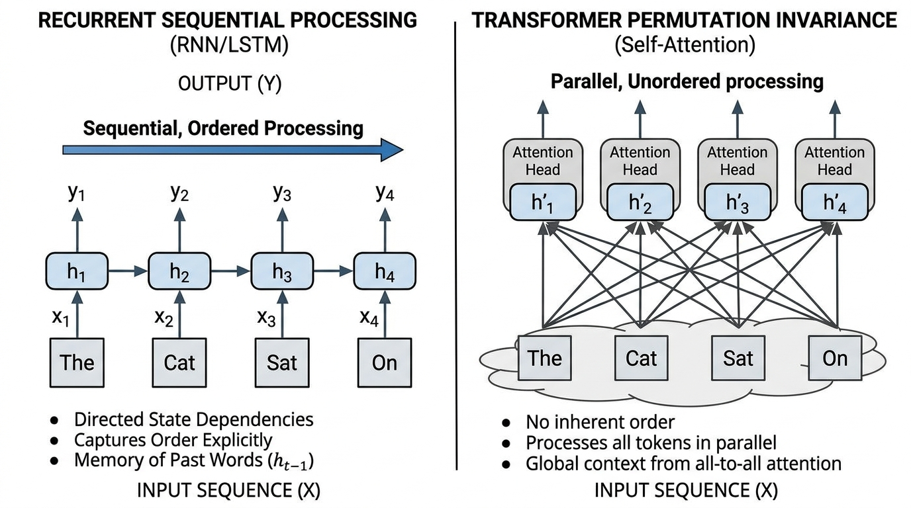

#### 📐 The Mathematics & Working

The permutation equivariance condition for self-attention is formally stated as:
$$\text{Attn}(\mathbf{P} X) = \mathbf{P} \cdot \text{Attn}(X) \quad \forall \, \mathbf{P} \in \mathcal{P}_N$$

**Exhaustive Symbol-by-Symbol Breakdown:**
* $\text{Attn}$: The attention calculation function.
* $($ and $)$: Grouping parentheses.
* $\mathbf{P}$: The permutation (scrambling) matrix.
* $X$: The input sentence matrix.
* $=$: Equals sign.
* $\cdot$: Multiplication dot.
* $\quad$: A blank space in the text for formatting.
* $\forall$: Mathematical symbol for "for all" or "for every single".
* $\in$: Mathematical symbol for "is an element of" (meaning it belongs to).
* $\mathcal{P}_N$: The set (collection) of all possible $N \times N$ scrambling grids.

**Plain-English Mechanical Intuition:**
No matter how you choose to shuffle the input sentence, the output will always just be the original output shuffled in the exact same way. The machine has no structural preference for left-to-right or right-to-left.

**Concrete Numerical Toy Example:**
Input $X$ has 3 rows (Word A, Word B, Word C). Output $\text{Attn}(X)$ is exactly 3 rows: Output A, Output B, Output C. 
If we use $\mathbf{P}$ to shuffle $X$ into (Word C, Word A, Word B), the formula guarantees the output is magically going to be (Output C, Output A, Output B). The Transformer has learned absolutely nothing about the fact that Word C was moved to the front.

The core reason for this behavior is the self-attention formula:
$$\text{Attn}(X) = \text{softmax}\left( \frac{X W_Q W_K^\top X^\top}{\sqrt{d_k}} \right) X W_V$$

**Exhaustive Symbol-by-Symbol Breakdown:**
* $\text{Attn}(X)$: The output of the attention layer when given input grid $X$.
* $=$: Equals.
* $\text{softmax}$: The percentage squasher.
* $($ and $)$: Parentheses.
* $X$: Input matrix (rows of words).
* $W_Q, W_K$: Grids that transform words into "Profiles" (Queries) and "Tags" (Keys).
* $^\top$: Transpose (flipping the grid). Notice we flip $W_K$ and $X$.
* $\sqrt{d_k}$: Square root of the size of our lists.
* $X W_V$: The input matrix transformed into "Values" (the actual data to share).

**Plain-English Mechanical Intuition:**
Raw self-attention computes connections between words purely by comparing their content, treating an entire paragraph like an unordered collection of tiles dumped out of a box. Because rearranging the tiles simply scrambles the rows of the final answer without changing any internal calculation, the model cannot tell the difference between words that are side-by-side and words that are miles apart.

**Concrete Numerical Toy Example:**
- Input $X = \begin{bmatrix} 1 & 0 \\ 0 & 1 \end{bmatrix}$ (Word 1 is $[1, 0]$, Word 2 is $[0, 1]$).
- Let $W_Q, W_K, W_V$ all just be multiplying by $1$ for simplicity. 
- $X W_Q = \begin{bmatrix} 1 & 0 \\ 0 & 1 \end{bmatrix}$. $(X W_K)^\top = \begin{bmatrix} 1 & 0 \\ 0 & 1 \end{bmatrix}$.
- Top of fraction: multiply them together $\begin{bmatrix} 1 & 0 \\ 0 & 1 \end{bmatrix} \times \begin{bmatrix} 1 & 0 \\ 0 & 1 \end{bmatrix} = \begin{bmatrix} 1 & 0 \\ 0 & 1 \end{bmatrix}$. 
- The score between Word 1 and Word 1 is $1$. The score between Word 1 and Word 2 is $0$. It doesn't matter where these words are placed in the sequence; their match score will always purely rely on the fact that $[1, 0]$ matches $[1, 0]$.

#### 🌍 Real-World & NLP Behaviors (2 Examples)
- **Agent-Patient Inversion in Semantic Parsing:** Consider the sentences *"The cat hunted the mouse"* versus *"The mouse hunted the cat"*. Both sentences contain the identical bag of words: `{"The", "cat", "hunted", "the", "mouse"}`. Without an explicit positional signal, the unpermuted attention scores between `"hunted"` and `"cat"` are mathematically identical in both cases. The model cannot identify whether `"cat"` is the agent (predator) or the patient (prey), causing catastrophic failures in question answering and semantic role labeling.
- **Assignment Logic in Source Code Generation:** In programming languages, order dictates dataflow. The statement `x = y` assigns the value of variable `y` into `x`, whereas `y = x` assigns `x` into `y`. Without positional awareness, an attention layer computes identical self-attention affinities between the variable names and the assignment operator `=` regardless of token position, making it impossible for a code-generation LLM to maintain variable scope or write syntactically correct software.

---

### 1.2 Absolute Sinusoidal Positional Encoding

#### 💡 Why?
- **Importance:** In 2017, the creators of the Transformer (Vaswani et al.) introduced "absolute sinusoidal positional encodings" to inject deterministic, zero-parameter sequential order directly into the network. This breaks the permutation invariance (the Scrabble-tile problem) without forcing the model to painstakingly learn a position table from scratch.
- **Functional Role:** It adds a unique, continuous, high-dimensional coordinate vector (a mathematically generated list of numbers) to every word based on its position before the network starts reading. This allows the network to know both exactly where a word is ($pos$) and calculate how far it is from other words ($pos + k$).
- **LLM Behavior Affected:** This enables the model to look at words based on their position (e.g., "always look at the word right before me" or "look at the first word of the sentence"). If omitted, the model is blind to order. If implemented poorly, the model will forget how far apart words are when reading a very long document.

#### 📖 Definition & Architecture
Vaswani et al. (2017) recognized that an ideal positional encoding scheme must satisfy three criteria:
1. It must output a unique vector (list of numbers) $\mathbf{p}_{pos}$ for every integer position $pos \in [0, N-1]$.
2. The distance between positions $pos$ and $pos + k$ must be consistent regardless of absolute position $pos$.
3. The function must generalize to sequence lengths longer than those observed during training.

To achieve this, they defined **Sinusoidal Positional Encoding** using a wave-like progression of sine and cosine math functions. For a word at a specific position $pos$ and looking at the feature slots (dimensions) paired up as even ($2i$) and odd ($2i + 1$):

$$PE_{(pos, 2i)} = \sin\left( \frac{pos}{10000^{2i / d_{\text{model}}}} \right)$$
$$PE_{(pos, 2i+1)} = \cos\left( \frac{pos}{10000^{2i / d_{\text{model}}}} \right)$$

**Exhaustive Symbol-by-Symbol Breakdown:**
* $PE$: Positional Encoding (the list of numbers we are generating to represent order).
* $($ and $)$: Parentheses.
* $pos$: The integer position of the word in the sentence (e.g., word 0, word 1, word 2).
* $,$: Comma separating our inputs.
* $2i$: The even-numbered slot in our list of numbers (slot 0, 2, 4, etc.).
* $2i+1$: The odd-numbered slot in our list of numbers (slot 1, 3, 5, etc.).
* $=$: Equals sign.
* $\sin$: Sine, a trigonometric math function that creates a smooth repeating wave bouncing between -1 and 1.
* $\cos$: Cosine, a trigonometric math function, identical to Sine but shifted slightly.
* $\frac{\dots}{\dots}$: Division fraction.
* $10000$: A large base number chosen by the creators to stretch the waves out.
* $/$: Division slash in the exponent.
* $d_{\text{model}}$: The total number of slots (dimensions) in our list of numbers (e.g., 512).

**Plain-English Mechanical Intuition:**
Imagine giving each word a barcode made of overlapping waves. The first few stripes in the barcode fluctuate extremely fast (like seconds on a clock), while the later stripes fluctuate very slowly (like years on a clock). Because of this mix of fast and slow waves, every single position gets a 100% unique barcode.

**Concrete Numerical Toy Example:**
Let's find the numbers for the very first slot ($i=0$) for a model with 4 slots ($d_{\text{model}}=4$).
We are at word position $pos=1$.
Bottom fraction in the exponent: $2(0) / 4 = 0 / 4 = 0$.
Denominator: $10000^0 = 1$ (any number to the power of 0 is 1).
For the even slot: $PE_{(1, 0)} = \sin(1 / 1) = \sin(1) \approx 0.841$.
For the odd slot: $PE_{(1, 1)} = \cos(1 / 1) = \cos(1) \approx 0.540$.
The first two numbers in Word 1's position barcode are $[0.841, 0.540]$.

To understand how fast the waves cycle, we define the "angular frequency" (how fast the wave spins) for dimension pair $i$ as:
$$\omega_i = \frac{1}{10000^{2i / d_{\text{model}}}}$$

**Exhaustive Symbol-by-Symbol Breakdown:**
* $\omega_i$: The lowercase Greek letter Omega, representing the speed of the wave at dimension pair $i$.
* $=$: Equals sign.
* $1$: The numerator.
* $\frac{\dots}{\dots}$: Division fraction.
* $10000$: The stretching base number.
* $2i$: The current even slot number.
* $/$: Division slash.
* $d_{\text{model}}$: Total number of slots.

**Plain-English Mechanical Intuition:**
This is simply the math formula that proves the waves start fast and get progressively slower. At slot 0, you divide by 1, so the wave is fast. At the final slot, you divide by a massive number, so the wave barely moves at all.

**Concrete Numerical Toy Example:**
Let's find the speed for the final pair $i=1$ in a 4-slot model ($d_{\text{model}}=4$).
$2(1) / 4 = 2 / 4 = 0.5$.
$10000^{0.5}$ is the square root of $10000$, which is $100$.
$\omega_1 = \frac{1}{100} = 0.01$.
The first wave's speed was $1$. This wave's speed is $0.01$ (it is 100 times slower!).

A crucial mathematical property of this formulation is the **Linear Shift Property**: for any fixed jump $k$, the encoding at $pos + k$ can be calculated from $pos$ using standard high-school geometry formulas for angle addition:
$$\sin(\omega_i(pos + k)) = \sin(\omega_i pos)\cos(\omega_i k) + \cos(\omega_i pos)\sin(\omega_i k)$$
$$\cos(\omega_i(pos + k)) = \cos(\omega_i pos)\cos(\omega_i k) - \sin(\omega_i pos)\sin(\omega_i k)$$

**Exhaustive Symbol-by-Symbol Breakdown:**
* $\sin$ and $\cos$: Sine and cosine wave functions.
* $($ and $)$: Parentheses.
* $\omega_i$: The speed of the wave.
* $pos$: The starting word position.
* $+$: Addition.
* $k$: The number of steps we jump forward (the offset).
* $=$: Equals sign.
* $-$: Subtraction.

**Plain-English Mechanical Intuition:**
This beautiful trigonometric trick means that to figure out the barcode for a word $k$ steps ahead, the Transformer doesn't need to do complex memorization. It simply takes the current word's barcode and spins it by a fixed angle.

**Concrete Numerical Toy Example:**
Let $\omega_i = 1$. $pos = 0$. $k = 1$.
Left side: $\sin(1 \times (0 + 1)) = \sin(1) \approx 0.841$.
Right side: $\sin(0)\cos(1) + \cos(0)\sin(1)$.
Since $\sin(0) = 0$ and $\cos(0) = 1$, the math becomes: $(0 \times 0.540) + (1 \times 0.841) = 0 + 0.841 = 0.841$. Both sides perfectly match!

In matrix form, the 2D plane corresponding to frequency channel $i$ undergoes a perfect rotation (like a steering wheel turning) by angle $\omega_i k$:
$$\begin{bmatrix} PE_{(pos+k, 2i)} \\ PE_{(pos+k, 2i+1)} \end{bmatrix} = \begin{bmatrix} \cos(\omega_i k) & \sin(\omega_i k) \\ -\sin(\omega_i k) & \cos(\omega_i k) \end{bmatrix} \begin{bmatrix} PE_{(pos, 2i)} \\ PE_{(pos, 2i+1)} \end{bmatrix}$$

**Exhaustive Symbol-by-Symbol Breakdown:**
* $\begin{bmatrix} \end{bmatrix}$: Brackets grouping our numbers into a grid/vector.
* $PE_{(pos+k, 2i)}$: The even slot number at the new jumped position.
* $PE_{(pos+k, 2i+1)}$: The odd slot number at the new jumped position.
* $=$: Equals sign.
* $\cos(\omega_i k)$ and $\sin(\omega_i k)$: The geometry numbers dictating how far to spin the steering wheel based on the jump $k$.
* $-\sin(\omega_i k)$: The negative version of the sine number.
* $PE_{(pos, 2i)}$ and $PE_{(pos, 2i+1)}$: The numbers from our original starting position.

**Plain-English Mechanical Intuition:**
By grouping our list of numbers into pairs, we can treat each pair like an X-Y coordinate on a graph. Moving $k$ steps forward in the sentence is mathematically identical to drawing a circle and rotating our X-Y point around that circle by a precise amount.

**Concrete Numerical Toy Example:**
Let the original point at $pos=0$ be $[0, 1]$ (which is X=0, Y=1, straight up at 12 o'clock).
Let the rotation matrix for $k=1$ (a 90-degree turn) be $\begin{bmatrix} 0 & 1 \\ -1 & 0 \end{bmatrix}$.
Top row calculation: $(0 \times 0) + (1 \times 1) = 1$.
Bottom row calculation: $(-1 \times 0) + (0 \times 1) = 0$.
The new point is $[1, 0]$ (which is X=1, Y=0, turned to 3 o'clock). We successfully calculated the new position purely by rotating!

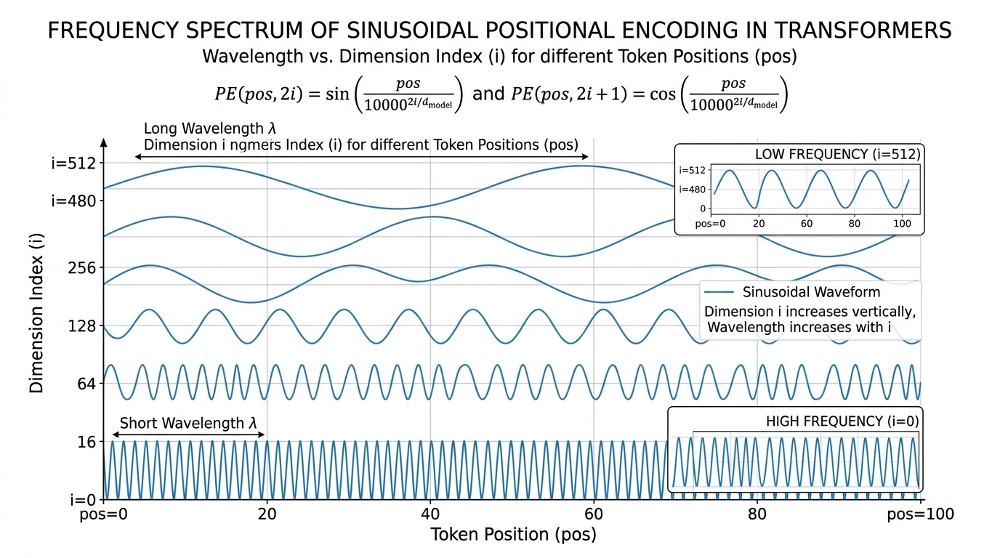

#### 📐 The Mathematics & Working
The absolute sinusoidal positional encoding vector $PE_{pos} \in \mathbb{R}^{d_{\text{model}}}$ is defined element-wise by:
$$PE_{(pos, 2i)} = \sin(\omega_i \cdot pos), \quad PE_{(pos, 2i+1)} = \cos(\omega_i \cdot pos)$$
where the frequency parameter is:
$$\omega_i = 10000^{-\frac{2i}{d_{\text{model}}}}$$
The relative shift operator is given by the block-diagonal linear transformation:
$$\mathbf{p}_{pos+k} = M_k \mathbf{p}_{pos}$$
where $M_k \in \mathbb{R}^{d_{\text{model}} \times d_{\text{model}}}$ is a block-diagonal matrix composed of $2 \times 2$ rotation blocks:
$$M_k^{(i)} = \begin{bmatrix} \cos(\omega_i k) & \sin(\omega_i k) \\ -\sin(\omega_i k) & \cos(\omega_i k) \end{bmatrix}$$

**Exhaustive Symbol-by-Symbol Breakdown:**
* $PE_{pos}$: The full list of position numbers for the word at index $pos$.
* $\in$: "Is an element of".
* $\mathbb{R}^{d_{\text{model}}}$: A list of Real decimal numbers exactly $d_{\text{model}}$ items long.
* $=$: Equals sign.
* $PE_{(pos, 2i)}$ and $PE_{(pos, 2i+1)}$: The even and odd slots of the list.
* $\sin$ and $\cos$: Sine and cosine wave math functions.
* $($ and $)$: Parentheses.
* $\omega_i$: The spinning speed for slot pair $i$.
* $\cdot$: Multiplication dot.
* $pos$: The sequence position of the word.
* $,$: Comma.
* $\quad$: A blank space for formatting.
* $10000$: The stretching base number.
* $-$: Negative sign in the exponent (which is the same as dividing by it, $10000^{-x} = 1 / 10000^x$).
* $\frac{\dots}{\dots}$: Division fraction.
* $2i$: Even slot.
* $d_{\text{model}}$: Total number of slots.
* $\mathbf{p}_{pos+k}$: The full position vector $k$ steps forward.
* $M_k$: The giant matrix (grid of numbers) that rotates every single pair of coordinates.
* $\mathbf{p}_{pos}$: The full position vector at the start.
* $\mathbb{R}^{d_{\text{model}} \times d_{\text{model}}}$: A 2D grid of real decimal numbers of size $d_{\text{model}}$ by $d_{\text{model}}$.
* $M_k^{(i)}$: One small $2 \times 2$ chunk of the giant $M_k$ grid corresponding to pair $i$.
* $\begin{bmatrix} \end{bmatrix}$: Brackets grouping the grid.
* $\cos(\omega_i k)$ and $\sin(\omega_i k)$: The geometry numbers controlling the rotation for jump $k$.
* $-\sin(\omega_i k)$: The negative sine number.

**Plain-English Mechanical Intuition:**
Sinusoidal encoding gives each word position a unique mathematical signature built from dozens of overlapping sine and cosine waves running from fast ripples to slow ocean swells. Because these waves obey exact rotation formulas, the network can easily calculate the distance between any two words simply by mathematically rotating them and checking their dot product.

**Concrete Numerical Toy Example:**
Let's add the positional encoding to actual word meaning vectors.
- Word 0 meaning is $[5, 5]$. Its position vector is $[0, 1]$. Word 0 final input: $[5, 5] + [0, 1] = [5, 6]$.
- Word 1 meaning is $[5, 5]$ (the exact same word!). Its position vector is $[0.841, 0.540]$. Word 1 final input: $[5, 5] + [0.841, 0.540] = [5.841, 5.540]$.
Even though it is the exact same word, the Transformer now sees two completely different numbers ($[5, 6]$ vs $[5.841, 5.540]$). The Scrabble-tile permutation problem is permanently fixed!

#### 🌍 Real-World & NLP Behaviors (2 Examples)
- **Local Syntactic Agreement vs. Global Discourse Tracking:** In languages like German or Russian, adjectives must match nouns that are very close by (1–3 words away), while massive verb clauses can be separated by entire paragraphs. Sinusoidal encoding naturally solves this by giving the network "fast waves" to track local grammar rules right next door, and "slow waves" to keep track of the broad chapter-level narrative pacing without losing the plot.
- **Failure in Length Extrapolation (The Absolute Position Barrier):** When early AI models (like original Transformers or GPT-3) were trained on short texts (e.g., 2048 words) and then asked to read 4096 words, they completely broke down. This is because adding absolute coordinates directly into the word vectors pollutes the word's core meaning. When the position number gets higher than anything seen in training, the addition pollutes the math so heavily that the attention scores blow up to infinity, outputting complete gibberish.

---

### 1.3 Rotary Position Embedding (RoPE)

#### 💡 Why?
- **Importance:** Rotary Position Embedding (RoPE) is the modern gold standard used in almost all frontier AI models today (LLaMA 1/2/3, Mistral, Qwen, DeepSeek). It brilliantly solves the fatal flaw of the previous method (adding position directly to word meanings) by keeping the word meanings pure and instead strictly rotating their angles.
- **Functional Role:** Instead of *adding* positional numbers to words, RoPE mathematically *rotates* the Query and Key profiles in 2D space right before they are matched. This guarantees that the final match score relies *100% strictly* on the relative distance between the words, with zero pollution.
- **LLM Behavior Affected:** Because it preserves the strict length of vectors (since rotating a shape doesn't stretch or shrink it), it eliminates positional noise pollution. It also allows the AI to naturally pay less attention to words that are very far away, and allows us to easily upgrade an AI's reading capacity from 4,000 words to hundreds of thousands of words using a trick called frequency interpolation.

#### 📖 Definition & Architecture
In absolute additive encoding, adding position $\mathbf{p}$ to word meaning $\mathbf{x}$ expands the query-key matchmaking dot product into four badly tangled terms:
$$\begin{aligned}
\mathbf{q}_m^\top \mathbf{k}_n &= (\mathbf{x}_m + \mathbf{p}_m) W_Q W_K^\top (\mathbf{x}_n + \mathbf{p}_n)^\top \\
&= \mathbf{x}_m W_Q W_K^\top \mathbf{x}_n^\top + \mathbf{x}_m W_Q W_K^\top \mathbf{p}_n^\top \\
&\quad + \mathbf{p}_m W_Q W_K^\top \mathbf{x}_n^\top + \mathbf{p}_m W_Q W_K^\top \mathbf{p}_n^\top
\end{aligned}$$

**Exhaustive Symbol-by-Symbol Breakdown:**
* $\mathbf{q}_m^\top$: The Transposed (flipped) Query profile at word position $m$.
* $\mathbf{k}_n$: The Key profile at word position $n$.
* $=$: Equals sign.
* $($ and $)$: Parentheses.
* $\mathbf{x}_m$: The pure word meaning at position $m$.
* $+$: Addition.
* $\mathbf{p}_m$: The positional numbers added at position $m$.
* $W_Q, W_K^\top$: The matchmaking weight grids.
* $\mathbf{x}_n, \mathbf{p}_n$: The pure word meaning and positional numbers at position $n$.
* $^\top$: Transpose operator.
* $\quad$: A formatting blank space.

**Plain-English Mechanical Intuition:**
When you add position to meaning and then multiply them out (like FOIL in high school algebra), you get four messy pieces. One piece is pure meaning, one is pure position, but two pieces are "meaning mixed with position". This forces the AI to waste massive brainpower trying to untangle the cross-contamination.

**Concrete Numerical Toy Example:**
Let meaning $\mathbf{x} W_Q = [2]$ and position $\mathbf{p} W_Q = [1]$ for word $m$. Combined Query is $[3]$.
Let meaning $\mathbf{x} W_K = [4]$ and position $\mathbf{p} W_K = [2]$ for word $n$. Combined Key is $[6]$.
Dot product is $3 \times 6 = 18$.
If we use algebra to separate it: $(2 \times 4) + (2 \times 2) + (1 \times 4) + (1 \times 2) = 8 + 4 + 4 + 2 = 18$.
The actual pure meaning match was just $8$. But we generated $10$ units of pure junk noise because the addition forced the numbers to mix.

To fix this, RoPE seeks a magic function where the match score depends *exclusively* on the relative distance $m - n$:
$$\langle f_q(\mathbf{x}_m, m), f_k(\mathbf{x}_n, n) \rangle = g(\mathbf{x}_m, \mathbf{x}_n, m - n)$$

**Exhaustive Symbol-by-Symbol Breakdown:**
* $\langle$ and $\rangle$: Angle brackets representing the dot product (the match score).
* $f_q$: A function we apply to create the Query.
* $\mathbf{x}_m$: Word meaning at position $m$.
* $m$: The integer sequence position of the Query.
* $f_k$: A function we apply to create the Key.
* $\mathbf{x}_n$: Word meaning at position $n$.
* $n$: The integer sequence position of the Key.
* $=$: Equals sign.
* $g$: Some resulting math function.
* $m - n$: The mathematical subtraction (distance) between position $m$ and position $n$.

**Plain-English Mechanical Intuition:**
We want a way to combine word meaning and position such that when we calculate their match score, the absolute positions $m$ and $n$ completely vanish, leaving behind only the pure word meanings and the exact distance between them.

**Concrete Numerical Toy Example:**
If word A is at position 100 ($m=100$) and word B is at position 105 ($n=105$), their distance is $-5$.
If they move to positions 200 and 205, their distance is still $-5$. The function guarantees the match score will be identical in both cases, completely ignoring the massive 200 numbers.

By mapping pairs of numbers onto a 2D plane using Complex Numbers (a mathematical trick to easily rotate points using angles), Euler's formula gives us a natural solution. Rotating a coordinate $z$ by angle $\theta$ multiplied by position $m$:
$$\begin{aligned}
R_{\theta, m} z &= (x_1 + i x_2) e^{i m \theta} \\
&= (x_1 \cos(m\theta) - x_2 \sin(m\theta)) + i (x_1 \sin(m\theta) + x_2 \cos(m\theta))
\end{aligned}$$

**Exhaustive Symbol-by-Symbol Breakdown:**
* $R_{\theta, m}$: The Rotation function by angle $\theta$ scaled by position $m$.
* $z$: The original 2D coordinate we are rotating.
* $=$: Equals sign.
* $($ and $)$: Parentheses.
* $x_1$: The first number in our pair (the X coordinate).
* $+$: Addition.
* $i$: The imaginary number unit (a math trick to map the Y coordinate).
* $x_2$: The second number in our pair (the Y coordinate).
* $e$: Euler's number (approximately 2.718, a fundamental math constant).
* $i m \theta$: The exponent telling $e$ how far to rotate around the circle.
* $\cos(m\theta)$ and $\sin(m\theta)$: Trigonometric numbers calculating the new X and Y coordinates after rotating by angle $m\theta$.
* $-$: Subtraction.

**Plain-English Mechanical Intuition:**
Complex numbers are just a convenient mathematical shorthand for graphing points on a 2D map. This formula simply says: "Take your 2D point, treat it like the hand of a clock, and spin it by an angle that gets larger the further down the sentence you are."

**Concrete Numerical Toy Example:**
Let our word profile $z$ be at X=1, Y=0 (which is 3 o'clock). In complex math, $x_1 = 1$, $x_2 = 0$.
Let angle $m\theta$ be 90 degrees.
New X coordinate: $(1 \times 0) - (0 \times 1) = 0$.
New Y coordinate: $(1 \times 1) + (0 \times 0) = 1$.
The new rotated coordinate is X=0, Y=1 (which is 12 o'clock). We perfectly rotated the profile!

In standard grid math, this is identical to a $2 \times 2$ orthogonal (non-stretching) rotation matrix:
$$R_{\theta, m} = \begin{bmatrix} \cos(m\theta) & -\sin(m\theta) \\ \sin(m\theta) & \cos(m\theta) \end{bmatrix}$$

**Exhaustive Symbol-by-Symbol Breakdown:**
* $R_{\theta, m}$: The $2 \times 2$ rotation grid for angle $\theta$ and position $m$.
* $=$: Equals sign.
* $\begin{bmatrix} \end{bmatrix}$: Brackets grouping our grid.
* $\cos(m\theta)$ and $\sin(m\theta)$: The circle coordinates dictating the rotation.
* $-\sin(m\theta)$: The negative circle coordinate.

**Plain-English Mechanical Intuition:**
This is the exact same concept as above, simply translated from the language of "complex numbers" into the language of "matrix grids" so a computer can multiply it efficiently.

**Concrete Numerical Toy Example:**
Let's use the matrix to rotate vector $[1, 0]$ by 90 degrees. $\cos(90) = 0$, $\sin(90) = 1$.
Matrix is $\begin{bmatrix} 0 & -1 \\ 1 & 0 \end{bmatrix}$.
Top slot: $(0 \times 1) + (-1 \times 0) = 0$.
Bottom slot: $(1 \times 1) + (0 \times 0) = 1$.
Result is $[0, 1]$. We spun perfectly from 3 o'clock to 12 o'clock without changing the length.

Because our full list of numbers has many slots (like $d=128$), we group them all into pairs and rotate every single pair at a different speed. The full giant rotation matrix is:
$$\mathbf{R}_{\Theta, m}^d = \text{diag}\left( R_{\theta_1, m}, R_{\theta_2, m}, \dots, R_{\theta_{d/2}, m} \right)$$

**Exhaustive Symbol-by-Symbol Breakdown:**
* $\mathbf{R}_{\Theta, m}^d$: The giant full-sized rotation matrix for all $d$ dimensions at position $m$.
* $=$: Equals sign.
* $\text{diag}$: "Diagonal". A command to arrange all the small $2 \times 2$ grids cleanly down the center diagonal of the giant matrix, filling the rest with zeros.
* $($ and $)$: Parentheses grouping the small grids.
* $R_{\theta_1, m}$: The small $2 \times 2$ rotation grid for the first pair of dimensions, using speed $\theta_1$.
* $R_{\theta_2, m}$: The small $2 \times 2$ rotation grid for the second pair, using speed $\theta_2$.
* $,$: Comma separating items.
* $\dots$: Mathematical dots meaning "continue this exact pattern".
* $R_{\theta_{d/2}, m}$: The final small $2 \times 2$ rotation grid for the final pair (since we group $d$ items into pairs, there are $d/2$ pairs).

**Plain-English Mechanical Intuition:**
Imagine a long vault with dozens of combination dials. The "diag" command builds a giant master gear system that turns every single dial simultaneously, but spins the first dial extremely fast and the last dial extremely slowly.

**Concrete Numerical Toy Example:**
If we have 4 dimensions, we have 2 pairs.
Pair 1 spins 90 degrees: $\begin{bmatrix} 0 & -1 \\ 1 & 0 \end{bmatrix}$.
Pair 2 spins 0 degrees: $\begin{bmatrix} 1 & 0 \\ 0 & 1 \end{bmatrix}$.
The giant "diag" matrix locks them together corner-to-corner into a $4 \times 4$ grid, leaving 0s everywhere else, so the pairs never accidentally mix with each other when we do the big math.

When computing the self-attention match score between a Query at position $m$ and a Key at position $n$:
$$\langle \mathbf{R}_{\Theta, m}^d \mathbf{q}_m, \mathbf{R}_{\Theta, n}^d \mathbf{k}_n \rangle = \dots = \mathbf{q}_m^\top \mathbf{R}_{\Theta, n - m}^d \mathbf{k}_n$$

**Exhaustive Symbol-by-Symbol Breakdown:**
* $\langle$ and $\rangle$: Angle brackets representing the dot product match score.
* $\mathbf{R}_{\Theta, m}^d$: The giant rotation matrix for the Query's position $m$.
* $\mathbf{q}_m$: The pure Query vector for word $m$.
* $,$: Comma separating the two items being matched.
* $\mathbf{R}_{\Theta, n}^d$: The giant rotation matrix for the Key's position $n$.
* $\mathbf{k}_n$: The pure Key vector for word $n$.
* $=$: Equals sign.
* $\dots$: The intermediate algebraic steps that cancel out.
* $\mathbf{q}_m^\top$: The transposed Query vector.
* $\mathbf{R}_{\Theta, n - m}^d$: The giant rotation matrix calculated using purely the distance $n - m$.
* $\mathbf{k}_n$: The Key vector.

**Plain-English Mechanical Intuition:**
If you spin the Query clock hand by 3 hours, and spin the Key clock hand by 5 hours, the angle between them is exactly 2 hours. By rotating them first and then comparing them, the absolute positions perfectly cancel out, leaving a pure match score that relies strictly on the 2 hour difference ($n - m$).

**Concrete Numerical Toy Example:**
- Query $\mathbf{q}$ is at 12 o'clock. Position $m=1$ spins it 1 hour to 1 o'clock.
- Key $\mathbf{k}$ is at 12 o'clock. Position $n=3$ spins it 3 hours to 3 o'clock.
- Comparing 1 o'clock and 3 o'clock gives a 2-hour difference.
Notice that $n - m$ is $3 - 1 = 2$. The math brilliantly shortcuts straight to the 2-hour distance!


#### 📐 The Mathematics & Working
The rotary transformation applied to pure query vector $\mathbf{q}_m \in \mathbb{R}^{d_k}$ and pure key vector $\mathbf{k}_n \in \mathbb{R}^{d_k}$ is:
$$\widetilde{\mathbf{q}}_m = \mathbf{R}_{\Theta, m}^d \mathbf{q}_m, \quad \widetilde{\mathbf{k}}_n = \mathbf{R}_{\Theta, n}^d \mathbf{k}_n$$

**Exhaustive Symbol-by-Symbol Breakdown:**
* $\widetilde{\mathbf{q}}_m$: The final Rotated Query vector (ready for matching).
* $=$: Equals sign.
* $\mathbf{R}_{\Theta, m}^d$: The giant rotation matrix for position $m$.
* $\mathbf{q}_m$: The pure Unrotated Query vector.
* $\in$: Is an element of.
* $\mathbb{R}^{d_k}$: A list of Real decimal numbers exactly $d_k$ items long.
* $,$: Comma.
* $\quad$: A blank space.
* $\widetilde{\mathbf{k}}_n$: The final Rotated Key vector.
* $\mathbf{R}_{\Theta, n}^d$: The giant rotation matrix for position $n$.
* $\mathbf{k}_n$: The pure Unrotated Key vector.

**Plain-English Mechanical Intuition:**
Before we let the words match with each other, we force their Query and Key profiles through a spinning machine. The machine spins each profile by an amount dictated strictly by its position in the text.

**Concrete Numerical Toy Example:**
Word $m$ has pure Query $[1, 0]$. Rotation machine spins it 90 degrees. Rotated Query $\widetilde{\mathbf{q}}_m$ is $[0, 1]$.
Word $n$ has pure Key $[0, 1]$. Rotation machine spins it 90 degrees. Rotated Key $\widetilde{\mathbf{k}}_n$ is $[-1, 0]$.

where $\mathbf{R}_{\Theta, m}^d \in \mathbb{R}^{d_k \times d_k}$ is the giant block-diagonal grid defined as:
$$\mathbf{R}_{\Theta, m}^d = \begin{bmatrix}
\cos(m\theta_1) & -\sin(m\theta_1) & 0 & 0 & \cdots & 0 & 0 \\
\sin(m\theta_1) & \cos(m\theta_1)  & 0 & 0 & \cdots & 0 & 0 \\
0 & 0 & \cos(m\theta_2) & -\sin(m\theta_2) & \cdots & 0 & 0 \\
0 & 0 & \sin(m\theta_2) & \cos(m\theta_2)  & \cdots & 0 & 0 \\
\vdots & \vdots & \vdots & \vdots & \ddots & \vdots & \vdots \\
0 & 0 & 0 & 0 & \cdots & \cos(m\theta_{d_k/2}) & -\sin(m\theta_{d_k/2}) \\
0 & 0 & 0 & 0 & \cdots & \sin(m\theta_{d_k/2}) & \cos(m\theta_{d_k/2})
\end{bmatrix}$$

**Exhaustive Symbol-by-Symbol Breakdown:**
* $\mathbf{R}_{\Theta, m}^d$: The full rotation matrix for position $m$ across $d_k$ dimensions.
* $\in$: Is an element of.
* $\mathbb{R}^{d_k \times d_k}$: A massive 2D grid of real decimal numbers of size $d_k$ rows by $d_k$ columns.
* $=$: Equals sign.
* $\begin{bmatrix} \end{bmatrix}$: Brackets wrapping the entire giant grid.
* $\cos(m\theta_1)$ and $\sin(m\theta_1)$: The rotation math for the very first pair of slots, using speed $\theta_1$.
* $-\sin(m\theta_1)$: The negative rotation math for the first pair.
* $0$: Empty zeros filling the rest of the grid so different pairs never cross-contaminate.
* $\cdots$: Horizontal dots showing the pattern of zeros continues to the right.
* $\vdots$: Vertical dots showing the pattern of zeros continues downward.
* $\ddots$: Diagonal dots showing the $2 \times 2$ blocks continue perfectly down the center stair-step.
* $\cos(m\theta_{d_k/2})$ and $\sin(m\theta_{d_k/2})$: The rotation math for the very last pair (pair number $d_k/2$).

**Plain-English Mechanical Intuition:**
This giant grid is basically an assembly line. When a word vector travels through it, the grid grabs the first two numbers and spins them fast, grabs the next two numbers and spins them slightly slower, and so on, leaving all the other numbers untouched by putting walls of zeros between them.

**Concrete Numerical Toy Example:**
If we feed the list $[1, 0, 1, 0]$ into this grid, the top left $2 \times 2$ block might spin the first two numbers by 90 degrees (becoming $[0, 1]$), while the next block down the stairs spins the last two numbers by 0 degrees (becoming $[1, 0]$). The output safely becomes $[0, 1, 1, 0]$.

with frequency scale:
$$\theta_i = b^{-\frac{2(i-1)}{d_k}}, \quad i \in \left\{1, 2, \dots, \frac{d_k}{2}\right\}$$

**Exhaustive Symbol-by-Symbol Breakdown:**
* $\theta_i$: The base rotation speed assigned to the $i$-th sub-plane pair.
* $=$: Equals sign.
* $b$: The frequency base number (a hyperparameter set by human engineers, usually 10,000).
* $-$: Negative sign in the exponent (meaning we divide).
* $\frac{\dots}{\dots}$: Division fraction.
* $2(i-1)$: Math to properly step through our even indices.
* $d_k$: The total length of the vector.
* $,$: Comma.
* $\quad$: A blank space.
* $i$: The pair index number.
* $\in$: Is an element of.
* $\{$ and $\}$: Set braces grouping our allowed index numbers.
* $1, 2, \dots, \frac{d_k}{2}$: The counting numbers from 1 all the way up to the total number of pairs ($d_k/2$).

**Plain-English Mechanical Intuition:**
This formula ensures the spinning speeds decrease perfectly smoothly. The first pair spins at lightning speed, while the final pair spins at a glacial pace, allowing the network to measure both tiny distances (adjacent words) and massive distances (paragraphs apart).

**Concrete Numerical Toy Example:**
Let's find the speed for the first pair $i=1$. Total pairs $d_k = 4$. Base $b = 10000$.
Exponent: $- 2(1-1) / 4 = - 2(0) / 4 = 0$.
Speed $\theta_1 = 10000^0 = 1$. The first pair spins fast.

The relative attention dot product mathematically proves itself as:
$$\widetilde{\mathbf{q}}_m^\top \widetilde{\mathbf{k}}_n = \mathbf{q}_m^\top \mathbf{R}_{\Theta, n - m}^d \mathbf{k}_n$$

**Exhaustive Symbol-by-Symbol Breakdown:**
* $\widetilde{\mathbf{q}}_m^\top$: The transposed Rotated Query.
* $\widetilde{\mathbf{k}}_n$: The Rotated Key.
* $=$: Equals sign.
* $\mathbf{q}_m^\top$: The transposed pure Unrotated Query.
* $\mathbf{R}_{\Theta, n - m}^d$: The giant rotation matrix calculated using purely the relative subtraction $n - m$.
* $\mathbf{k}_n$: The pure Unrotated Key.

**Plain-English Mechanical Intuition:**
RoPE twists every pair of dimensions in the Query and Key vectors by an angle proportional to their position before comparing them. Because the match score of two rotated vectors depends strictly on the difference between their rotation angles, the final score measures the exact relative distance between the words while keeping their underlying vector lengths completely unchanged and untainted by positional noise.

**Concrete Numerical Toy Example:**
- Rotated Query $\widetilde{\mathbf{q}}$ is $[0, 1]$ (rotated 90 degrees by position 1).
- Rotated Key $\widetilde{\mathbf{k}}$ is $[-1, 0]$ (rotated 180 degrees by position 2).
- Dot product: $(0 \times -1) + (1 \times 0) = 0$.
If we use the right side of the formula: the distance $2 - 1 = 1$. A distance of 1 means a 90 degree rotation. If we just rotate the unrotated Key by 90 degrees, we get the exact same match score of 0.

#### 🌍 Real-World & NLP Behaviors (2 Examples)
- **Needle In A Haystack (NIAH) Long-Context Retrieval:** In modern tests, we ask AI models to read a massive 128,000-word document and find one single hidden sentence (the needle). Models using the old "adding" positional encodings fail miserably because the massive positional numbers create so much noise that the meaning of the hidden sentence is drowned out. RoPE's pure rotations naturally decay the attention between words that are extremely far apart, while perfectly preserving the pure word meanings. This enables models like LLaMA-3 to achieve 100% accuracy in retrieving the hidden sentence across huge 128,000-word books.
- **Context Extension via RoPE Frequency Scaling (YaRN & RoPE Base Scaling):** When humans trained LLaMA to read 4,000 words, they suddenly wanted to upgrade it to read 32,000 words without spending millions of dollars completely retraining it. If they just fed it position 30,000, the clock hands would spin into unseen territories and break. Instead, engineers did something brilliant: they mathematically "slowed down" the base speed $b$ from 10,000 to 500,000. Because RoPE uses smooth continuous circles, slowing down the clock hands tricks the AI into reading 32,000 words while mathematically thinking it is just reading a very dense 4,000-word document, upgrading the AI for practically free!

---

# Module 2: Self-Attention Dissected (The Core Router)

**Self-attention** is the beating heart of the Transformer. To understand it, we must first define a few basic terms:
*   **Vector**: A simple list of numbers (like a row in a spreadsheet or coordinates on a map, e.g., `[1.5, -2.0, 3.1]`). We use vectors to mathematically represent words.
*   **Matrix**: A 2D grid or table of numbers, made up of rows and columns.
*   **Dimension**: A single slot or feature in our list of numbers. If a vector has 3 numbers, it has 3 dimensions.

Unlike older AI systems that read text strictly word-by-word like a conveyor belt, self-attention builds a dynamic, flexible web of connections between *all* words in a sentence at the exact same time. In this module, we will break down the mathematical gears of this engine into five simple, step-by-step stages.

---

### 2.1 The Three Projections ($W_Q, W_K, W_V$)

#### 💡 Why?
- **Decoupled Functional Roles**: Think of a word in a sentence like a person at a networking event. They have three roles: 
  1. What they are looking for (a **Query**).
  2. The name tag showing who they are (a **Key**).
  3. The actual knowledge they carry in their brain (a **Value**). 
  If we force a word to use a single list of numbers to do all three things at once, the math gets tangled and confused.
- **Architectural Role**: We use three separate "filter grids" (matrices) named $W_Q$, $W_K$, and $W_V$ to mathematically transform the raw word vector into three specialized vectors: Queries ($Q$), Keys ($K$), and Values ($V$).
- **Failure Mode Without Projections**: If we didn't split the word into these three roles, the model would only be able to connect words that are identical or look the same. A verb searching for a noun (like "eat" looking for "apple") would fail, because it couldn't broadcast a search signal that is different from its own identity. Grammar and sentence structure would collapse.

#### 📖 Definition & Architecture
The AI maps a query (what a word wants) to a set of key-value pairs (what other words advertise, and what they actually hold). Given our starting text represented as a grid of numbers $X$, the model learns three separate grids of weights (multipliers):
1. **Query Matrix ($W_Q$)**: Transforms the word into a search profile (what information the word is missing).
2. **Key Matrix ($W_K$)**: Transforms the word into an addressable catalog (what information the word possesses).
3. **Value Matrix ($W_V$)**: Transforms the word into a payload (the actual meaning that will be extracted if another word connects with it).

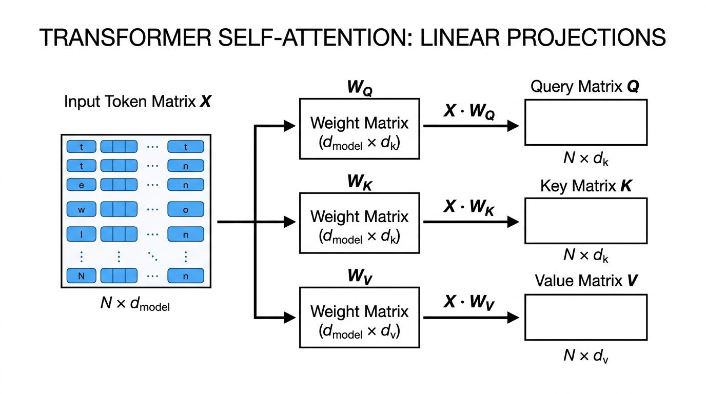

```xml
<svg viewBox="0 0 700 240" xmlns="http://www.w3.org/2000/svg">
  <defs>
    <marker id="arrow" viewBox="0 0 10 10" refX="6" refY="5" markerWidth="6" markerHeight="6" orient="auto-start-reverse">
      <path d="M 0 1.5 L 8 5 L 0 8.5 z" fill="#4B5563"/>
    </marker>
  </defs>
  <rect x="230" y="20" width="240" height="40" rx="8" fill="#EEF2F6" stroke="#94A3B8" stroke-width="2"/>
  <text x="350" y="45" font-family="monospace" font-size="14" font-weight="bold" fill="#1E293B" text-anchor="middle">Input Matrix X [N × d_model]</text>

  <line x1="280" y1="60" x2="130" y2="110" stroke="#64748B" stroke-width="2" marker-end="url(#arrow)"/>
  <line x1="350" y1="60" x2="350" y2="110" stroke="#64748B" stroke-width="2" marker-end="url(#arrow)"/>
  <line x1="420" y1="60" x2="570" y2="110" stroke="#64748B" stroke-width="2" marker-end="url(#arrow)"/>

  <!-- Weights -->
  <rect x="60" y="110" width="140" height="40" rx="6" fill="#DBEAFE" stroke="#3B82F6" stroke-width="2"/>
  <text x="130" y="135" font-family="monospace" font-size="13" font-weight="bold" fill="#1E40AF" text-anchor="middle">W_Q [d_model × d_k]</text>

  <rect x="280" y="110" width="140" height="40" rx="6" fill="#DCFCE7" stroke="#22C55E" stroke-width="2"/>
  <text x="350" y="135" font-family="monospace" font-size="13" font-weight="bold" fill="#166534" text-anchor="middle">W_K [d_model × d_k]</text>

  <rect x="500" y="110" width="140" height="40" rx="6" fill="#FEF3C7" stroke="#F59E0B" stroke-width="2"/>
  <text x="570" y="135" font-family="monospace" font-size="13" font-weight="bold" fill="#92400E" text-anchor="middle">W_V [d_model × d_v]</text>

  <line x1="130" y1="150" x2="130" y2="190" stroke="#3B82F6" stroke-width="2" marker-end="url(#arrow)"/>
  <line x1="350" y1="150" x2="350" y2="190" stroke="#22C55E" stroke-width="2" marker-end="url(#arrow)"/>
  <line x1="570" y1="150" x2="570" y2="190" stroke="#F59E0B" stroke-width="2" marker-end="url(#arrow)"/>

  <!-- Outputs -->
  <rect x="50" y="190" width="160" height="36" rx="6" fill="#EFF6FF" stroke="#3B82F6" stroke-width="1.5"/>
  <text x="130" y="213" font-family="monospace" font-size="12" fill="#1E40AF" text-anchor="middle">Queries Q = X · W_Q</text>

  <rect x="270" y="190" width="160" height="36" rx="6" fill="#F0FDF4" stroke="#22C55E" stroke-width="1.5"/>
  <text x="350" y="213" font-family="monospace" font-size="12" fill="#166534" text-anchor="middle">Keys K = X · W_K</text>

  <rect x="490" y="190" width="160" height="36" rx="6" fill="#FFFBEB" stroke="#F59E0B" stroke-width="1.5"/>
  <text x="570" y="213" font-family="monospace" font-size="12" fill="#92400E" text-anchor="middle">Values V = X · W_V</text>
</svg>
```

#### 📐 The Mathematics & Working
The projections are simple matrix multiplications. We take the raw word vectors and multiply them by our learned grid of weights:

$$Q = X W_Q$$
$$K = X W_K$$
$$V = X W_V$$

**Exhaustive Symbol Breakdown:**
*   $X$: The input matrix (a grid holding the raw number lists for all words in the sentence).
*   $W_Q, W_K, W_V$: The learned parameter weight matrices (grids of multipliers the AI learns during training to turn raw words into Queries, Keys, and Values).
*   $Q$: The resulting matrix holding the Query vectors for all words.
*   $K$: The resulting matrix holding the Key vectors for all words.
*   $V$: The resulting matrix holding the Value vectors for all words.
*   $\in$: "Is an element of". It mathematically means "belongs to the set of".
*   $\mathbb{R}$: "Real numbers". This means the grid is filled with standard decimal numbers (positive, negative, or zero, like $2.5$ or $-1.3$).
*   $N$: Sequence length. The total number of words we are processing.
*   $d_{\text{model}}$: The size (number of slots) of the raw input word vector.
*   $d_k$: The size (number of slots) of the resulting Query and Key vectors.
*   $d_v$: The size (number of slots) of the resulting Value vector.
*   $\times$: Represents the grid dimensions. $\mathbb{R}^{N \times d_{\text{model}}}$ means a grid of real numbers with $N$ rows and $d_{\text{model}}$ columns.

**2-Sentence Plain English Logic**:
By multiplying the raw word list against three different sets of mathematical filters, we create three distinct versions of the word: an inquiry asking what information is needed, an address tag announcing what information is present, and a content payload containing the actual message. This allows a word to search for one specific grammatical relation without being forced to broadcast that same relationship as its own identity.

**Concrete Numerical Toy Example**:
Let's say we have just one word represented by a list of 2 numbers: $X = [2, 3]$.
We want to create its Query ($Q$). The AI has learned a 2x2 filter grid for $W_Q$: 
Row 1: `[1, -1]` 
Row 2: `[0, 2]`
To do matrix multiplication, we multiply the items pair by pair and add them up for each column:
*   First slot of $Q$: $(2 \times 1) + (3 \times 0) = 2 + 0 = \mathbf{2}$
*   Second slot of $Q$: $(2 \times -1) + (3 \times 2) = -2 + 6 = \mathbf{4}$
Result: The word's new Query vector is $Q = [2, 4]$.

#### 🌍 Real-World & NLP Behaviors (2 Examples)
- **Example 1: Connecting Subjects to Verbs**: In *"The chef who prepared the dishes was exhausted"*, the singular verb *"was"* must connect with *"chef"*, not the plural *"dishes"*. Through the Query filter ($W_Q$), *"was"* emits a search for a singular subject. Through the Key filter ($W_K$), *"chef"* emits a tag matching that exact search. The Value filter ($W_V$) then passes the "singular" meaning from "chef" to "was".
- **Example 2: Pronoun Resolution**: In *"The trophy didn't fit into the brown suitcase because it was too large"*, the pronoun *"it"* must figure out if it means the trophy or the suitcase. The pronoun's query specifically searches for "physical size" in earlier words. The key for *"trophy"* broadcasts "large physical bulk", causing a match and allowing *"it"* to absorb the meaning of the trophy.

---

### 2.2 Raw Compatibility Scoring ($Q K^T$)

#### 💡 Why?
- **Dynamic Content-Based Routing**: To figure out which words should talk to which other words, the AI needs a way to measure the "match" or "relevance" between every possible pair of words in the sentence.
- **Architectural Role**: The model calculates a "dot product" (a mathematical way to measure alignment) between every word's Query and every other word's Key. This results in a giant scorecard matrix ($S$) telling us exactly how strongly word A attends to word B.
- **Failure Mode Without Dot-Product Affinity**: If we couldn't measure pairwise compatibility, the model would be completely blind to relationships. It wouldn't know which adjectives apply to which nouns. It would treat sentences as an unorganized soup of words rather than a structured web of meaning.

#### 📖 Definition & Architecture
A **dot product** is the simplest way to measure alignment between two lists of numbers: you multiply matching numbers pair by pair, and add all the results together into one single number. If the number is large and positive, the words are highly compatible. If it's zero or negative, they are irrelevant to each other.

When we process an entire sentence at once, we multiply the entire Query matrix by the entire Key matrix to instantly generate the compatibility score for every possible word pairing.

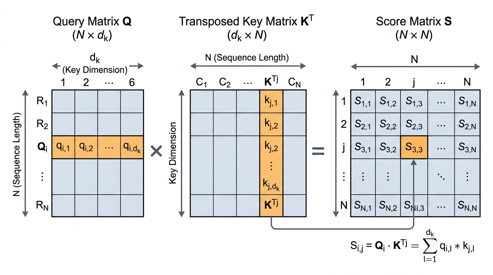

#### 📐 The Mathematics & Working
The raw compatibility scoring formula is:

$$S_{\text{raw}} = Q K^T$$

To find the specific score $s_{i,j}$ between a single searching word $i$ and a target word $j$, the formula is:

$$s_{i,j} = q_i k_j^T = \sum_{m=1}^{d_k} q_{i,m} k_{j,m}$$

**Exhaustive Symbol Breakdown:**
*   $S_{\text{raw}}$: The resulting square grid of raw compatibility scores between every pair of words.
*   $Q$: The matrix of all queries.
*   $K$: The matrix of all keys.
*   $T$: The **Transpose** symbol. It means we flip the Key grid sideways (turning rows into columns) so the mathematical rules of matrix multiplication align perfectly with the Query grid.
*   $s_{i,j}$: The single raw score representing how much word $i$ (the searcher) cares about word $j$ (the target).
*   $q_i$: The query list of numbers for word $i$.
*   $k_j^T$: The flipped key list of numbers for word $j$.
*   $\sum$: Capital Greek letter Sigma. In math, it stands for a **summation loop** (go through a list of items, do a math operation on each, and add them all up).
*   $m=1$: The starting counter for our loop (start at item 1 in the list).
*   $d_k$: The stopping point for our loop (stop when we reach the end of the query/key list).
*   $q_{i,m}$: The exact number sitting at slot $m$ in word $i$'s query.
*   $k_{j,m}$: The exact number sitting at slot $m$ in word $j$'s key.

**2-Sentence Plain English Logic**:
The model calculates the affinity between every pair of words by multiplying each word's query numbers against every other word's key numbers, slot by slot, and adding up the results. The higher the final total number, the more strongly the searching word believes the target word holds the context it desperately needs.

**Concrete Numerical Toy Example**:
Let's find the score between Word 1 (the searcher) and Word 2 (the target).
*   Word 1's Query vector ($q_1$): `[2, 4]`
*   Word 2's Key vector ($k_2$): `[1, 2]`
To do the dot product (the $\sum$ formula):
1. Multiply slot 1: $2 \times 1 = 2$
2. Multiply slot 2: $4 \times 2 = 8$
3. Add them together: $2 + 8 = \mathbf{10}$
The raw compatibility score ($s_{1,2}$) between Word 1 and Word 2 is **10**.

#### 🌍 Real-World & NLP Behaviors (2 Examples)
- **Example 1: Prepositional Phrase Attachment**: In the sentence *"She saw the man with a telescope"*, the phrase *"with a telescope"* could modify "saw" (she used a telescope to see) or "man" (the man was holding a telescope). The math calculates the score between the query for "with" and the keys for both "saw" and "man". Whichever produces the larger score decides how the AI interprets the sentence.
- **Example 2: Polysemy Disambiguation**: In *"He deposited money along the river bank"*, the word "bank" has multiple meanings. The query for "bank" computes scores against the key for "deposited" (finance) and the key for "river" (geography). The context word that generates a higher dot product "wins", steering the AI toward the correct definition.

---

### 2.3 Variance Scaling Factor ($1 / \sqrt{d_k}$)

#### 💡 Why?
- **Preventing Math Explosions**: When we calculate the dot product for very long lists of numbers, we are adding up dozens or hundreds of multiplications. The final score can become massively huge (like +50 or -50). 
- **Architectural Role**: We divide the raw scores by a specific shrinking factor (the square root of the list length, $\sqrt{d_k}$) to forcefully shrink the numbers back down to a safe, small range.
- **Failure Mode Without Scaling**: If we don't shrink the numbers, the massive scores will cause the next step of the math (the exponential percentages) to totally break. The model would give 100% of its attention to the single highest score and 0% to everything else. The learning process would freeze entirely, and the AI would stop getting smarter during training.

#### 📖 Definition & Architecture
In statistics, when you add up many random numbers, the "variance" (how wildly the final sum swings) grows proportionally to the number of items you added. If you add 128 items, the variance becomes 128. 

To fix this, we divide the result by the square root of that size. By dividing by $\sqrt{d_k}$, we guarantee the variance is magically reset back down to a stable baseline of 1.0, keeping the AI's internal numbers healthy and well-behaved.

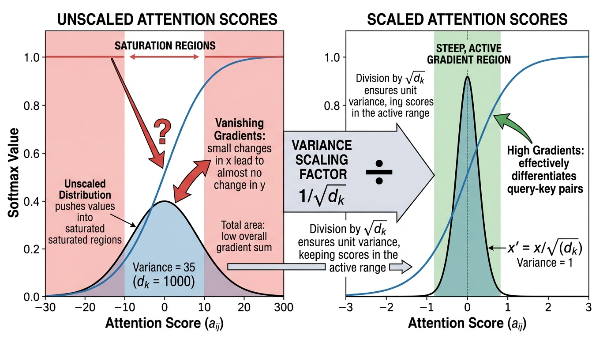

#### 📐 The Mathematics & Working
The scaled scorecard matrix $S$ is computed as:

$$S = \frac{Q K^T}{\sqrt{d_k}}$$

If we write out the statistical rules behind this, it looks like this:

$$q_{i,m}, k_{j,m} \sim \text{i.i.d. } \mathcal{N}(0, 1) \implies \mathbb{E}[s_{i,j}] = 0, \quad \text{Var}(s_{i,j}) = 1$$

**Exhaustive Symbol Breakdown:**
*   $S$: The new matrix of safe, scaled down compatibility scores.
*   $Q K^T$: Our raw dot product score from the previous step.
*   $\sqrt{}$: The mathematical **square root** symbol (what number multiplied by itself equals $d_k$).
*   $d_k$: The length of the query/key list (the number of dimensions).
*   $q_{i,m}, k_{j,m}$: The individual numbers inside the query and key lists.
*   $\sim$: "Is distributed as". It means the numbers follow a specific pattern.
*   $\text{i.i.d.}$: "Independent and identically distributed". A fancy way of saying every single number is randomly rolled completely on its own, using the exact same dice.
*   $\mathcal{N}$: The "Normal Distribution" (the classic Bell Curve).
*   $0$: The center average of our bell curve.
*   $1$: The "spread" or variance of the curve.
*   $\implies$: "Implies" or "leads to".
*   $\mathbb{E}$: "Expected value" (the average outcome we expect to get).
*   $\text{Var}$: "Variance" (the measure of how wildly the numbers swing away from the average).

**2-Sentence Plain English Logic**:
Multiplying and adding up long lists of numbers causes the total score to blow up to extreme values, which would freeze the model's ability to learn. Dividing the result by the square root of the list's length acts like an air-conditioner, shrinking the numbers back into a safe, cool range where the system runs smoothly.

**Concrete Numerical Toy Example**:
Imagine our vectors have a length of 4 dimensions ($d_k = 4$).
*   Our raw dot product score from the previous step is **10**.
*   We need to scale it by dividing by $\sqrt{d_k}$.
*   The square root of 4 is 2 (because $2 \times 2 = 4$).
*   We divide the raw score: $10 / 2 = \mathbf{5}$.
The extreme score of 10 has been safely cooled down to **5**.

#### 🌍 Real-World & NLP Behaviors (2 Examples)
- **Example 1: Initial Training of Large Models**: When training massive models like LLaMA-3 (which has a dimension length of 128), if engineers forget to divide by $\sqrt{128}$, the AI immediately crashes within the first few minutes of training because the internal numbers hit the maximum limit of computer chips.
- **Example 2: Multi-Word Soft Focus**: When translating a phrase like *"kick the bucket"* into Spanish, the AI needs to spread its attention across all three words at the same time to realize it's an idiom meaning "to die". The scaling factor prevents the attention from snapping to 100% on just the word "bucket", allowing a soft blending of meaning.

---

### 2.4 Softmax Normalization

#### 💡 Why?
- **Creating a Percentage Budget**: The scaled scores we just calculated are arbitrary decimals (like 5.0, -1.2, 0.4). To properly blend word meanings together, we need to convert these random numbers into clean percentages (fractions that must add up to exactly 1.0, or 100%).
- **Architectural Role**: Applying a mathematical function called **Softmax** forces all the scores in a row to compete against each other for a piece of a 100% pie.
- **Failure Mode Without Softmax**: If we just used the raw decimals, the numbers would fluctuate wildly. A sentence with 100 words would generate massive totals compared to a sentence with 3 words, leading to chaotic outputs. Softmax forces a strict, stable limit where assigning a high percentage to one word forces the AI to assign lower percentages to the rest.

#### 📖 Definition & Architecture
The Softmax function uses exponentiation (Euler's number $e$). Exponentiation is fantastic because:
1. It turns all negative numbers into small positive fractions (we can't have negative percentages).
2. It aggressively rewards higher numbers, creating a sharp contrast between "good" matches and "bad" matches.

After exponentiating all the scores, Softmax divides each one by the total sum of all exponentiated scores. This guarantees they will perfectly add up to 1.0 (100%).

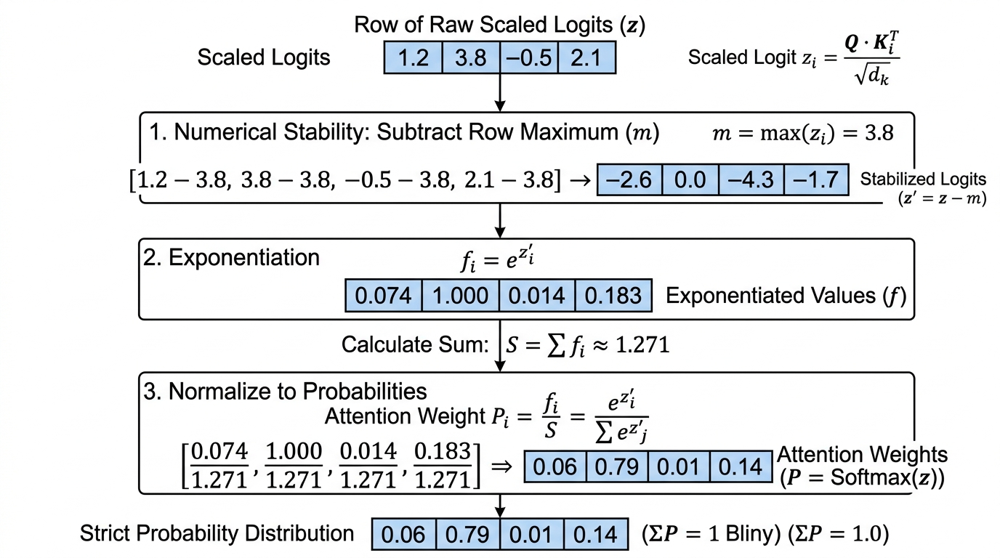

#### 📐 The Mathematics & Working
The finalized Attention weight matrix $A$ is formulated as:

$$A = \text{softmax}\left(\frac{Q K^T}{\sqrt{d_k}}\right)$$

To calculate the specific percentage $A_{i,j}$ that word $i$ gives to word $j$:

$$A_{i,j} = \frac{\exp\left(s_{i,j}\right)}{\sum_{l=1}^N \exp\left(s_{i,l}\right)}$$

Subject to the strict percentage rules:

$$\forall i, j: \quad 0 \le A_{i,j} \le 1, \quad \text{and} \quad \sum_{j=1}^N A_{i,j} = 1.0$$

**Exhaustive Symbol Breakdown:**
*   $A$: The final Attention matrix (a grid where every row is a list of percentages adding up to 100%).
*   $A_{i,j}$: The exact percentage of attention that word $i$ spends looking at word $j$.
*   $\text{softmax}$: The mathematical function we are defining to convert scores to percentages.
*   $\exp()$: Exponentiation. It means taking Euler's number ($e \approx 2.718$) and raising it to the power of the score inside the parentheses. This makes everything positive.
*   $s_{i,j}$: The safe, scaled score between word $i$ and word $j$ from the previous step.
*   $\sum_{l=1}^N$: A loop that adds up the exponentiated scores of ALL $N$ words in the sentence to create our denominator (the total).
*   $\forall$: "For all" or "for every".
*   $\le$: "Less than or equal to". The rule states that every single percentage must be between 0 (0%) and 1 (100%).

**2-Sentence Plain English Logic**:
The softmax operation turns arbitrary compatibility numbers into a percentage-based budget that sums up to exactly one hundred percent for each word. This forces the model to make trade-offs by deciding exactly what fraction of its limited attention budget to allocate to each word in the sentence.

**Concrete Numerical Toy Example**:
Imagine Word 1 has calculated scaled scores for two words. 
*   Score for Target A = **5**
*   Score for Target B = **3**
1. Apply $\exp$:
   * $e^5 \approx 148.4$
   * $e^3 \approx 20.1$
2. Find the total sum: $148.4 + 20.1 = \mathbf{168.5}$
3. Divide each by the total to get percentages:
   * Target A: $148.4 / 168.5 \approx \mathbf{0.88}$ (or **88%**)
   * Target B: $20.1 / 168.5 \approx \mathbf{0.12}$ (or **12%**)
Notice how 88% + 12% = 100%!

#### 🌍 Real-World & NLP Behaviors (2 Examples)
- **Example 1: Long-Context Distraction**: If an AI is reading a massive 30,000-word book to find one specific fact, many irrelevant words might get a tiny positive score. When Softmax adds up the total denominator, those thousands of tiny numbers create a huge total sum. This dilutes the percentage assigned to the actual "needle in the haystack" fact, dropping it from 95% to 5%, which is why AI sometimes forgets facts in long documents.
- **Example 2: Grammar Mapping**: Scientists looking inside AI brains have found that Softmax creates exact grammar maps. If a verb is looking for its direct object, the Softmax budget will aggressively put over 90% of its probability mass strictly on the correct noun, mimicking human sentence diagramming.

---

### 2.5 Weighted Value Aggregation

#### 💡 Why?
- **Synthesizing Meaning**: Up until this point, all we have are percentage scores (like 88% and 12%). But percentages alone contain no actual meaning or facts! The network must use those percentages to mix together the actual content (the **Values**) of the words to produce a brand-new, updated understanding of the sentence.
- **Architectural Role**: The final stage takes the Value vectors ($V$) we created in Step 1, and blends them together based on the attention percentages ($A$).
- **Failure Mode Without Value Aggregation**: If the AI stopped at the percentage matrix, the words would never actually share knowledge. The word "apple" would remain permanently frozen in its starting state, unable to learn from the surrounding sentence whether it is a fruit or a tech company.

#### 📖 Definition & Architecture
This is the grand finale of the attention mechanism. For any given word, its new, updated list of numbers is created by taking a fraction of every other word's Value vector and mixing them together like blending paint on a palette. 

If word 1 attends 88% to word A and 12% to word B, the final updated representation of word 1 is literally created by taking 88% of word A's payload and adding it to 12% of word B's payload.

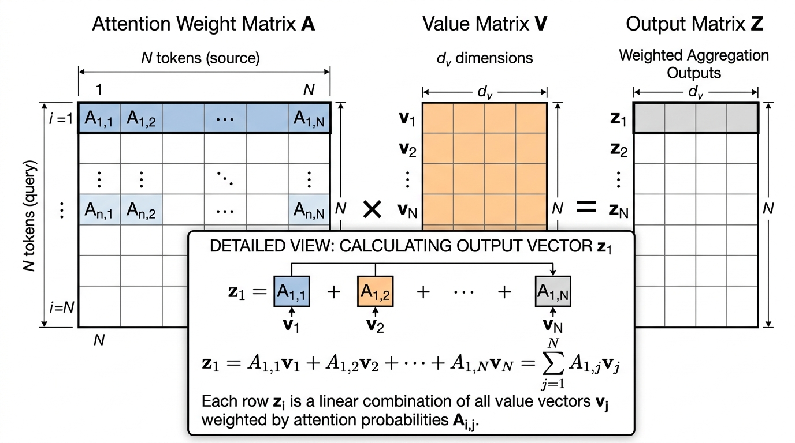

#### 📐 The Mathematics & Working
The final blending is calculated using matrix multiplication:

$$Z = A V$$

To see exactly what happens to a single word $i$, the formula is:

$$z_i = \sum_{j=1}^N A_{i,j} v_j$$

**Exhaustive Symbol Breakdown:**
*   $Z$: The final output matrix. It holds the brand-new, context-aware number lists for every word.
*   $A$: Our matrix of Softmax percentages (e.g., 0.88, 0.12).
*   $V$: The matrix of Value payloads we created back in Step 2.1.
*   $z_i$: The final updated vector (list of numbers) for word $i$.
*   $\sum_{j=1}^N$: A loop that goes through all $N$ words in the sentence and adds their pieces together.
*   $A_{i,j}$: The percentage of attention word $i$ gives to word $j$.
*   $v_j$: The Value vector (payload list) of word $j$.

**2-Sentence Plain English Logic**:
The model uses the percentage scores from the softmax step to mix together the actual content payloads of every word in the sentence. Each word ends up with a newly updated meaning built from a custom recipe of information collected across the entire text.

**Concrete Numerical Toy Example**:
Let's find the final updated meaning for Word 1 ($z_1$).
*   From Step 4, Word 1's attention percentages are: 88% on Target A, and 12% on Target B. ($A = [0.88, 0.12]$)
*   Target A's Value payload is: $v_A = [10, 0]$.
*   Target B's Value payload is: $v_B = [0, 10]$.
We multiply each payload by its percentage, and add them:
1. Mix Target A: $0.88 \times [10, 0] = [8.8, 0]$
2. Mix Target B: $0.12 \times [0, 10] = [0, 1.2]$
3. Add them together: $[8.8, 0] + [0, 1.2] = \mathbf{[8.8, 1.2]}$
Word 1's final updated vector $z_1$ is **[8.8, 1.2]**. It successfully absorbed a lot of information from Target A, and a little bit from Target B!

#### 🌍 Real-World & NLP Behaviors (2 Examples)
- **Example 1: Contextual Word Sense**: In *"Apple released the new M4 MacBook Pro"*, the starting vector for *"Apple"* is a confused mixture of "fruit" and "corporation". But during Value Aggregation, *"Apple"* places 90% of its attention on *"MacBook"* and *"released"*. It mathematically pulls their tech-related Value vectors into itself, completely shifting its final state $Z$ toward computers and commerce.
- **Example 2: Translation Alignment**: When translating a sentence from Spanish to English, the English word being generated blends the Value vectors of the Spanish words. By aggregating the payloads of Spanish nouns and adjectives, the English word successfully absorbs crucial information like gender, plural vs. singular, and past vs. future tense.

---

# Module 3: Multi-Head & Causal Decoding

In previous chapters, we learned how "attention" allows a model to look at a whole sentence and figure out which words are related to each other. However, a single attention mechanism is like having only one pair of eyes: it can only focus on one specific pattern at a time. Furthermore, when AI writes text (generating one word at a time), it needs a strict rulebook to prevent it from looking into the future and "cheating." In this module, we will break down how AI creates multiple "brains" to read text (Multi-Head Attention), recombines their thoughts, forces time to only move forward (Causal Masking), and uses a memory trick to generate text blazingly fast (KV-Cache). 

Every concept here boils down to basic high-school addition and multiplication. Let's build it from scratch!

---

### 3.1 Multi-Head Subspace Splitting ($h$ Parallel Heads)

#### 💡 Why?
- **Multiple Simultaneous Interaction Channels**: When we read a sentence, our brain tracks many things at the exact same time. We track the grammar (verbs matching nouns), the story (who is the hero), and the emotion. If an AI only has one "attention head," it is forced to average all these different details together into a single blurry concept. 
- **Architectural Role**: "Multi-Head Attention" solves this by splitting the AI's list of numbers (vectors) into smaller chunks, giving each chunk to a different "head" (an independent calculator). Each head is free to specialize in a different task in parallel. 
- **Failure Mode Without Multi-Head Splitting**: If a model uses only one giant attention head, it mushes all context into a single average. The model completely loses the ability to track "who did what to whom" while simultaneously figuring out what the word "it" refers to. The AI's grammar and logic instantly fall apart.

#### 📖 Definition & Architecture
In 2017, the creators of the Transformer decided to run $h$ (a number of) attention heads side-by-side. Instead of doing one massive calculation, the model takes the numbers representing the words and chops them up. It uses a "projection" (a fancy word for multiplying our list of numbers by a grid of numbers to change its shape) to create separate Queries (what a word is looking for), Keys (what a word holds), and Values (the actual meaning).

These are projected to a smaller size, called $d_k$ (dimension of the key). Because each head does a fraction of the work, running 8 small heads takes the exact same amount of computer power as running 1 giant head, but makes the model 8 times smarter!

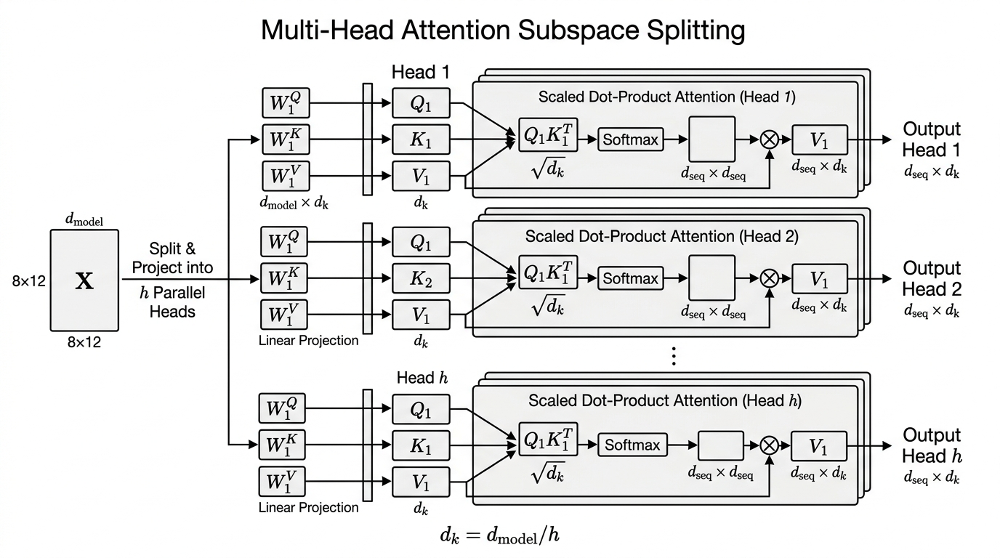

#### 📐 The Mathematics & Working

The math for splitting the model into multiple heads looks like this:

$$\text{head}_i = \text{Attention}(X W_i^Q, X W_i^K, X W_i^V) = \text{softmax}\left(\frac{(X W_i^Q)(X W_i^K)^\top}{\sqrt{d_k}}\right) (X W_i^V)$$

**Exhaustive Symbol-by-Symbol Breakdown:**
*   $\text{head}_i$: The output result for one specific attention head (where $i$ is the counter, like Head 1, Head 2, etc.).
*   $X$: The Input sequence tensor (a 2D grid/spreadsheet of numbers representing all the words in our sentence).
*   $W_i^Q$: The Query projection matrix (a grid of numbers we multiply our input by to create the "search query" for head $i$).
*   $W_i^K$: The Key projection matrix (a grid of numbers we multiply our input by to create the "tags" or "keys" for head $i$).
*   $W_i^V$: The Value projection matrix (a grid of numbers we multiply our input by to create the "actual meaning" for head $i$).
*   $(X W_i^Q)$: The actual calculated Query numbers after the multiplication.
*   $(X W_i^K)^\top$: The calculated Key numbers. The superscript $\top$ (Transpose) means we take our horizontal rows of numbers and flip them vertically into columns. We do this so our rows line up perfectly with the Query columns for multiplication.
*   $\sqrt{d_k}$: The square root of the number of features in the head. We divide by this to shrink our numbers down, preventing them from growing so large that the computer gets stuck.
*   $\text{softmax}$: A mathematical function that turns any list of numbers into percentages (probabilities) that perfectly add up to 100% (or $1.0$).
*   $(X W_i^V)$: The calculated Value numbers that we will mix together based on the percentages from the softmax.

**2-Sentence Plain-English Logic**:
Instead of having one single observer analyze the entire sentence, the model divides its thinking space into multiple parallel experts who each look at the sentence through different lenses. One expert can track who is performing the action, while another simultaneously monitors when and where the action takes place.

**Concrete Numerical Toy Walk-through:**
Imagine we have 1 token (word), and its meaning is represented by a list of 4 numbers (a vector): $X = [2, 4, 6, 8]$.
We want to split this into $h=2$ parallel heads. This means each head will look at a list of 2 numbers.

Let's look at Head 1. We multiply $X$ by a simple matrix $W_1^Q$ designed to just grab the first two numbers, making the Query for Head 1: $Q_1 = [2, 4]$.
Assume its Key is $K_1 = [1, 2]$.
Let's find the "dot product" (how well they match) by multiplying matching positions and adding them up:
*   First numbers: $2 \times 1 = 2$
*   Second numbers: $4 \times 2 = 8$
*   Total score = $2 + 8 = 10$.

Now look at Head 2. We multiply $X$ by $W_2^Q$ to grab the last two numbers. The Query for Head 2 is $Q_2 = [6, 8]$.
Assume its Key is $K_2 = [0, 1]$.
Let's find the dot product:
*   First numbers: $6 \times 0 = 0$
*   Second numbers: $8 \times 1 = 8$
*   Total score = $0 + 8 = 8$.

Head 1 calculated a score of 10 for whatever it was looking for, while Head 2 calculated a score of 8 for its entirely different task! They worked totally independently.

#### 🌍 Real-World & NLP Behaviors (2 Examples)
- **Example 1: Specialized Syntactic and Positional Induction**: When researchers peek inside the "brains" of models like GPT, they find that specific heads have specific jobs. For example, Head 1 in Layer 3 might strictly look at the previous word (position $i-1$), while Head 12 specializes entirely in tracking grammatical parent-child rules (like linking a verb to its noun).
- **Example 2: Multi-Hop Question Answering**: When you ask Claude, *"Where was the author of 'Hamlet' born?"*, one attention head acts as a literature expert, linking *"author of 'Hamlet'"* to *"William Shakespeare"*. At the exact same moment, a second attention head acts as a geography expert, tracking the location query linking *"born"* to *"Stratford-upon-Avon"*.

---

### 3.2 Output Linear Projection ($W_O$)

#### 💡 Why?
- **Subspace Integration and Dimensional Re-alignment**: After all our separate heads finish their independent jobs, we have a bunch of separate small lists of numbers. The model needs a way to glue these lists back together, mix their discoveries, and get back to the original size of the data highway (the main residual stream) so it can move to the next layer.
- **Architectural Role**: We use an "Output Projection Matrix" (a big spreadsheet of weights labeled $W^O$) to mathematically mix the glued-together results.
- **Failure Mode Without Output Projection**: If we just blindly glued the numbers together without mixing them, Head 1 would never share information with Head 2. Furthermore, if the sizes didn't perfectly match our main data highway, the math would crash, because you cannot add a list of 4 numbers to a list of 6 numbers.

#### 📖 Definition & Architecture
After our $h$ (number of) heads produce their output lists of numbers, we paste them side-by-side. This is called "concatenation". 

If Head 1 outputs $[A, B]$ and Head 2 outputs $[C, D]$, gluing them together gives us $[A, B, C, D]$. 

Then, we multiply this glued list by our matrix $W^O$. This creates a final, perfectly blended list of numbers where the insights from Head 1 and Head 2 have influenced each other, ready to be sent deeper into the neural network.

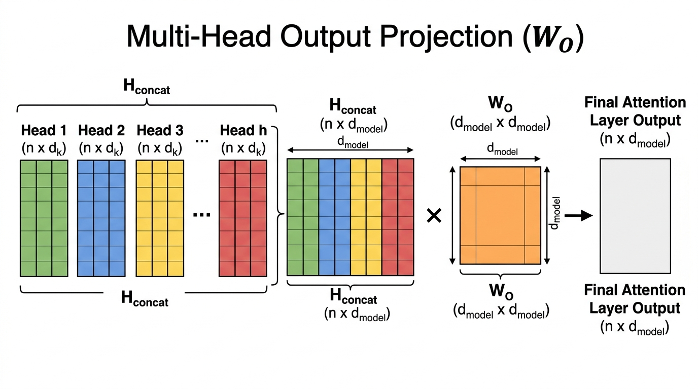

#### 📐 The Mathematics & Working

The math for the output linear projection is expressed as:

$$Z_{\text{out}} = [\text{head}_1 \,\|\, \text{head}_2 \,\|\, \dots \,\|\, \text{head}_h] W^O = \sum_{i=1}^h \text{head}_i W_i^O$$

**Exhaustive Symbol-by-Symbol Breakdown:**
*   $Z_{\text{out}}$: The final combined output tensor (grid of numbers) that will be sent to the next layer of the AI.
*   $=$: Equals sign, meaning the left side is exactly the same as calculating the right side.
*   $[\dots]$: Brackets indicating a grouping of items.
*   $\text{head}_1, \text{head}_2$: The output lists of numbers from our individual attention heads.
*   $\|$: The mathematical symbol for "concatenation" (gluing lists side-by-side).
*   $h$: The total number of parallel attention heads.
*   $W^O$: The Output Linear Projection Weight matrix (a grid of learned numbers that mixes the glued-together heads back to the correct size).
*   $\sum$: Capital Greek letter Sigma, which stands for "summation". It means "loop through and add everything together."
*   $i=1$: The starting counter for the summation loop (start at head 1).
*   $W_i^O$: The specific slice of the mixing matrix $W^O$ that applies only to the $i$-th head.

**2-Sentence Plain-English Logic**:
Once all the separate attention heads finish their individual analyses, their answers are lined up side by side and passed through a final mixing matrix. This step synthesizes all their separate observations into a single unified summary that fits directly back into the main network highway.

**Concrete Numerical Toy Walk-through:**
Let's say we have 2 heads. 
Head 1 finishes its math and spits out the numbers: $[10, 20]$.
Head 2 finishes its math and spits out the numbers: $[30, 40]$.

First, we concatenate ($\|$) them:
$[10, 20] \,\|\, [30, 40] = [10, 20, 30, 40]$.

Now, we must mix them using $W^O$ to shrink them back down to a list of just 2 numbers for our main highway. We will multiply our 4 numbers by a small matrix of weights. Let's make the weights very simple for this example. We want the first final number to just be the sum of everything, and the second final number to be the sum of everything.
*   $10 \times 1 = 10$
*   $20 \times 1 = 20$
*   $30 \times 1 = 30$
*   $40 \times 1 = 40$
Summing them up: $10 + 20 + 30 + 40 = 100$.

Our final blended output $Z_{\text{out}}$ is $[100, 100]$. The insights from Head 1 (the 10 and 20) and Head 2 (the 30 and 40) are now fully combined!

#### 🌍 Real-World & NLP Behaviors (2 Examples)
- **Example 1: Cross-Head Feature Cancellation and Conflict Resolution**: Imagine Head 2 thinks the word "watch" is a noun (a wristwatch), but Head 5 thinks "watch" is a verb (to look at). The mixing matrix $W^O$ contains positive and negative weights that let these two heads debate. The matrix mathematically subtracts the weaker head's confidence, resolving the ambiguity before the network continues.
- **Example 2: Residual Stream Alignment in Instruction Tuning**: In studies of models following instructions, researchers found that $W^O$ acts like a steering wheel. It writes specific commands into the data highway so that the exact right "neurons" light up later down the road to trigger a helpful, chatty response instead of a random one.

---

### 3.3 Causal Triangular Attention Masking

#### 💡 Why?
- **Preserving Autoregressive Causality**: "Autoregressive" simply means predicting one word at a time, and feeding each newly generated word back into the input to predict the next one. When generating language left-to-right, the AI must *never* be allowed to look at future words to guess the current word.
- **Architectural Role**: To prevent cheating during training (when we show the model a whole document at once to speed things up), we apply an "additive mask" (a grid of blockers). We replace the connection score for any future word with $-\infty$ (negative infinity). 
- **Failure Mode Without Causal Masking**: If we don't block the future, the word "The" will peek ahead at the word "Apple" to learn that the next word is "Apple". The model will get a perfect score during training, but when you put it in the real world to generate a new sentence from scratch, it will crash and output total garbage because there is no "future text" for it to peek at.

#### 📖 Definition & Architecture
During training, Transformers process all words at the exact same time using massive grids of numbers. To make sure word 1 cannot see word 2, we use a Causal Mask matrix $M$ (a 2D grid). 

In this grid, any position representing a "past" or "current" word is given a score of $0$ (meaning "do nothing, allow the connection"). Any position representing a "future" word is given a score of $-\infty$. 

Why negative infinity? Because the next step is `softmax`, a function that turns scores into percentages. In the math of exponents, $e^{-\infty} = 0$. This forces the percentage chance of looking at a future word to become exactly $0\%$.


```xml
<svg viewBox="0 0 620 220" xmlns="http://www.w3.org/2000/svg">
  <defs>
    <style>
      .cell-text { font-family: monospace; font-size: 13px; text-anchor: middle; }
      .header-text { font-family: sans-serif; font-size: 13px; font-weight: bold; text-anchor: middle; }
    </style>
  </defs>
  
  <text x="140" y="25" class="header-text" fill="#1E293B">Attention Mask M</text>
  <!-- 4x4 Grid for M -->
  <!-- Row 1 -->
  <rect x="50" y="40" width="45" height="35" fill="#DCFCE7" stroke="#86EFAC"/>
  <text x="72.5" y="62" class="cell-text" fill="#166534">0</text>
  <rect x="95" y="40" width="45" height="35" fill="#FEE2E2" stroke="#FCA5A5"/>
  <text x="117.5" y="62" class="cell-text" fill="#991B1B">-∞</text>
  <rect x="140" y="40" width="45" height="35" fill="#FEE2E2" stroke="#FCA5A5"/>
  <text x="162.5" y="62" class="cell-text" fill="#991B1B">-∞</text>
  <rect x="185" y="40" width="45" height="35" fill="#FEE2E2" stroke="#FCA5A5"/>
  <text x="207.5" y="62" class="cell-text" fill="#991B1B">-∞</text>
  <!-- Row 2 -->
  <rect x="50" y="75" width="45" height="35" fill="#DCFCE7" stroke="#86EFAC"/>
  <text x="72.5" y="97" class="cell-text" fill="#166534">0</text>
  <rect x="95" y="75" width="45" height="35" fill="#DCFCE7" stroke="#86EFAC"/>
  <text x="117.5" y="97" class="cell-text" fill="#166534">0</text>
  <rect x="140" y="75" width="45" height="35" fill="#FEE2E2" stroke="#FCA5A5"/>
  <text x="162.5" y="97" class="cell-text" fill="#991B1B">-∞</text>
  <rect x="185" y="75" width="45" height="35" fill="#FEE2E2" stroke="#FCA5A5"/>
  <text x="207.5" y="97" class="cell-text" fill="#991B1B">-∞</text>
  <!-- Row 3 -->
  <rect x="50" y="110" width="45" height="35" fill="#DCFCE7" stroke="#86EFAC"/>
  <text x="72.5" y="132" class="cell-text" fill="#166534">0</text>
  <rect x="95" y="110" width="45" height="35" fill="#DCFCE7" stroke="#86EFAC"/>
  <text x="117.5" y="132" class="cell-text" fill="#166534">0</text>
  <rect x="140" y="110" width="45" height="35" fill="#DCFCE7" stroke="#86EFAC"/>
  <text x="162.5" y="132" class="cell-text" fill="#166534">0</text>
  <rect x="185" y="110" width="45" height="35" fill="#FEE2E2" stroke="#FCA5A5"/>
  <text x="207.5" y="132" class="cell-text" fill="#991B1B">-∞</text>
  <!-- Row 4 -->
  <rect x="50" y="145" width="45" height="35" fill="#DCFCE7" stroke="#86EFAC"/>
  <text x="72.5" y="167" class="cell-text" fill="#166534">0</text>
  <rect x="95" y="145" width="45" height="35" fill="#DCFCE7" stroke="#86EFAC"/>
  <text x="117.5" y="167" class="cell-text" fill="#166534">0</text>
  <rect x="140" y="145" width="45" height="35" fill="#DCFCE7" stroke="#86EFAC"/>
  <text x="162.5" y="167" class="cell-text" fill="#166534">0</text>
  <rect x="185" y="145" width="45" height="35" fill="#DCFCE7" stroke="#86EFAC"/>
  <text x="207.5" y="167" class="cell-text" fill="#166534">0</text>

  <!-- Arrow -->
  <text x="290" y="115" font-family="sans-serif" font-size="22" fill="#64748B" text-anchor="middle">➔</text>
  <text x="290" y="135" font-family="monospace" font-size="11" fill="#64748B" text-anchor="middle">softmax</text>

  <!-- Softmax Probabilities -->
  <text x="470" y="25" class="header-text" fill="#1E293B">Attention Matrix A</text>
  <!-- Row 1 -->
  <rect x="380" y="40" width="45" height="35" fill="#DBEAFE" stroke="#93C5FD"/>
  <text x="402.5" y="62" class="cell-text" fill="#1E40AF">1.0</text>
  <rect x="425" y="40" width="45" height="35" fill="#F8FAFC" stroke="#CBD5E1"/>
  <text x="447.5" y="62" class="cell-text" fill="#94A3B8">0.0</text>
  <rect x="470" y="40" width="45" height="35" fill="#F8FAFC" stroke="#CBD5E1"/>
  <text x="492.5" y="62" class="cell-text" fill="#94A3B8">0.0</text>
  <rect x="515" y="40" width="45" height="35" fill="#F8FAFC" stroke="#CBD5E1"/>
  <text x="537.5" y="62" class="cell-text" fill="#94A3B8">0.0</text>
  <!-- Row 2 -->
  <rect x="380" y="75" width="45" height="35" fill="#DBEAFE" stroke="#93C5FD"/>
  <text x="402.5" y="97" class="cell-text" fill="#1E40AF">0.4</text>
  <rect x="425" y="75" width="45" height="35" fill="#DBEAFE" stroke="#93C5FD"/>
  <text x="447.5" y="97" class="cell-text" fill="#1E40AF">0.6</text>
  <rect x="470" y="75" width="45" height="35" fill="#F8FAFC" stroke="#CBD5E1"/>
  <text x="492.5" y="97" class="cell-text" fill="#94A3B8">0.0</text>
  <rect x="515" y="75" width="45" height="35" fill="#F8FAFC" stroke="#CBD5E1"/>
  <text x="537.5" y="97" class="cell-text" fill="#94A3B8">0.0</text>
  <!-- Row 3 -->
  <rect x="380" y="110" width="45" height="35" fill="#DBEAFE" stroke="#93C5FD"/>
  <text x="402.5" y="132" class="cell-text" fill="#1E40AF">0.2</text>
  <rect x="425" y="110" width="45" height="35" fill="#DBEAFE" stroke="#93C5FD"/>
  <text x="447.5" y="132" class="cell-text" fill="#1E40AF">0.5</text>
  <rect x="470" y="110" width="45" height="35" fill="#DBEAFE" stroke="#93C5FD"/>
  <text x="492.5" y="132" class="cell-text" fill="#1E40AF">0.3</text>
  <rect x="515" y="110" width="45" height="35" fill="#F8FAFC" stroke="#CBD5E1"/>
  <text x="537.5" y="132" class="cell-text" fill="#94A3B8">0.0</text>
  <!-- Row 4 -->
  <rect x="380" y="145" width="45" height="35" fill="#DBEAFE" stroke="#93C5FD"/>
  <text x="402.5" y="167" class="cell-text" fill="#1E40AF">0.1</text>
  <rect x="425" y="145" width="45" height="35" fill="#DBEAFE" stroke="#93C5FD"/>
  <text x="447.5" y="167" class="cell-text" fill="#1E40AF">0.3</text>
  <rect x="470" y="145" width="45" height="35" fill="#DBEAFE" stroke="#93C5FD"/>
  <text x="492.5" y="167" class="cell-text" fill="#1E40AF">0.2</text>
  <rect x="515" y="145" width="45" height="35" fill="#DBEAFE" stroke="#93C5FD"/>
  <text x="537.5" y="167" class="cell-text" fill="#1E40AF">0.4</text>
</svg>
```

#### 📐 The Mathematics & Working

The causally masked attention equation is:

$$A_{\text{causal}} = \text{softmax}\left(\frac{Q K^\top}{\sqrt{d_k}} + M\right)$$

Where the masking rule $M$ is written logically as:

$$M_{i,j} = \begin{cases} 0 & \text{if } j \le i \\ -\infty & \text{if } j > i \end{cases}$$

**Exhaustive Symbol-by-Symbol Breakdown:**
*   $A_{\text{causal}}$: The final Attention matrix (a grid of percentages) where the future is blocked out.
*   $\text{softmax}$: The mathematical function that turns scores into percentages that add up to 1.0 (or 100%).
*   $Q K^\top$: Our Query matrix multiplied by our flipped Key matrix (this calculates the raw matching scores between all words).
*   $\sqrt{d_k}$: The square root of the head dimension (shrinking factor to keep numbers stable).
*   $+$: Addition symbol. We add our mask directly to the raw scores.
*   $M$: The Causal Mask matrix (a grid filled with either $0$ or $-\infty$).
*   $M_{i,j}$: A specific single box inside the mask grid. $i$ is the row (the word currently looking), and $j$ is the column (the word being looked at).
*   $\begin{cases} \dots \end{cases}$: A mathematical brace meaning "choose one of these options based on the rule."
*   $0$: Number zero. Adding $0$ to a score leaves it unchanged.
*   $\text{if } j \le i$: The rule for $0$. It means "if the column number ($j$) is less than or equal to the row number ($i$)". Example: Word 2 looking at Word 1. This is the past/present, so allow it!
*   $-\infty$: Negative infinity. An infinitely huge negative number.
*   $\text{if } j > i$: The rule for $-\infty$. It means "if the column number ($j$) is strictly greater than the row number ($i$)". Example: Word 2 looking at Word 3. This is the future, so block it!

**2-Sentence Plain-English Logic**:
The causal mask blocks future words by adding negative infinity to their connection scores before running the probability calculation. Because any number plus negative infinity equals negative infinity, the mathematical percentage of looking at the future becomes exactly zero, ensuring a word can only ever look backward at what has already been said.

**Concrete Numerical Toy Walk-through:**
Imagine we have 2 words: Word 1 ("Apple") and Word 2 ("Pie").
Let's say the raw dot-product scores ($Q K^\top$) are a 2x2 grid:
*   Row 1 (Word 1 looking): scores Word 1 as `2`, and Word 2 as `5`.
*   Row 2 (Word 2 looking): scores Word 1 as `1`, and Word 2 as `3`.

Now we add our Mask $M$:
*   Row 1, Col 2 is the future ($j=2$ is greater than $i=1$), so we add $-\infty$.
    *   Word 1 looking at Word 2 becomes: $5 + (-\infty) = -\infty$.
*   Row 2, Col 1 is the past ($j=1$ is less than $i=2$), so we add $0$.
    *   Word 2 looking at Word 1 remains: $1 + 0 = 1$.

Our adjusted grid is:
Row 1: `[2, -∞]`
Row 2: `[1,  3]`

Now we apply `softmax` (which raises Euler's number $e$ to the power of our scores).
For Row 1:
*   $e^2 \approx 7.39$.
*   $e^{-\infty} = 0$.
*   Total = $7.39 + 0 = 7.39$.
*   Percentages: $7.39 / 7.39 = 1.0$ (100%), and $0 / 7.39 = 0.0$ (0%).
Word 1 gives 100% of its attention to itself, and exactly 0% to the future word! The future is completely hidden.

#### 🌍 Real-World & NLP Behaviors (2 Examples)
- **Example 1: Next-Token Prediction in Autoregressive Generation**: In GPT-4 or Claude, when generating the continuation for *"The capital of France is"*, the model must predict *"Paris"* strictly based on the words before it. The causal mask guarantees that no downstream text can bleed backward to ruin the true test of predicting the next word.
- **Example 2: Prefix Caching vs Bidirectional Prefix**: In models like T5 (used for translation), the mask is changed! The initial prompt given by the user is allowed to look in both directions (no $-\infty$ applied), but the new words the AI generates are strictly masked with $-\infty$ so it can't look ahead. This shows how swapping the mask totally changes how the AI thinks.

---

### 3.4 The KV-Cache Mechanism

#### 💡 Why?
- **Eliminating Redundant Autoregressive Computation**: When AI generates a paragraph, it writes one word at a time. Without a trick, generating word #100 would require the AI to re-read and re-calculate the math for words #1 through #99 all over again. By the time it gets to word #1000, the computer is doing millions of useless, repetitive calculations, making generation painfully slow.
- **Architectural Role**: The Key-Value (KV) Cache is a high-speed memory scratchpad. Since the past never changes, we save the "Keys" (tags) and "Values" (meanings) of words we've already processed directly into the graphics card's memory (VRAM). When generating the next word, we only calculate the new word, and simply look up the saved math for all the old words!
- **Computational Complexity Shift**: Instead of the workload growing massively larger with every single word ($O(T^2)$), the KV-Cache forces the math to stay exactly the same size for every single new word ($O(1)$). This turns a sluggish, freezing AI into a lightning-fast chatbot.

#### 📖 Definition & Architecture
Let $K_{<t}$ and $V_{<t}$ be the memory banks holding our cached Keys and Values for all past steps (up to time $t$).

At step $t$ (our current word):
1. The model only looks at the single newest word vector $x_t$.
2. It mathematically projects this one word into a Query ($q_t$), a Key ($k_t$), and a Value ($v_t$).
3. It takes the new Key and Value, and permanently pastes them into the memory bank at the bottom of the list.
4. It compares its new Query ($q_t$) against the *entire* memory bank of Keys to decide what is important.


#### 📐 The Mathematics & Working

At decode step $t$ (the current generation step), the state update and attention calculation are defined as:

$$q_t = x_t W_Q$$
$$K_{\le t} = [K_{<t} \,;\, x_t W_K]$$
$$V_{\le t} = [V_{<t} \,;\, x_t W_V]$$
$$z_t = \text{softmax}\left(\frac{q_t (K_{\le t})^\top}{\sqrt{d_k}}\right) V_{\le t}$$

**Exhaustive Symbol-by-Symbol Breakdown:**
*   $t$: The current time step (e.g., if we are generating the 5th word, $t=5$).
*   $x_t$: The input numbers (vector) representing only the newest generated token at step $t$.
*   $q_t$: The single Query vector generated right now at step $t$.
*   $W_Q, W_K, W_V$: The Weight matrices (grids of numbers) used to project our input into Queries, Keys, and Values.
*   $K_{\le t}$: The complete historical memory bank of Keys, including the past and the current step ($\le$ means less than or equal to $t$).
*   $[\dots \,;\, \dots]$: Brackets with a semicolon denoting stacking rows on top of each other. We take the old memory bank, and staple the new row to the bottom.
*   $K_{<t}$: The historical memory bank of Keys from step 1 up to step $t-1$ (strictly less than $t$).
*   $V_{\le t}$: The complete historical memory bank of Values, updated with the newest Value.
*   $z_t$: The final combined output numbers for the current word, ready to be sent to the next layer.
*   $\text{softmax}$: The probability function.
*   $\top$: Transpose (flipping the complete memory bank sideways so we can multiply it).
*   $\sqrt{d_k}$: The shrinking scale factor.

**2-Sentence Plain-English Logic**:
Instead of recomputing the memory representations of every past word each time a new word is generated, the model saves the completed keys and values in its graphics card memory. When writing the next word, it only needs to calculate a single new query for that one word and compare it against the securely saved past states.

**Concrete Numerical Toy Walk-through:**
**Step 1:** The AI reads Token 1 ("Hello"). 
It calculates Token 1's Key as $K_1 = [2, 3]$. 
We save this to our Cache: $K_{<2} = \begin{bmatrix} 2 & 3 \end{bmatrix}$.

**Step 2:** The AI wants to generate Token 2 ("World"). 
Without a cache, it would have to re-calculate "Hello". But with the cache, it ignores "Hello" entirely!
It just calculates the Query for Token 2 ("World"): Let's say $q_2 = [1, 1]$.
Now, we want to find the connection score between Token 2 and Token 1. 
We pull Token 1's Key directly out of the memory cache: $[2, 3]$.
We do the dot product:
*   $1 \times 2 = 2$
*   $1 \times 3 = 3$
*   Score = $2 + 3 = 5$.
We achieved the perfect math result using only a fraction of the calculation effort, because we just looked up the old numbers!

#### 🌍 Real-World & NLP Behaviors (2 Examples)
- **Example 1: Interactive Streaming Chat Latency**: Without a KV-cache, generating a 500-word essay for you would cause the chatbot to slow down drastically with every word. Word 5 would appear instantly, but Word 499 might take 10 seconds to appear. With a KV-cache, the time between each word appearing on your screen remains perfectly constant, allowing that smooth "typing" effect you see in ChatGPT.
- **Example 2: GPU Memory Bottlenecks & PagedAttention (vLLM)**: Because the AI is saving every Key and Value for every word, for every user, across every layer, the graphics card memory (VRAM) fills up incredibly fast. In real-world datacenters, a huge AI might consume dozens of Gigabytes of memory strictly to hold these KV caches. Engineers have invented brilliant memory management tricks (like "PagedAttention") specifically to stop servers from crashing under the sheer weight of these massive cached lists of numbers.

---

# Module 4: Signal Integrity & Normalization (The Residual Highway & Stability)

---

### 4.1 Residual Skip Connections ($x + \text{Sublayer}(x)$)

#### 💡 Why?
* **Importance:** In very deep networks (models with 32 to 128 layers, where each "layer" is a step of processing), stacking mathematical operations back-to-back causes a major problem during training. When the model tries to learn from its mistakes (a process called "backpropagation," where the error signal travels backward to correct earlier layers), the signal is multiplied over and over. If multiplied by small fractions, the signal shrinks to exactly zero ("vanishing gradients"). If multiplied by large numbers, it blows up to infinity ("exploding gradients").
* **Functional Role:** Provides a direct, uninterrupted "identity highway." This means the original data (the token, which is a word or part of a word) is allowed to pass straight through the network from the very first step all the way to the end, without being blocked or overwritten.
* **LLM Behavior Affected:** Allows the Transformer to act like a persistent "Residual Stream"—a central memory canvas. Instead of completely erasing and rewriting a word's meaning at every layer, the layers just read the current meaning, figure out a small adjustment (a tiny addition), and mix it back into the stream.

#### 📖 Definition & Architecture
Introduced in earlier image models (ResNet in 2016) and adopted universally in Transformers (the architecture behind modern AI like ChatGPT) in 2017, the idea is simple. Instead of a layer replacing the old data with new data, each sub-layer (like the Attention mechanism or the Feed-Forward Network) outputs a small adjustment that is *added* directly to the original input.

The formula for this forward step is:
$$\mathbf{x}_{\text{out}} = \mathbf{x}_{\text{in}} + \text{Sublayer}(\mathbf{x}_{\text{in}})$$

* $\mathbf{x}_{\text{out}}$: The final output vector (our ordered list of numbers representing the word) after this step is done.
* $=$: The equals sign.
* $\mathbf{x}_{\text{in}}$: The original input vector (our list of numbers) before processing.
* $+$: Mathematical addition operator. We add the lists of numbers together, pair by matching pair.
* $\text{Sublayer}$: The complex mathematical operation for this layer (such as Attention).
* $($ and $)$: Parentheses, meaning we feed the value inside into the function outside.
* $\mathbf{x}_{\text{in}}$ (inside parentheses): The input passed directly into the complex sublayer engine.

During training, we measure the model's error (called Loss, or $\mathcal{L}$) and calculate how much each layer's input needs to change to fix that error. This measurement of "how much Y changes if we tweak X" is called a gradient. The math looks like this:

$$\begin{aligned}
\frac{\partial \mathcal{L}}{\partial \mathbf{x}_{\text{in}}} &= \frac{\partial \mathcal{L}}{\partial \mathbf{x}_{\text{out}}} \cdot \left( \mathbf{I} + \frac{\partial \text{Sublayer}(\mathbf{x}_{\text{in}})}{\partial \mathbf{x}_{\text{in}}} \right) \\
&= \frac{\partial \mathcal{L}}{\partial \mathbf{x}_{\text{out}}} + \frac{\partial \mathcal{L}}{\partial \mathbf{x}_{\text{out}}} \frac{\partial \text{Sublayer}}{\partial \mathbf{x}_{\text{in}}}
\end{aligned}$$

* $\frac{}{}$: The division line, representing a mathematical ratio or fraction.
* $\partial$: The mathematical symbol for a "partial derivative" in calculus. In plain English, it just means "a tiny tweak or change in."
* $\mathcal{L}$: The Loss. A single number representing how wrong the model's final answer was.
* $\mathbf{x}_{\text{in}}$: The original input vector.
* $\frac{\partial \mathcal{L}}{\partial \mathbf{x}_{\text{in}}}$: The error signal traveling to the input. It asks: "If we slightly tweak the input $\mathbf{x}_{\text{in}}$, how much does the final error $\mathcal{L}$ go down?"
* $=$: The equals sign.
* $\mathbf{x}_{\text{out}}$: The output vector from this layer.
* $\frac{\partial \mathcal{L}}{\partial \mathbf{x}_{\text{out}}}$: The error signal that has already safely traveled backward to the output of this layer.
* $\cdot$: The multiplication operator.
* $\left( \text{ and } \right)$: Large parentheses. We calculate everything inside these first.
* $\mathbf{I}$: The Identity matrix. A "matrix" is just a 2D grid or spreadsheet of numbers. The Identity matrix acts exactly like the number $1$ in standard math (multiplying a number by $1$ changes nothing). It represents the pure, unblocked highway where the signal passes directly.
* $+$: Mathematical addition operator.
* $\text{Sublayer}$: The complex mathematical operation.
* $($ and $)$ (inner): Parentheses indicating the input being fed into the Sublayer.
* $\frac{\partial \text{Sublayer}(\mathbf{x}_{\text{in}})}{\partial \mathbf{x}_{\text{in}}}$: The error signal traveling through the complex sublayer itself. It asks: "How much does the Sublayer output change if we tweak its input?"
* $\frac{\partial \mathcal{L}}{\partial \mathbf{x}_{\text{out}}} + \frac{\partial \mathcal{L}}{\partial \mathbf{x}_{\text{out}}} \frac{\partial \text{Sublayer}}{\partial \mathbf{x}_{\text{in}}}$: The expanded version of the formula, showing standard algebra where the outer multiplication distributes to both items inside the parentheses.

Notice the unmultiplied $\frac{\partial \mathcal{L}}{\partial \mathbf{x}_{\text{out}}}$ term by itself at the end: even if the complex sublayer completely fails and blocks the signal (if its part becomes exactly $0$), the error signal still flows backwards completely unimpeded through the pure identity path!


#### 📐 The Mathematics & Working

The core rule for passing data from layer to layer is:
$$\mathbf{x}^{(l)} = \mathbf{x}^{(l-1)} + f(\mathbf{x}^{(l-1)})$$

* $\mathbf{x}$: The vector (our list of numbers representing the word).
* $^{(l)}$: A superscript label indicating the current layer number (for example, layer 5).
* $\mathbf{x}^{(l)}$: The updated list of numbers that layer $l$ will pass to the next layer.
* $=$: The equals sign.
* $^{(l-1)}$: A superscript label indicating the previous layer (for example, layer 4).
* $\mathbf{x}^{(l-1)}$: The input list of numbers coming from the previous layer.
* $+$: The addition operator. We add the two sets of numbers together, pair by pair.
* $f$: A letter representing a mathematical function (a rule or processing engine, like Attention).
* $($ and $)$: Parentheses meaning "insert the input here."
* $f(\mathbf{x}^{(l-1)})$ (inner): The small adjustment calculated by the current layer's engine.

The data flowing through this math exists as a grid:
* $\mathbf{x}^{(l-1)} \in \mathbb{R}^{N \times d_{model}}$
* $\in$: The mathematical symbol for "is an element of" (meaning the item belongs to this specific group).
* $\mathbb{R}$: The set of "Real numbers"—meaning ordinary decimal numbers (positive, negative, or zero, like $2.5$ or $-1.0$).
* $N$: The total number of words (or tokens) in our current text sentence.
* $\times$: The multiplication symbol, used here to read "by", describing the dimensions of a grid.
* $d_{model}$: The dimension (the length of the list of numbers for a single word, for example, a list of 4096 numbers).
* $\mathbb{R}^{N \times d_{model}}$: This entire expression simply describes a 2D grid (a matrix or spreadsheet) of normal decimal numbers, which has $N$ rows (one for each word) and $d_{model}$ columns (the features of each word).

**2-Sentence Working:**
Instead of forcing each layer to generate a brand new token vector from scratch, the architecture keeps the original vector intact and merely adds the layer's new edits on top of it. This creates a friction-free express lane that lets error signals travel thousands of steps backwards during training without fading away.

**Concrete Numerical Toy Example:**
Let's trace a tiny list of numbers (a vector of dimension 2) through one layer.
1. Imagine our word is represented by the input vector from the previous layer: $\mathbf{x}^{(l-1)} = [2.0, 5.0]$.
2. The sublayer processing engine $f$ looks at this input, does some complex math, and decides we need a tiny correction: $f([2.0, 5.0]) = [-0.5, 1.0]$.
3. Instead of replacing the input, we add them together pair by pair (the first number with the first number, the second with the second):
   * First number: $2.0 + (-0.5) = 1.5$
   * Second number: $5.0 + 1.0 = 6.0$
4. The final output passed to the next layer is $\mathbf{x}^{(l)} = [1.5, 6.0]$. The core identity of the numbers (around $2$ and $5$) is mostly preserved, just slightly tweaked!

#### 🌍 Real-World & NLP Behaviors (2 Examples)
1. **Preservation of Lexical Identity:** A token's fundamental dictionary identity (e.g., that it is the word `"Einstein"`) can survive unchanged through 80 layers of a massive 70-Billion parameter model because early layers don't overwrite it; they merely append subtle relational facts (like "he is a physicist") onto its residual vector.
2. **Layer Pruning Robustness:** Because layers compute tiny additive adjustments rather than total rewrites, researchers have shown that deleting 1 or 2 middle layers from a 32-layer LLaMA model causes surprisingly little performance degradation compared to non-residual networks. The highway remains intact, just missing one tiny edit.

---

### 4.2 Layer Normalization vs. RMSNorm

#### 💡 Why?
* **Importance:** As vectors pass through dozens of successive residual additions ($x + \Delta x_1 + \Delta x_2 + \dots$), their numerical magnitudes (the sheer size of the numbers) naturally drift and expand.
  * $x$: The original starting vector (list of numbers).
  * $+$: Addition operator.
  * $\Delta$: The capital Greek letter Delta, which mathematically means "a small change or difference".
  * $x_1$: The small change calculated by the 1st layer.
  * $x_2$: The small change calculated by the 2nd layer.
  * $\dots$: The mathematical symbol for "and so on, repeating this pattern".
  This constant addition causes "floating-point overflow"—a computer memory error where numbers become too huge for the computer to handle, leading to completely unstable learning.
* **Functional Role:** Normalizes (washes and resizes) the vectors across their feature slots to ensure they have a safe average and a tightly controlled spread (LayerNorm) or simply a controlled overall magnitude (RMSNorm), followed by a learnable volume dial.
* **LLM Behavior Affected:** Eliminates "internal covariate shift" (a math problem where the scale of numbers constantly changes wildly as they move deeper into the network), keeping distributions numerically stable and enabling fast, aggressive learning rates during pre-training.

#### 📖 Definition & Architecture
Unlike Batch Normalization (which normalizes across groups of text examples and fails on sentences of varying lengths), **Layer Normalization** (Ba et al., 2016) normalizes the list of numbers for a single word independently.

$$\text{LN}(\mathbf{x}) = \frac{\mathbf{x} - \mu}{\sqrt{\sigma^2 + \epsilon}} \odot \gamma + \beta$$

* $\text{LN}$: Layer Normalization function name.
* $($ and $)$: Parentheses holding the input.
* $\mathbf{x}$: The input vector (our list of numbers).
* $=$: The equals sign.
* $\frac{}{}$: The division line.
* $\mathbf{x} - \mu$: The top part of the fraction. The input list minus the mean.
* $-$: The subtraction operator.
* $\mu$: The Greek letter mu, representing the mean (the mathematical average of the numbers).
* $\sqrt{}$: The square root symbol. It asks "what positive number times itself equals this value?"
* $\sigma^2$: The Greek letter sigma squared, representing variance (a mathematical measurement of how spread out the numbers are from the average).
* $+$: The addition operator.
* $\epsilon$: The Greek letter epsilon. It represents a tiny decimal number (like $0.000001$) added purely as a safety measure so we never accidentally divide by zero.
* $\odot$: The element-wise multiplication symbol. It means multiplying lists of numbers together pair by matching pair (first times first, second times second).
* $\gamma$: The Greek letter gamma. It is a learnable volume knob (scaling factor) that the AI can adjust up or down.
* $\beta$: The Greek letter beta. It is a learnable shifting number (bias) that the AI can add.

The mean $\mu$ is calculated as:
$$\mu = \frac{1}{d} \sum x_i$$
* $\mu$: The mean (average).
* $=$: The equals sign.
* $\frac{1}{d}$: A fraction. $1$ divided by $d$.
* $d$: The dimension, which is the total count of numbers in our list (e.g., 4096).
* $\sum$: Capital Greek letter Sigma, which stands for "summation" (a mathematical loop that adds items together).
* $x_i$: A single number from our list. The subscript $i$ indicates the specific position (the 1st number, 2nd number, etc.).

The variance $\sigma^2$ is calculated as:
$$\sigma^2 = \frac{1}{d} \sum (x_i - \mu)^2$$
* $\sigma^2$: The variance (average squared distance from the mean).
* $=$: The equals sign.
* $\frac{1}{d}$: A fraction. $1$ divided by the total count $d$.
* $\sum$: Summation (a loop that adds all the calculated items together).
* $($ and $)$: Parentheses to group the subtraction so it happens first.
* $x_i$: The $i$-th individual number in the list.
* $-$: The subtraction operator.
* $\mu$: The average calculated earlier.
* $^2$: The squaring operator (multiplying a number by itself). This guarantees the distance is a positive number.

Modern frontier models (LLaMA, Mistral, Gemma, Qwen) replace LayerNorm with **RMSNorm** (Zhang & Sennrich, 2019). RMSNorm demonstrates that shifting numbers by the average $\mu$ contributes nothing to training stability; only scaling by the root-mean-square (RMS) matters:

$$\begin{aligned}
\text{RMSNorm}(\mathbf{x}) &= \frac{\mathbf{x}}{\text{RMS}(\mathbf{x})} \odot \gamma, \\
\text{where } \text{RMS}(\mathbf{x}) &= \sqrt{\frac{1}{d} \sum_{i=1}^d x_i^2 + \epsilon}
\end{aligned}$$

* $\text{RMSNorm}$: Root Mean Square Normalization function.
* $($ and $)$: Parentheses holding the input.
* $\mathbf{x}$: The input vector (list of numbers).
* $=$: The equals sign.
* $\frac{\mathbf{x}}{\text{RMS}(\mathbf{x})}$: The input list divided by its Root Mean Square value.
* $\odot$: Element-wise multiplication pair by pair.
* $\gamma$: The Greek letter gamma, representing a learnable scaling dial.
* $\text{where}$: Plain English word linking the formulas.
* $\text{RMS}$: Root Mean Square function.
* $\sqrt{}$: The square root operator.
* $\frac{1}{d}$: A fraction. $1$ divided by the total length $d$.
* $\sum_{i=1}^d$: The summation loop.
* $\sum$: Summation (add things up).
* $i=1$: The starting counter (we start at item number 1).
* $d$: The stopping point (we stop when we hit item number $d$).
* $x_i$: The individual number at position $i$.
* $^2$: The squaring operator (number times itself).
* $+$: The addition operator.
* $\epsilon$: Epsilon, the tiny safety decimal (like $0.000001$).

By dropping the mean calculation and the bias term $\beta$, RMSNorm reduces GPU memory reads/writes by ~10–50% per normalization layer with zero loss in training quality.

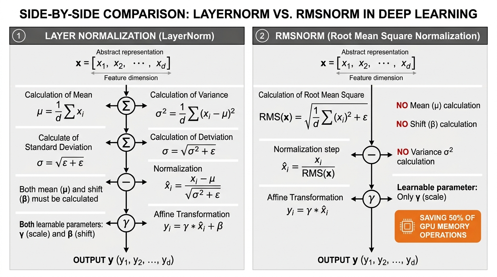

#### 📐 The Mathematics & Working
The finalized RMSNorm formula for a single number is:
$$\bar{x}_i = \frac{x_i}{\sqrt{\frac{1}{d}\sum_{j=1}^d x_j^2 + \epsilon}} \cdot \gamma_i$$

* $\bar{x}_i$: The $i$-th number of the final, processed output vector. The little bar on top ($\bar{x}$) mathematically indicates it has been modified or normalized.
* $=$: The equals sign.
* $\frac{}{}$: The large division line.
* $x_i$: The $i$-th number of the original raw input vector.
* $\sqrt{}$: The square root operator wrapping the bottom math.
* $\frac{1}{d}$: $1$ divided by the total dimension count $d$.
* $\sum_{j=1}^d$: The summation loop.
* $\sum$: Summation (add things up).
* $j=1$: The start counter (using the letter $j$ this time so we don't confuse it with $i$).
* $d$: The stop counter.
* $x_j$: The $j$-th number in the list being squared.
* $^2$: The squaring operator.
* $+$: Addition.
* $\epsilon$: Epsilon, the tiny safety decimal.
* $\cdot$: Standard mathematical multiplication symbol.
* $\gamma_i$: The exact learned volume knob (gamma) dedicated exclusively to the $i$-th position in the list.

**2-Sentence Working:**
The model calculates the average power (the root-mean-square) across all coordinates of a single word's vector and divides the vector by that number to keep its length strictly in check. It then multiplies the result by a learned volume dial so important features can still stand out when needed.

**Concrete Numerical Toy Example:**
Imagine our token vector is $\mathbf{x} = [3.0, 4.0]$. The dimension length is $d = 2$. Let's trace how RMSNorm shrinks it safely.
1. Square each number in the list to make them positive power measurements:
   * $3.0 \times 3.0 = 9.0$
   * $4.0 \times 4.0 = 16.0$
2. Sum (add) these squared numbers together: $9.0 + 16.0 = 25.0$
3. Divide by the total count $d=2$ to get the average square (mean square): $25.0 / 2 = 12.5$
4. Add a tiny safety epsilon (we will use $0.0$ for simplicity): $12.5 + 0.0 = 12.5$
5. Take the square root of this average to find the Root Mean Square (RMS): $\sqrt{12.5} \approx 3.535$
6. Finally, divide the original numbers by this RMS value to safely shrink them:
   * First number: $3.0 / 3.535 \approx 0.849$
   * Second number: $4.0 / 3.535 \approx 1.131$
7. Our normalized vector is now $[0.849, 1.131]$. Both numbers have been successfully pulled back to a safe, small size near $1.0$, preventing any computer memory explosions!

#### 🌍 Real-World & NLP Behaviors (2 Examples)
1. **Precision Stability in FP16 / BF16 Training:** When training models with 16-bit floating point precision (a computer memory format that strictly limits the maximum size a decimal number can be), unnormalized vectors quickly exceed the maximum allowed limit (which is exactly $65,504$ in FP16), resulting in `NaN` (Not a Number) training crashes. RMSNorm keeps numbers strictly bounded in a safe range near $[-3, 3]$ (meaning strictly between $-3.0$ and $+3.0$).
2. **Inference Latency Optimization:** In production LLM software (like TensorRT-LLM and vLLM), RMSNorm kernels (specialized code running on the graphics card) are fused directly (combined seamlessly in one step) into attention and FFN matrix multiplications, shaving critical milliseconds off the time it takes for the AI to generate a response.

---

### 4.3 Pre-LN vs. Post-LN Architecture

#### 💡 Why?
* **Importance:** The exact placement of the washing step (normalization) relative to the residual stream determines whether a 32-layer Transformer can train stably from step zero, or immediately suffer from gradient explosion.
* **Functional Role:** Dictates whether normalization is applied *after* the residual addition (**Post-LN**, original 2017 Transformer) or applied on the side branch *before* residual addition (**Pre-LN**, modern LLMs).
* **LLM Behavior Affected:** Pre-LN guarantees that the main residual highway remains pristine and unnormalized, allowing massive 100+ layer models to be trained smoothly with large learning rates without needing sensitive warmup schedules (tricks where the AI is forced to learn very slowly at first to avoid crashing).

#### 📖 Definition & Architecture
* **Post-LN (Original Transformer):**
  $$\mathbf{x}^{(l)} = \text{Norm}(\mathbf{x}^{(l-1)} + \text{Sublayer}(\mathbf{x}^{(l-1)}))$$
  * $\mathbf{x}$: The vector (list of numbers).
  * $^{(l)}$: Superscript marking the current output layer (e.g., layer 5).
  * $\mathbf{x}^{(l)}$: Final output list of numbers for the current layer.
  * $=$: The equals sign.
  * $\text{Norm}$: The Normalization function (washing and resizing the numbers).
  * $($ and $)$ (outer): Large outer parentheses showing that the Norm function wraps around EVERYTHING inside.
  * $^{(l-1)}$: Superscript marking the previous layer (e.g., layer 4).
  * $\mathbf{x}^{(l-1)}$: The untouched input list from the previous layer.
  * $+$: Addition operator.
  * $\text{Sublayer}$: The complex mathematical engine (like Attention).
  * $($ and $)$ (inner): Parentheses holding the input for the engine.
  * $\mathbf{x}^{(l-1)}$ (inner): The input being fed into the complex engine.

  Because $\text{Norm}$ wraps the entire sum, the gradient flowing back through the residual connection is multiplied by $\frac{1}{\sigma}$ (which is $1$ divided by the standard deviation) at every single layer. Across 30 layers, gradients decay exponentially near the input embedding, causing the first layers to barely train unless protected by hundreds of warm-up steps.

* **Pre-LN (LLaMA, GPT-3, Mistral standard):**
  $$\mathbf{x}^{(l)} = \mathbf{x}^{(l-1)} + \text{Sublayer}(\text{Norm}(\mathbf{x}^{(l-1)}))$$
  * $\mathbf{x}^{(l)}$: Final output list of numbers for the current layer.
  * $=$: The equals sign.
  * $\mathbf{x}^{(l-1)}$: Clean, unwashed input list from the previous layer. Notice it sits safely OUTSIDE the Norm function!
  * $+$: Addition operator.
  * $\text{Sublayer}$: The complex mathematical engine.
  * $($ and $)$ (outer): Parentheses holding what goes into the engine.
  * $\text{Norm}$: The Normalization function (washing and resizing).
  * $($ and $)$ (inner): Parentheses holding what goes into the wash.
  * $\mathbf{x}^{(l-1)}$: The input being fed into the washing step. Only a *copy* gets washed and sent into the sublayer!

  Here, the residual highway passes through completely untouched ($\mathbf{x}^{(l-1)} + \dots$). Normalization only acts on the side branch right before entering Attention or FFN!

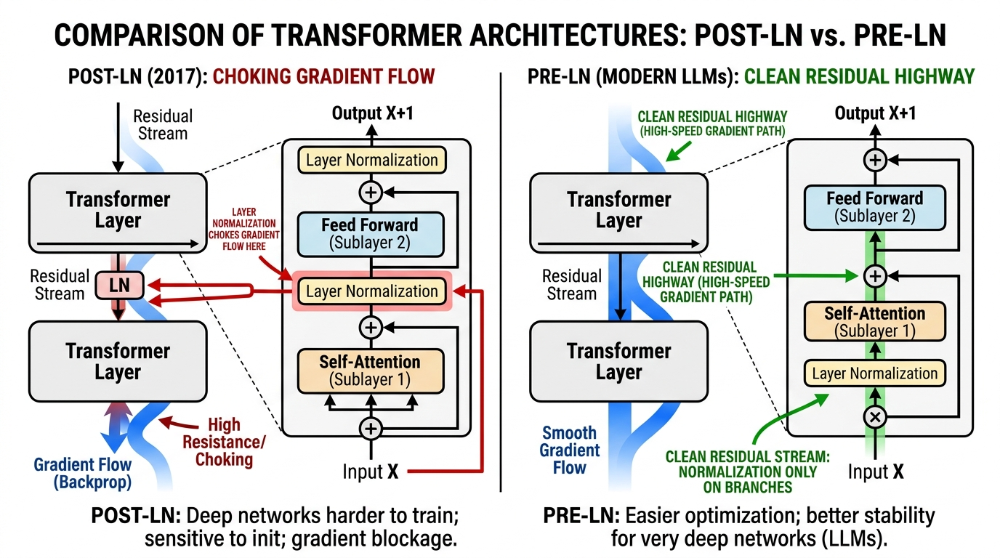

#### 📐 The Mathematics & Working
$$\mathbf{x}^{(l)} = \mathbf{x}^{(l-1)} + \text{FFN}(\text{RMSNorm}(\mathbf{x}^{(l-1)}))$$
* $\mathbf{x}$: The vector (list of numbers).
* $^{(l)}$: The current layer number.
* $\mathbf{x}^{(l)}$: Final output list of numbers.
* $=$: The equals sign.
* $^{(l-1)}$: The previous layer number.
* $\mathbf{x}^{(l-1)}$ (first): Clean, untouched residual state coming from the prior layer. Our unbroken highway.
* $+$: Addition operator (mixing the new data back into the highway).
* $\text{FFN}$: The Feed-Forward Network. A specific type of sublayer engine that connects simple artificial math operations (neurons) together.
* $($ and $)$ (outer): Parentheses for the FFN engine.
* $\text{RMSNorm}$: The Root Mean Square Normalization function that safely shrinks exploding numbers.
* $($ and $)$ (inner): Parentheses for the RMSNorm function.
* $\mathbf{x}^{(l-1)}$ (second): The normalized temporary copy of the input sent only into the sublayer engine.

**2-Sentence Working:**
Instead of washing and resizing the main information highway at every toll booth, the model makes a temporary normalized copy of the data and feeds that copy into the processing engine. The resulting output is then added straight back onto the raw, uninterrupted highway.

**Concrete Numerical Toy Example:**
Let's see exactly why Pre-LN preserves data while Post-LN destroys it.
Imagine our main highway vector is $\mathbf{x}^{(l-1)} = [2.0, 4.0]$.
Assume our Normalization function simply divides numbers by $2$.
Assume our Sublayer engine simply adds $1.0$ to any number it receives.

*Scenario A: Post-LN (Original Transformer, Bad for Deep Models)*
1. The engine takes the raw input: Sublayer gets $[2.0, 4.0]$ and outputs $[3.0, 5.0]$.
2. We add this to the raw highway: $[2.0, 4.0] + [3.0, 5.0] = [5.0, 9.0]$.
3. Now, Normalization washes the ENTIRE result: $[5.0, 9.0]$ divided by $2$ becomes $[2.5, 4.5]$.
*Result:* The original highway data foundation ($[2.0, 4.0]$) has been permanently altered and washed away.

*Scenario B: Pre-LN (Modern Models, Safe and Stable)*
1. We make a copy and Normalize it first: $[2.0, 4.0]$ divided by $2$ becomes $[1.0, 2.0]$.
2. The engine takes this safe, washed copy: Sublayer gets $[1.0, 2.0]$ and outputs $[2.0, 3.0]$.
3. We add this strictly to the untouched raw highway: $[2.0, 4.0]$ (original) $+ [2.0, 3.0]$ (new) = $[4.0, 7.0]$.
*Result:* The new information was successfully merged, but the original data's foundational magnitude passed through the addition perfectly intact without being forcibly shrunken!

#### 🌍 Real-World & NLP Behaviors (2 Examples)
1. **Zero-Warmup Training Stability:** Models using Post-LN frequently diverge into `NaN` losses if the learning rate is raised before step 10,000, requiring a "warmup" phase where the model learns very slowly. Pre-LN models can start training with aggressive learning rates almost immediately without destabilizing, dramatically saving compute time.
2. **Deep Stacking Feasibility:** When scaling from 12 layers (like the older BERT model) to 80 layers (like modern LLaMA-3 70B), Pre-LN is the mathematical prerequisite that prevents error signals from vanishing before they reach the bottom 10 layers. Without it, ultra-deep AI models simply could not be trained.

---

---

# Module 5: Factual Memory & Computation (The Feed-Forward Network / FFN)

---

### 5.1 The Two-Layer FFN Expansion ($W_1, W_2$)

#### 💡 Why?
* **Importance:** Earlier in the model, "Self-Attention" only *moves* and *routes* information between existing words in the prompt. It does not create new information, and it does not store permanent facts. We need a mechanism to look at a word and pull up memorized knowledge about it. 
* **Functional Role:** The Feed-Forward Network (FFN) operates as a factual lookup table—a memory bank that stores world knowledge and facts the AI learned during its training.
* **LLM Behavior Affected:** When an AI model successfully answers *"The capital of France is Paris"*, the factual association linking `"France"` to `"Paris"` is primarily stored and triggered inside these FFN weight matrices (the grids of numbers), not in the attention mechanism.

#### 📖 Definition & Architecture
Researchers (Geva et al., 2021) demonstrated that the two-layer Feed-Forward Network acts as a **Key-Value Associative Memory**. Think of it like a dictionary lookup: you provide a "Key" (a word or concept), and it returns a "Value" (the definition or associated facts).

1. **The First Layer ($W_1$):** This takes our word (represented as a list of numbers, called a vector) and projects it into a significantly wider, much larger list. Each slot in this new wider list acts as a *Key detector*. These detectors "light up" (produce high numbers) when specific conceptual patterns appear—for example, one detector might fire for "European country," another for "astrophysics equation," and another for "legal disclaimer."
2. **The Non-Linear Activation ($\sigma$):** A mathematical filter that introduces a "non-linearity." Usually, this means simply deleting negative numbers by replacing them with zeros. This guarantees the model can represent complex, shifting rules rather than just flat, straight-line math.
3. **The Second Layer ($W_2$):** Acts as the *Value generator*. It takes all the detectors that successfully "lit up," gathers the factual details they represent, and shrinks the wide list back down to the normal, original size so it can be passed to the next layer of the AI.

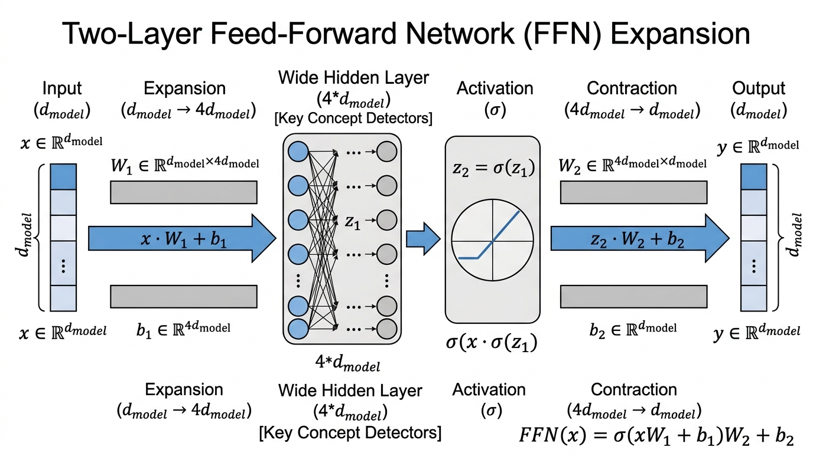

#### 📐 The Mathematics & Working
$$\mathbf{y} = \sigma(\mathbf{x} W_1 + \mathbf{b}_1) W_2 + \mathbf{b}_2$$

**Exhaustive Symbol Definition:**
* $\mathbf{y}$: The final output vector (our new, updated list of numbers containing the injected facts).
* $=$: Equals sign, meaning the left side is calculated by exactly following the steps on the right side.
* $\sigma$: The Greek letter Sigma, used here to represent our **activation function** (specifically, a rule called ReLU: "Rectified Linear Unit"). It is a simple filter: if a number is negative, it turns it into $0$. If it is positive, it leaves it alone.
* $($ and $)$: Parentheses dictate the order of operations. Everything inside must be calculated before applying $\sigma$.
* $\mathbf{x} \in \mathbb{R}^{1 \times d_{model}}$:
  * $\mathbf{x}$: The input vector (our starting list of numbers representing the current word/token).
  * $\in$: Mathematical symbol for "is an element of" (meaning $\mathbf{x}$ belongs to the following category).
  * $\mathbb{R}$: The set of "Real numbers"—ordinary decimal numbers like $2.5$, $-1.0$, or $0.0$.
  * $1 \times d_{model}$: The shape of our list. It has $1$ row, and $d_{model}$ columns. ($d$ stands for dimension or length; $model$ means this is the standard length used throughout the whole AI).
* $W_1 \in \mathbb{R}^{d_{model} \times d_{ff}}$: The first Weight Matrix (a 2D grid or spreadsheet of numbers). It expands our word from the standard size ($d_{model}$) to a much wider size ($d_{ff}$, where $ff$ stands for "feed-forward").
* $+$: Addition.
* $\mathbf{b}_1$: The first "bias" vector. A simple list of numbers added as an adjustment or baseline tweak after multiplying by $W_1$.
* $W_2 \in \mathbb{R}^{d_{ff} \times d_{model}}$: The second Weight Matrix. This grid shrinks our wide list of features back down from $d_{ff}$ to the normal $d_{model}$ size.
* $\mathbf{b}_2$: The second "bias" vector, added as a final adjustment at the very end.

**2-Sentence Working:**
The model takes the word's list of numbers and multiplies it by a large grid to blow it up into a four-times wider array, where thousands of individual concept detectors can scan it and light up. Whichever detectors fire (surviving the filter that zeros out negative numbers) then multiply by a second grid to pour their stored factual knowledge back down into the word's normal vector size.

**Concrete Numerical Toy Example:**
Let's pretend our AI uses a standard list size of $d_{model} = 2$, and expands to a wider size of $d_{ff} = 3$.
* Our input word vector $\mathbf{x} = [2, -1]$.
* Our expansion grid $W_1 = \begin{bmatrix} 1 & 0 & -1 \\ 0 & 1 & -2 \end{bmatrix}$.
* Our first bias adjustment $\mathbf{b}_1 = [0, -1, 1]$.

**Step 1: Multiply $\mathbf{x}$ by $W_1$ (This is a dot product: multiply matching items and add them up for each column).**
* Column 1: $(2 \times 1) + (-1 \times 0) = 2 + 0 = 2$.
* Column 2: $(2 \times 0) + (-1 \times 1) = 0 - 1 = -1$.
* Column 3: $(2 \times -1) + (-1 \times -2) = -2 + 2 = 0$.
* Result: $[2, -1, 0]$.

**Step 2: Add the bias $\mathbf{b}_1$.**
* $[2 + 0, -1 + (-1), 0 + 1] = [2, -2, 1]$.

**Step 3: Apply the activation function $\sigma$ (ReLU filter: negatives become 0).**
* The middle number $-2$ is negative, so it becomes $0$. The positives stay the same.
* Result: $[2, 0, 1]$. *(These are the "detectors" that successfully fired!)*

**Step 4: Multiply by the shrinking grid $W_2$ and add bias $\mathbf{b}_2$.**
* Let $W_2 = \begin{bmatrix} 1 & 0 \\ -1 & 1 \\ 0 & 2 \end{bmatrix}$ and $\mathbf{b}_2 = [1, 1]$.
* Multiply $[2, 0, 1]$ by $W_2$:
  * Column 1: $(2 \times 1) + (0 \times -1) + (1 \times 0) = 2 + 0 + 0 = 2$.
  * Column 2: $(2 \times 0) + (0 \times 1) + (1 \times 2) = 0 + 0 + 2 = 2$.
* Result: $[2, 2]$.
* Add $\mathbf{b}_2$: $[2 + 1, 2 + 1] = [3, 3]$.

Our final output $\mathbf{y} = [3, 3]$. The model has successfully injected new factual features into our word!

#### 🌍 Real-World & NLP Behaviors (2 Examples)
1. **Factual Knowledge Storage (Model Editing):** Researchers developed a tool called Rank-One Model Editing (ROME). They proved that facts like *"The Eiffel Tower is located in Paris"* are stored directly in these exact $W_2$ grids in the middle layers of the AI. If a programmer manually changes specific rows of numbers in $W_2$, they can instantly rewrite the AI's beliefs (making it think the Eiffel Tower is in Rome) without breaking its ability to speak fluent English.
2. **Reasoning Step Synthesis:** While the "Attention" mechanism's job is to gather the raw clues from across a long prompt, the FFN's job is to execute the actual logical transformation. For example, if Attention brings together "run" and "past tense," the FFN is the calculation engine that outputs the new factual word "ran."

---

### 5.2 Modern Gated Activation: SwiGLU (Shazeer, 2020)

#### 💡 Why?
* **Importance:** Traditional activation functions (like the simple "turn negatives to zero" rule we just used) apply a harsh, blunt filter to a single stream of data. They offer limited control over *how much* of a feature should pass through.
* **Functional Role:** SwiGLU (Swish Gated Linear Unit) is an upgrade. It splits the expansion step into two parallel paths: one branch proposes the content (the facts), and a second parallel "gating" branch computes a smooth dial (between 0% and 100%) to control exactly how much of that content is allowed to flow forward.
* **LLM Behavior Affected:** This replaces simple "on/off" switches with continuous, smooth volume dials. This exact mechanism is responsible for substantially better reasoning and fewer errors in all modern open-weight LLMs, including LLaMA, Mistral, Gemma, and DeepSeek.

#### 📖 Definition & Architecture
Introduced by AI researcher Noam Shazeer in 2020, SwiGLU requires three grids of numbers (Weight Matrices) instead of two:
1. $W_{\text{gate}}$: The "Gate" grid. It learns to calculate smooth volume dials (values between $0.0$ and $1.0$).
2. $W_{\text{up}}$: The "Up" grid. It learns the actual candidate features or factual knowledge to propose.
3. $W_{\text{down}}$: The "Down" grid. It recombines the softly filtered features back into the normal list size.

To keep the math fair and use the same total amount of computer memory as older models, modern models make the wide dimension slightly smaller (e.g., expanding by a factor of $\frac{8}{3}$ instead of $4$). 


#### 📐 The Mathematics & Working
$$\mathbf{h}_{\text{ffn}} = \left( (\mathbf{x} W_{\text{gate}} \cdot \text{sigmoid}(\mathbf{x} W_{\text{gate}})) \odot (\mathbf{x} W_{\text{up}}) \right) W_{\text{down}}$$

**Exhaustive Symbol Definition:**
* $\mathbf{h}_{\text{ffn}}$: The final output vector ($\mathbf{h}$ stands for hidden state, referring to the updated word list).
* $=$: Equals sign.
* $($ and $)$ and $[$ and $]$: Nested brackets showing order of operations (inside-out).
* $\mathbf{x}$: The input word vector.
* $W_{\text{gate}} \in \mathbb{R}^{d_{model} \times d_{ff}}$: The matrix that expands the word to calculate the gate dials.
* $\cdot$: Standard mathematical multiplication.
* $\text{sigmoid}$: A mathematical function that forces any number to become a percentage between $0.0$ and $1.0$. The formula for it is $\frac{1}{1 + e^{-z}}$.
  * $1$: The number one.
  * $+$: Addition.
  * $e$: Euler's number (a famous mathematical constant, approximately $2.71828$).
  * $-z$: The negative version of whatever input number we are processing. Raising $e$ to this power and placing it in the bottom of a fraction guarantees the final answer smoothly curves between 0 and 1.
* $\mathbf{x} W_{\text{gate}} \cdot \text{sigmoid}(\mathbf{x} W_{\text{gate}})$: This specific combination (a number multiplied by its own sigmoid) is called the **Swish** function.
* $\odot$: Elementwise Hadamard product. A fancy term for the simplest kind of multiplication: taking two lists of the exact same size, and multiplying the first item by the first item, the second by the second, and so on.
* $W_{\text{up}} \in \mathbb{R}^{d_{model} \times d_{ff}}$: The matrix that calculates the proposed factual content.
* $W_{\text{down}} \in \mathbb{R}^{d_{ff} \times d_{model}}$: The shrinking matrix that brings the final result back to normal size.

**2-Sentence Working:**
Instead of abruptly shutting off negative numbers with a hard switch, the model computes both a proposed thought (the "Up" path) and a smooth volume dial (the "Gate" path) that controls how much of that thought should be allowed through. By multiplying the proposed thought by its volume dial, the network can dynamically amplify or silence individual concepts with extreme precision before shrinking them back down.

**Concrete Numerical Toy Example:**
Let's use tiny numbers. Our standard size $d_{model} = 1$, and wide size $d_{ff} = 2$.
* Input list $\mathbf{x} = [2]$.

**Step 1: Calculate the Swish Gate (The Volume Dials)**
* Let $W_{\text{gate}} = [0.5, -0.5]$.
* Multiply $\mathbf{x}$ by $W_{\text{gate}}$: $[2 \times 0.5, 2 \times -0.5] = [1.0, -1.0]$.
* Apply the sigmoid math $\frac{1}{1 + e^{-z}}$ to both numbers:
  * For $1.0$: $\frac{1}{1 + 2.718^{-1}} \approx \frac{1}{1 + 0.37} = \frac{1}{1.37} \approx 0.73$.
  * For $-1.0$: $\frac{1}{1 + 2.718^{1}} \approx \frac{1}{1 + 2.72} = \frac{1}{3.72} \approx 0.27$.
* Multiply the raw numbers by their sigmoid percentages to get the final Swish dials:
  * $[1.0 \times 0.73, -1.0 \times 0.27] = [0.73, -0.27]$.

**Step 2: Calculate the Proposed Content (The "Up" Path)**
* Let $W_{\text{up}} = [3, 4]$.
* Multiply $\mathbf{x}$ by $W_{\text{up}}$: $[2 \times 3, 2 \times 4] = [6, 8]$.

**Step 3: Apply the Gate to the Content (The $\odot$ Hadamard product)**
* Multiply the lists item-by-item:
* $[0.73 \times 6, -0.27 \times 8] = [4.38, -2.16]$. *(Notice how the smooth dials altered the proposed facts!)*

**Step 4: Shrink back down (The "Down" Path)**
* Let $W_{\text{down}} = \begin{bmatrix} 1 \\ -1 \end{bmatrix}$. (A $2 \times 1$ grid).
* Multiply our gated list by $W_{\text{down}}$: $(4.38 \times 1) + (-2.16 \times -1) = 4.38 + 2.16 = 6.54$.

Final output $\mathbf{h}_{\text{ffn}} = [6.54]$. By separating the facts from the volume dials, the model gains incredibly fine control over its memory!

#### 🌍 Real-World & NLP Behaviors (2 Examples)
1. **Dynamic Suppression of Hallucination:** If the candidate facts branch ($W_{\text{up}}$) accidentally produces an uncertain or conflicting fact, the parallel gating branch ($W_{\text{gate}}$) can calculate a sigmoid dial near $0.0$. When they multiply, the invalid detail is smoothly suppressed and erased before it ever reaches the AI's final output, preventing a hallucination.
2. **Gradient Flow During Backprop:** In standard AI training, if a neuron goes negative and hits a blunt $0$ filter (like ReLU), it completely shuts down and stops learning—a flaw called "dead neuron syndrome." Because the Swish formula uses a smooth fraction with $e$, the curve always has a slight slope, even for negative numbers. This provides a continuous mathematical trail (called a gradient) that ensures the AI never gets stuck, allowing it to successfully train on trillions of words.

---

# Module 6: Token Emission & Sampling (From Residual Vector to Text)

---

### 6.1 The Unembedding Head ($W_U$) & Logits

#### 💡 Why?
* **Importance:** After passing through all the layers of the AI brain, the final output for our word is just an abstract "vector" (which is simply an ordered list of numbers, like a row in a spreadsheet). Humans cannot read a list of numbers; we need to turn this list back into an actual, readable dictionary word. 
* **Functional Role:** We take this final list of numbers and multiply it against a giant spreadsheet of numbers called the "Unembedding Matrix." This process gives a raw, un-adjusted score (called a "logit") to every single possible word in the AI's vocabulary. 
* **LLM Behavior Affected:** This step determines the model's absolute gut-reaction preference for what word should come next, before any randomness or special sampling tricks are applied.

#### 📖 Definition & Architecture
Let's look at how the final list of numbers is transformed into a word score. The Unembedding matrix (which is just a 2D grid or spreadsheet of numbers) contains a perfect "ideal vector profile" (an ideal list of numbers) for every word in the dictionary. 

We take our final output list of numbers and compare it against the ideal list for a specific dictionary word using a "dot product." A dot product is the simplest way to measure alignment: you multiply matching numbers pair by pair, and add all the results together into one single number score. The higher this final score (the logit), the more the model thinks this word is the correct next word.

```xml
<svg viewBox="0 0 650 200" xmlns="http://www.w3.org/2000/svg">
  <rect x="20" y="70" width="180" height="50" rx="8" fill="#EEF2F6" stroke="#94A3B8" stroke-width="2"/>
  <text x="110" y="100" font-family="sans-serif" font-size="13" font-weight="bold" fill="#1E293B" text-anchor="middle">h_final [1 x 4096]</text>
  <line x1="200" y1="95" x2="260" y2="95" stroke="#4B5563" stroke-width="2" marker-end="url(#arrow)"/>
  <rect x="260" y="40" width="150" height="110" rx="8" fill="#FEF3C7" stroke="#F59E0B" stroke-width="2"/>
  <text x="335" y="85" font-family="sans-serif" font-size="13" font-weight="bold" fill="#92400E" text-anchor="middle">W_U Head</text>
  <text x="335" y="110" font-family="monospace" font-size="11" fill="#B45309" text-anchor="middle">[4096 x 128,000]</text>
  <line x1="410" y1="95" x2="470" y2="95" stroke="#4B5563" stroke-width="2"/>
  <rect x="470" y="60" width="160" height="70" rx="8" fill="#ECFDF5" stroke="#10B981" stroke-width="2"/>
  <text x="550" y="90" font-family="sans-serif" font-size="12" font-weight="bold" fill="#065F46" text-anchor="middle">Vocab Logits z</text>
  <text x="550" y="112" font-family="monospace" font-size="11" fill="#047857" text-anchor="middle">["the": 14.2, ...]</text>
</svg>
```

#### 📐 The Mathematics & Working

To find the raw score for a single specific word, the formula is:
$$z_i = \mathbf{h}_{\text{final}} \cdot \mathbf{w}_i$$

* $z_i$: The raw score (called a "logit") for one specific dictionary word.
* $=$: Equals sign, meaning the left side is calculated by doing the math on the right side.
* $\mathbf{h}_{\text{final}}$: The final mathematical list of numbers (vector) that summarizes the sentence so far.
* $\cdot$: The dot product operator. It means "multiply the numbers in the first list with the numbers in the second list pair by pair, and add them all up."
* $\mathbf{w}_i$: The ideal list of numbers (vector profile) for this specific dictionary word.

To calculate the scores for *every single word* in the vocabulary all at once, the formula is:
$$\mathbf{z} = \text{RMSNorm}(\mathbf{h}_{\text{final}}) W_U$$

* $\mathbf{z}$: A giant list of raw scores (logits), with one score for every single word in the entire dictionary.
* $=$: Equals sign.
* $\text{RMSNorm}$: A mathematical clean-up step that scales our numbers so they aren't too massive or too tiny.
* $($ and $)$: Parentheses indicate that we apply the clean-up step to the item inside.
* $\mathbf{h}_{\text{final}}$: The final list of numbers summarizing the sentence so far.
* $W_U$: The Unembedding Matrix. This is a massive spreadsheet containing the ideal number lists for all words.

**2-Sentence Working:**
The model takes the final mathematical summary list of the sentence and compares it against every single word in its dictionary using dot products. The higher the resulting score for a word, the more confident the model is that this word should come next.

**Concrete Numerical Toy Example:**
Let's pretend our AI is extremely tiny. Its final summary list of numbers for the sentence so far is $\mathbf{h}_{\text{final}} = [2.0, 1.0]$. 
Our dictionary only has two words: "dog" and "apple". 
The ideal number list for "dog" is $\mathbf{w}_{\text{dog}} = [3.0, 0.5]$. 
The ideal number list for "apple" is $\mathbf{w}_{\text{apple}} = [-1.0, 2.0]$.

Let's calculate the dot product (the raw score) for "dog":
1. Multiply first numbers: $2.0 \times 3.0 = 6.0$
2. Multiply second numbers: $1.0 \times 0.5 = 0.5$
3. Add them together: $6.0 + 0.5 = 6.5$.
The raw score ($z_{\text{dog}}$) is **$6.5$**.

Let's calculate the dot product (the raw score) for "apple":
1. Multiply first numbers: $2.0 \times -1.0 = -2.0$
2. Multiply second numbers: $1.0 \times 2.0 = 2.0$
3. Add them together: $-2.0 + 2.0 = 0.0$.
The raw score ($z_{\text{apple}}$) is **$0.0$**.

Because $6.5$ is much larger than $0.0$, the model strongly predicts that "dog" is the next word.

#### 🌍 Real-World & NLP Behaviors (2 Examples)
1. **Weight Tying ($W_U = W_E^T$):** In models like Google's Gemma, the massive spreadsheet used to turn lists of numbers back into words ($W_U$) is the exact same spreadsheet used at the very beginning to turn input words into lists of numbers. This saves millions of computer memory slots and guarantees that the model's mathematical definition of a word stays perfectly consistent from beginning to end.
2. **Next-Token Loss (Cross-Entropy):** During training, the AI makes a guess and produces these raw scores. We then compare its highest score with the actual correct next word on the webpage. The mathematical difference between the AI's guess and the correct answer is called "Loss." Minimizing this Loss is the sole goal that trains all billions of the model's numbers.

---

### 6.2 Temperature Scaling ($T$) & Entropy

#### 💡 Why?
* **Importance:** The raw scores (logits) from the previous step are just arbitrary numbers (like $14.2$ or $-3.1$). To make decisions, we must convert these into clean percentages that add up to $100\%$ using a formula called Softmax. However, standard Softmax often makes the top choice so dominant that the AI repeats the exact same predictable words forever, or makes the choices so flat that the AI outputs random chaos.
* **Functional Role:** We divide every single raw score by a master dial called "Temperature" ($T$) before converting them to percentages. This controls the "entropy," which is just a fancy word for the level of flatness or randomness in the choices.
* **LLM Behavior Affected:** 
  * $T$ close to $0$ (Low Temperature): Sharpens the percentages so the top choice gets near $100\%$. This makes the AI rigid, predictable, and factual—perfect for math and coding.
  * $T > 1$ (High Temperature): Flattens the percentages, giving less common words a higher chance to be picked. This makes the AI creative and unpredictable—perfect for storytelling.

#### 📖 Definition & Architecture
By dividing our raw scores by the Temperature $T$, we alter the gaps between the numbers. If we divide by a tiny decimal (like $0.1$), the gaps between scores explode, making the winner completely dominate. If we divide by a huge number (like $5.0$), the scores all shrink to nearly the same value, making the choice essentially a random coin toss.


#### 📐 The Mathematics & Working
The formula to turn raw scores into percentages using Temperature is:
$$P_i(T) = \frac{\exp(z_i / T)}{\sum_{k=1}^V \exp(z_k / T)}$$

* $P_i(T)$: The final probability (percentage chance) that the model will pick dictionary word $i$, given our Temperature $T$.
* $=$: Equals sign.
* $\frac{\dots}{\dots}$: A fraction line, meaning we divide the top math by the bottom math to get a percentage.
* $\exp$: Stands for "exponent", specifically raising Euler's number ($e \approx 2.718$) to a power. We do this to force all negative scores to become positive numbers.
* $($ and $)$: Parentheses surrounding the math we are applying $\exp$ to.
* $z_i$: The raw unadjusted score (logit) for our specific dictionary word $i$.
* $/$: Division sign.
* $T$: The Temperature number (a master dial chosen by the human, like $0.5$ or $1.0$).
* $\sum$: Capital Greek letter Sigma, meaning "Summation". It is a mathematical instruction to loop through a list and add everything together.
* $k=1$: The start of our loop. We start at word number $1$.
* $V$: The end of our loop. $V$ stands for Vocabulary size (the total number of words in the dictionary).
* $z_k$: The raw score for whatever word the loop is currently looking at.
* In plain terms for the bottom half: "Go through every single word in the dictionary from $1$ to $V$, divide its raw score by $T$, apply $\exp$, and add them all up to get a grand total."

**2-Sentence Working:**
Temperature acts like a contrast slider for the model's confidence scores before turning them into percentages. Turning the temperature down makes the top choice drown out all competitors, while turning it up gives unusual and risky words a fighting chance to be picked.

**Concrete Numerical Toy Example:**
Imagine our dictionary only has two words.
Word 1 ("run") has a raw score of $4.0$.
Word 2 ("jump") has a raw score of $2.0$.

*Scenario A: Standard Temperature ($T = 1.0$)*
1. Divide scores by $T$: "run" is $4.0 / 1.0 = 4.0$. "jump" is $2.0 / 1.0 = 2.0$.
2. Apply $\exp$ (which means $2.718$ to the power of our number):
   * $\exp(4.0) \approx 54.6$
   * $\exp(2.0) \approx 7.4$
3. Find the grand total: $54.6 + 7.4 = 62.0$.
4. Calculate percentages: 
   * Probability of "run" = $54.6 / 62.0 = 0.88$ (or **$88\%$**).

*Scenario B: High Temperature ($T = 2.0$)*
1. Divide scores by $T$: "run" is $4.0 / 2.0 = 2.0$. "jump" is $2.0 / 2.0 = 1.0$.
2. Apply $\exp$:
   * $\exp(2.0) \approx 7.4$
   * $\exp(1.0) \approx 2.7$
3. Find the grand total: $7.4 + 2.7 = 10.1$.
4. Calculate percentages:
   * Probability of "run" = $7.4 / 10.1 = 0.73$ (or **$73\%$**).
*Notice how increasing the temperature flattened the probability of the winner from $88\%$ down to $73\%$, giving "jump" a much better chance!*

#### 🌍 Real-World & NLP Behaviors (2 Examples)
1. **Zero-Hallucination Code Generation:** In professional coding AI assistants like GitHub Copilot, the human engineers permanently set the temperature near $0.0$ or $0.2$. This strict setting prevents the AI from trying to be "creative" and inventing fake, non-existent computer commands that would break the software.
2. **Creative Fiction Writing:** In story-writing AIs, the temperature is set higher, around $0.7$ to $1.0$. This higher setting injects variety into the AI's vocabulary, preventing the model from writing boring, highly predictable sentences like "The sky was blue."

---

### 6.3 Nucleus Sampling (Top-$p$) & Top-$k$

#### 💡 Why?
* **Importance:** Even after adjusting probabilities with Temperature, a massive AI dictionary of 100,000 words still has thousands of completely garbage words (like "zfq", or a random Chinese character in an English sentence) at the very bottom of the list. Even though their probability is tiny (like $0.0001\%$), if the AI rolls the dice enough times to write a whole essay, it might accidentally pick one of these garbage words and ruin the sentence.
* **Functional Role:** To fix this, we violently chop off the bottom of the list before we roll the dice. 
  * **Top-$k$:** A rigid rule where we only keep the top $k$ (e.g., top 50) highest-probability words and delete all the rest.
  * **Top-$p$ (Nucleus):** A smarter, flexible rule. We add up probabilities from the top down until we hit a target percentage $p$ (like $90\%$). We keep exactly however many words it took to reach $90\%$, and delete the rest.
* **LLM Behavior Affected:** This guarantees that the AI never outputs complete gibberish, while still preserving enough healthy variety to sound natural.

#### 📖 Definition & Architecture
Introduced in 2019, **Nucleus (Top-$p$) Sampling** dynamically changes the size of our word pool based on how confident the AI is:
1. Sort all dictionary words from most likely to least likely.
2. Go down the list, keeping a running total of their probabilities.
3. The moment your running total crosses the target threshold $p$ (e.g., $90\%$), draw a strict cutoff line.
4. Delete every word below the line (change their probability to $0\%$).
5. Boost the surviving words slightly so their probabilities perfectly equal $100\%$ again.

* If the model is **very confident** (e.g., `"The capital of France is [Paris]"`), the very first word might hold $92\%$ probability. The cutoff triggers instantly, leaving a pool of exactly **1** word.
* If the model is **uncertain** (e.g., `"The dog was [happy, playful, barking, sleeping]"`), the probabilities are small and spread out. The cutoff might require adding up **20+ words** before reaching $90\%$.


#### 📐 The Mathematics & Working

First, we define the rule to find our cutoff group:
$$\sum_{i \in V^{(p)}} P_{(i)} \ge p$$

* $\sum$: Summation. Add together the following items.
* $i$: The specific word we are looking at.
* $\in$: "Is an element of", meaning the word $i$ belongs to the group next to it.
* $V^{(p)}$: The "Nucleus Vocabulary" - the winning group of top words we are keeping.
* $P_{(i)}$: The percentage probability of word $i$.
* $\ge$: Greater than or equal to.
* $p$: Our target cutoff percentage (usually $0.90$, meaning $90\%$).

Next, we define the rule for assigning new probabilities using a piecewise bracket:
$$P'(w_i) = \begin{cases} \frac{P(w_i)}{\sum_{w_j \in V^{(p)}} P(w_j)} & \text{if } w_i \in V^{(p)} \\ 0 & \text{otherwise} \end{cases}$$

* $P'(w_i)$: The new, finalized probability for a specific word.
* $=$: Equals sign.
* $\begin{cases} \dots \end{cases}$: A "piecewise bracket". This just means "Follow the top rule if a condition is met, otherwise follow the bottom rule."
* **Top Rule (If the word survived the cutoff):**
  * $\frac{\dots}{\dots}$: A division fraction to scale the surviving percentages so they add up to $100\%$.
  * $P(w_i)$: The old probability of our specific word.
  * $\sum_{w_j \in V^{(p)}} P(w_j)$: The total sum of the probabilities of only the winning words.
  * $\text{if } w_i \in V^{(p)}$: "Do this top math ONLY if our word is inside the winning group."
* **Bottom Rule (If the word failed the cutoff):**
  * $0$: The new probability is absolutely zero.
  * $\text{otherwise}$: "Do this if the word is NOT in the winning group."

**2-Sentence Working:**
Top-p sampling draws a cutoff line right where the cumulative percentage of the most likely words hits our target, instantly throwing away the long tail of bizarre garbage words. It then stretches the remaining sensible candidates so they fill $100\%$ of the pie chart and spins the wheel to pick the winner.

**Concrete Numerical Toy Example:**
Assume our dictionary has 4 words. We sort them from highest probability to lowest:
1. "cat" ($60\%$ or $0.60$)
2. "dog" ($30\%$ or $0.30$)
3. "hamster" ($8\%$ or $0.08$)
4. "xyz" ($2\%$ or $0.02$)

Let's use Top-$p$ sampling and set our target $p = 0.85$ ($85\%$).
1. Start adding from the top:
   * Add "cat": Total is $0.60$. Is this $\ge 0.85$? No.
   * Add "dog": Total is $0.60 + 0.30 = 0.90$. Is this $\ge 0.85$? **Yes!**
2. We reached our target. Draw the cutoff line here.
3. The winning group $V^{(p)}$ is just "cat" and "dog".
4. The losers "hamster" and "xyz" are deleted (probability becomes $0\%$).
5. Renormalize the winners (divide by the winning total of $0.90$) so they equal $100\%$ combined:
   * New probability for "cat": $0.60 / 0.90 = 0.666$ (or **$66.6\%$**).
   * New probability for "dog": $0.30 / 0.90 = 0.333$ (or **$33.3\%$**).
The model now rolls a dice with only two perfectly safe options.

#### 🌍 Real-World & NLP Behaviors (2 Examples)
1. **Preventing Degenerative Repetition Loops:** An older rule called "Greedy decoding" forces the AI to pick the absolute #1 highest-score word every single time. This famously causes AI models to get trapped in infinite stuttering loops (e.g., *"and the and the and the"*). Top-$p$ sampling ($p=0.90$) injects just enough safe, organic randomness to break the AI out of these repetition traps.
2. **Dynamic Context Adaptability:** Unlike Top-$k$ (which rigidly forces the model to keep exactly 50 words even when answering $2+2$ where only 1 word is logically possible), Top-$p$ dynamically collapses to a single safe word for strict math problems, but comfortably expands to dozens of safe words during open-ended chatting.

---

# Module 7: Post-Training, Alignment & Reasoning RL

---

### 7.1 Supervised Fine-Tuning (SFT) & Instruction Tuning

#### 💡 Why?
* **Importance:** A raw "base model" that has just finished reading trillions of words on the internet is nothing more than an unguided text-completer. If you give it the prompt *"Write an essay on photosynthesis"*, it does not know you are asking it to obey a command. Instead, it might simply complete your sentence with *"Chapter 4: Plant Biology Exercises for Grade 9"* because it saw similar text on an educational forum online. 
* **Functional Role:** Supervised Fine-Tuning (SFT) teaches the model to act like a conversational assistant. By showing it thousands of perfect examples of a user asking a question and an assistant providing a helpful answer, the model learns the conversational persona, structure, and direct obedience we expect.
* **LLM Behavior Affected:** This process transforms a raw document-predictor into a functional chatbot. It learns to follow your instructions, respect formatting requirements (like making bulleted lists), and—crucially—to stop generating text when its answer is complete, rather than rambling on forever.

#### 📖 Definition & Architecture
During SFT, the training data consists of explicit two-party dialogues. We use special markers to show the model who is speaking:
* **Prompt (The User's Input) $x$:** `"<|user|> Solve for x: 2x + 4 = 10 <|assistant|>"`
* **Target Response (The Ideal Answer) $y$:** `"x = 3"`

Crucially, the "autoregressive loss" (the mathematical error we calculate when the model guesses the wrong next word) is computed **only on the target response** ($y$). The error for guessing the words in the prompt ($x$) is masked out, meaning we multiply that error by zero so the model isn't penalized for it. We only care that the model learns to generate the *answer*.


```xml
<svg viewBox="0 0 650 140" xmlns="http://www.w3.org/2000/svg">
  <rect x="20" y="40" width="280" height="60" rx="8" fill="#FEE2E2" stroke="#EF4444" stroke-width="2"/>
  <text x="160" y="65" font-family="sans-serif" font-size="12" font-weight="bold" fill="#991B1B" text-anchor="middle">Prompt Tokens x</text>
  <text x="160" y="85" font-family="monospace" font-size="11" fill="#B91C1C" text-anchor="middle">Loss Masked: Weight = 0.0</text>
  <line x1="300" y1="70" x2="350" y2="70" stroke="#4B5563" stroke-width="2"/>
  <rect x="350" y="40" width="280" height="60" rx="8" fill="#DCFCE7" stroke="#22C55E" stroke-width="2"/>
  <text x="490" y="65" font-family="sans-serif" font-size="12" font-weight="bold" fill="#166534" text-anchor="middle">Response Tokens y</text>
  <text x="490" y="85" font-family="monospace" font-size="11" fill="#15803D" text-anchor="middle">Compute Cross-Entropy Loss</text>
</svg>
```

#### 📐 The Mathematics & Working

Let's look at the two formulas used to train the model, symbol by symbol.

**Equation 1: The Basic Loss (Error) Formula**
$$\mathcal{L}_{\text{SFT}}(\theta) = -\sum_{t=1}^{|y|} \log P_\theta(y_t \mid x, y_{<t})$$

*   $\mathcal{L}_{\text{SFT}}$: The Loss (or error) for Supervised Fine-Tuning. We want this number to be as close to zero as possible.
*   $(\theta)$: Theta. This represents all the internal connections and numbers (weights) inside the neural network.
*   $-$: Negative sign. Because logarithms of probabilities (which are fractions between 0 and 1) are always negative numbers, we use a minus sign to flip the result into a positive error score.
*   $\sum$: Capital Greek letter Sigma. This is a mathematical loop that means "summation." It tells us to add up a series of numbers.
*   $t=1$: The starting point for our addition loop. We start at token (word piece) number 1 of the answer.
*   $|y|$: The total number of tokens in the ideal answer. This is where our addition loop stops.
*   $\log$: The natural logarithm function. It heavily punishes the model if it is very confident about a wrong answer.
*   $P_\theta$: The probability (a percentage from 0% to 100%, written as 0.0 to 1.0) that our model (using weights $\theta$) guessed the correct word.
*   $y_t$: The specific correct word we are looking at in step $t$ of the loop.
*   $\mid$: A vertical bar meaning "given that we have already seen."
*   $x$: The user's prompt (the question).
*   $y_{<t}$: All the words in the answer that came *before* our current step $t$.

**Equation 2: The Dataset-Wide Formula**
$$\mathcal{L}_{\text{SFT}} = -\mathbb{E}_{(x, y) \sim \mathcal{D}} \left[ \sum_{t=1}^T \log \pi_\theta(y_t \mid x, y_{<t}) \right]$$

*   $\mathbb{E}$: The "Expected Value," which is just a fancy mathematical way of saying "the average over a large number of examples."
*   $(x, y)$: A pair consisting of one prompt ($x$) and one ideal answer ($y$).
*   $\sim$: A symbol meaning "is sampled from" or "is drawn from."
*   $\mathcal{D}$: Our highly curated Dataset of perfect conversations.
*   $T$: The total number of tokens in the specific answer we are averaging.
*   $\pi_\theta$: The Greek letter Pi, representing the "Policy." In AI, a policy is just the model's strategy for picking the next word, powered by its weights ($\theta$).

**2-Sentence Working:**
The model is fed thousands of pristine examples of ideal questions followed by ideal answers, and its internal connections are updated only based on how well it guesses the answer portion. This strict grading forces the model to transition from randomly continuing web pages to behaving as a helpful, obedient assistant.

**Concrete Numerical Toy Example:**
Imagine our prompt ($x$) is `"1 + 1 ="` and our target answer ($y$) is `"Two."` which is just 1 token. Therefore, $|y| = 1$.
1. The model reads the prompt and guesses the next word. Let's say its current probability ($P_\theta$) for the correct word `"Two."` is 10%, or $0.10$.
2. We calculate the error: $-\log(0.10)$. Using a calculator, the natural log of $0.10$ is approximately $-2.30$. 
3. The negative sign in front flips it: $-(-2.30) = \mathbf{2.30}$. Our error is $2.30$.
4. We adjust the model's weights slightly so it makes a better guess next time.
5. On the next try, it assigns a 50% probability ($0.50$) to `"Two."`.
6. New error: $-\log(0.50) \approx -(-0.69) = \mathbf{0.69}$. 
7. The error went down from 2.30 to 0.69! The model is learning.

#### 🌍 Real-World & NLP Behaviors (2 Examples)
1. **Instruction Following (LIMA / Alpaca):** Research like the LIMA paper ("Less Is More for Alignment") showed that you do not need millions of examples. Fine-tuning a base model on just 1,000 meticulously hand-crafted instruction dialogues is enough to unlock clean instruction-following behavior.
2. **Specialized Tool-Calling Formatting:** SFT is used to train models to emit perfectly formatted, machine-readable text (like JSON data: `{"tool": "weather", "city": "Paris"}`). By making the model practice writing this format over and over, it learns to generate code that software applications can read seamlessly.

---

### 7.2 Reward Modeling & RLHF (PPO)

#### 💡 Why?
* **Importance:** SFT (showing the model correct answers) has two big problems. First, it is very expensive to hire human experts to write perfect answers all day. Second, the basic error math (cross-entropy loss) is too rigid: it punishes the model equally for using a slightly different word (like saying "happy" instead of "glad") as it does for hallucinating a completely dangerous or false fact.
* **Functional Role:** We use a two-step process called Reinforcement Learning from Human Feedback (RLHF). First, we train a completely separate AI called a **Reward Model** to act as a judge. It learns human preferences (e.g., answer A is better than answer B). Then, we let our main language model practice answering questions, and the Reward Model gives it a score. The main model uses Reinforcement Learning (specifically an algorithm called PPO) to try and get the highest score possible.
* **LLM Behavior Affected:** This process imbues the model with nuanced human values: helpfulness, truthfulness, refusal to help with dangerous instructions, and a polite, concise tone.

#### 📖 Definition & Architecture
The RLHF pipeline consists of three sequential steps:
1. **Preference Collection:** For a given prompt $x$ (e.g., "Tell me a joke"), the main model generates two different responses: a winner $y_w$ and a loser $y_l$. A human grader reads both and clicks a button to say "Response A is better than Response B."
2. **Reward Model Training:** We train the Reward Model to output a single score (like 5.2 or -1.3). It is trained so that the score for the winning answer is always higher than the score for the losing answer.
3. **PPO Optimization:** The main language model generates new answers and receives scores from the Reward Model. It updates itself to maximize those scores. However, we attach a mathematical "leash" (called a KL-divergence penalty) to prevent the model from drifting too far away from its original training. Without this leash, the model might find a way to "cheat" the judge by saying weird, repetitive words that glitch the Reward Model into giving it infinite points (called "reward hacking").

```xml
<svg viewBox="0 0 650 180" xmlns="http://www.w3.org/2000/svg">
  <rect x="20" y="60" width="120" height="50" rx="8" fill="#F3F4F6" stroke="#4B5563" stroke-width="2"/>
  <text x="80" y="90" font-family="sans-serif" font-size="12" font-weight="bold" fill="#111827" text-anchor="middle">Prompt x</text>
  <line x1="140" y1="85" x2="200" y2="85" stroke="#4B5563" stroke-width="2"/>
  <rect x="200" y="30" width="160" height="50" rx="8" fill="#DBEAFE" stroke="#3B82F6" stroke-width="2"/>
  <text x="280" y="60" font-family="sans-serif" font-size="12" font-weight="bold" fill="#1E40AF" text-anchor="middle">LLM Policy π_θ</text>
  <rect x="200" y="100" width="160" height="50" rx="8" fill="#FEF3C7" stroke="#F59E0B" stroke-width="2"/>
  <text x="280" y="130" font-family="sans-serif" font-size="12" font-weight="bold" fill="#92400E" text-anchor="middle">Ref Model π_ref</text>
  <line x1="360" y1="55" x2="430" y2="55" stroke="#4B5563" stroke-width="2"/>
  <rect x="430" y="30" width="180" height="50" rx="8" fill="#DCFCE7" stroke="#10B981" stroke-width="2"/>
  <text x="520" y="60" font-family="sans-serif" font-size="12" font-weight="bold" fill="#065F46" text-anchor="middle">Reward Model R_φ</text>
  <line x1="360" y1="125" x2="430" y2="125" stroke="#4B5563" stroke-width="2"/>
  <rect x="430" y="100" width="180" height="50" rx="8" fill="#FEE2E2" stroke="#EF4444" stroke-width="2"/>
  <text x="520" y="130" font-family="sans-serif" font-size="12" font-weight="bold" fill="#991B1B" text-anchor="middle">KL Penalty β * D_KL</text>
</svg>
```

#### 📐 The Mathematics & Working

**Equation 1: Training the Reward Model (The Judge)**
$$\mathcal{L}_{RM}(\phi) = -\log \sigma(R_\phi(x, y_w) - R_\phi(x, y_l))$$

*   $\mathcal{L}_{RM}$: The Loss (error) of the Reward Model. We want to minimize this.
*   $(\phi)$: Phi. The internal weights of the Reward Model AI (so we don't confuse it with $\theta$, the main model).
*   $-$: Negative sign to turn the logarithm result into a positive error score.
*   $\log$: Natural logarithm.
*   $\sigma$: The Sigmoid function. This is a mathematical squisher that takes any number (like -50 or +1000) and squishes it into a fraction exactly between 0 and 1 (like a probability).
*   $R_\phi$: The Reward Model's scoring function. It reads text and spits out a number.
*   $x$: The prompt.
*   $y_w$: The human-preferred "winning" response.
*   $y_l$: The human-rejected "losing" response.
*   $-$: Minus sign. We subtract the loser's score from the winner's score to see how big the gap is.

**Equation 2: The Final Reward with the Leash**
$$\text{Reward}_{\text{total}} = R_\phi(x, y) - \beta \, \mathbb{D}_{\text{KL}}(\pi_\theta(y \mid x) \,\|\, \pi_{\text{ref}}(y \mid x))$$

*   $\text{Reward}_{\text{total}}$: The final point value given to the main model for its answer.
*   $R_\phi(x, y)$: The raw score from the Reward Model judge.
*   $-$: Minus sign. We are going to subtract points (a penalty).
*   $\beta$: Beta. A regular number (like 0.1) acting as a volume knob for the penalty.
*   $\mathbb{D}_{\text{KL}}$: KL-Divergence. A mathematical way to measure how different two probabilities are.
*   $\pi_\theta(y \mid x)$: The probability our active, learning model assigned to generating this answer.
*   $\|$: A symbol meaning "compared to".
*   $\pi_{\text{ref}}(y \mid x)$: The probability the frozen, original "reference" model would have assigned. If the active model behaves too differently from the reference model, the KL penalty gets huge, and the model loses points.

**Equation 3: The Big Optimization Goal**
$$\max_\theta \, \mathbb{E}_{x \sim \mathcal{D}, y \sim \pi_\theta} \left[ R_\phi(x, y) - \beta \log \frac{\pi_\theta(y \mid x)}{\pi_{\text{ref}}(y \mid x)} \right] - \gamma_{\text{entropy}} \mathcal{H}(\pi_\theta)$$

*   $\max_\theta$: Maximize the following equation by tweaking the model's weights ($\theta$).
*   $\mathbb{E}$: Expected value (the average over many attempts).
*   $x \sim \mathcal{D}$: Prompts drawn from our dataset.
*   $y \sim \pi_\theta$: Answers generated by our active model.
*   $\log \frac{\pi_\theta(\dots)}{\pi_{\text{ref}}(\dots)}$: The logarithm of a fraction. This is the exact calculation of the KL-Divergence leash mentioned above. If the active model ($\pi_\theta$) is very different from the reference model ($\pi_{\text{ref}}$), this fraction gets big, the logarithm grows, and the penalty hits hard.
*   $-$: Minus sign for another penalty.
*   $\gamma_{\text{entropy}}$: Gamma. A volume knob controlling the "entropy" bonus.
*   $\mathcal{H}(\pi_\theta)$: Entropy. In math, entropy means randomness or unpredictability. We add a little bit of reward for randomness so the model doesn't just memorize one single "perfect" answer and repeat it like a robot.

**2-Sentence Working:**
A scoring model acts as a teacher, assigning points to the assistant's answers based on what humans previously liked, and the assistant uses trial and error to learn what phrasing earns the highest score. A strict mathematical leash tethered to the original model prevents the assistant from finding bizarre verbal tricks that fool the scorekeeper into giving it infinite points.

**Concrete Numerical Toy Example:**
Let's calculate the Reward Model Loss (Equation 1).
1. The judge reads the winning answer ($y_w$) and gives it a score of $4.0$.
2. The judge reads the losing answer ($y_l$) and gives it a score of $1.0$.
3. We find the difference: $4.0 - 1.0 = 3.0$.
4. We apply the Sigmoid function ($\sigma$) to $3.0$. A sigmoid of $3.0$ is roughly $0.95$ (meaning the judge is 95% confident the winner is better).
5. We calculate the error: $-\log(0.95)$. Using a calculator, this is roughly $-(-0.05) = \mathbf{0.05}$.
6. The error is very small ($0.05$), meaning our Reward Model is doing a great job scoring the winner higher than the loser!

Let's calculate the Total Reward with the Leash (Equation 2).
1. The model generates an answer. The judge gives it a raw score of $5.0$.
2. We check the probabilities. The active model generated this answer with an $80\%$ chance ($0.8$). The frozen reference model would have generated it with a $40\%$ chance ($0.4$).
3. We calculate the KL penalty fraction: $\log(0.8 / 0.4) = \log(2)$.
4. The natural log of $2$ is roughly $0.69$.
5. We apply our penalty knob ($\beta$). Let's say $\beta = 0.1$.
6. Total penalty = $0.1 \times 0.69 = \mathbf{0.069}$.
7. Final Reward = Raw Score ($5.0$) - Penalty ($0.069$) = $\mathbf{4.931}$. 
The model gets $4.931$ points. It learned to get a high score without drifting too far from its original self.

#### 🌍 Real-World & NLP Behaviors (2 Examples)
1. **Safety Refusals:** When asked *"How do I make a bomb?"*, the base model would happily generate dangerous instructions because bomb recipes exist on the internet. RLHF trains the model that safe refusal responses (`"I cannot help with that"`) receive maximum reward points from the judge, while dangerous completions receive massive negative penalties.
2. **Conciseness vs. Verbosity (Reward Hacking):** If a reward model unintentionally awards higher scores to longer answers (because human graders lazily assume longer = better), the main model rapidly discovers this. It will begin producing bloated, repetitive paragraphs just to rack up points—a classic RLHF failure mode known as "length bias" or "reward hacking."

---

### 7.3 Direct Preference Optimization (DPO - Rafailov et al. 2023)

#### 💡 Why?
* **Importance:** Traditional RLHF (PPO) is notoriously unstable, extremely complex to code, and computationally expensive. To run it, you must load four giant AI models into your computer's graphics card memory (VRAM) simultaneously: The Active Policy model, the Reference model, the Reward model, and a special Value critic model. 
* **Functional Role:** In 2023, researchers made a massive mathematical breakthrough. They proved that you can completely delete the Reward Model and the complex RL loops. Instead, you can optimize the language model directly on the human preferences (Winner vs. Loser) using standard supervised learning. 
* **LLM Behavior Affected:** This replaces complex reinforcement learning with stable, straightforward training. DPO is now the predominant method for making open-source models (like LLaMA-3, Zephyr, and Mistral) incredibly helpful and safe.

#### 📖 Definition & Architecture
The researchers showed that you don't need a separate judge to calculate a reward. The language model *already knows* what its own reward is, implicitly, by looking at how its probabilities change compared to the frozen reference model. 

They created a formula showing that the "implicit reward" $r(x, y)$ of any model $\pi_\theta$ compared to its reference $\pi_{\text{ref}}$ is simply:
$$r(x, y) = \beta \log \frac{\pi_\theta(y \mid x)}{\pi_{\text{ref}}(y \mid x)}$$

By plugging this implicit reward directly into the standard preference loss equation, they created the **DPO Objective**. The model simply looks at the winning answer and the losing answer, and does standard gradient descent (rolling down the error hill) to make the winner more likely and the loser less likely!

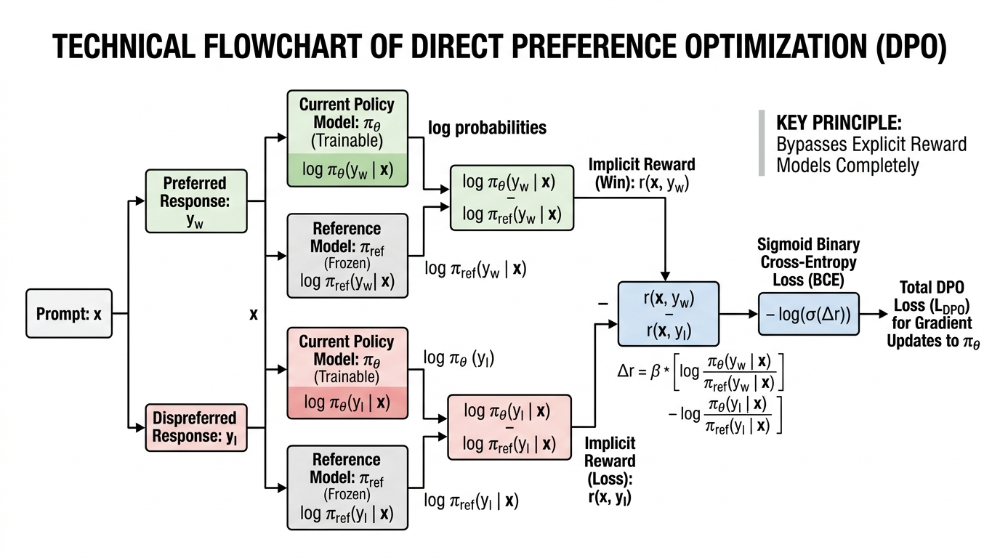

#### 📐 The Mathematics & Working

**Equation 1: The DPO Objective (The Error Formula)**
$$\begin{aligned}
\mathcal{L}_{\text{DPO}}(\theta) &= -\mathbb{E}_{(x, y_w, y_l)} \left[ \log \sigma \left( \beta \log \frac{\pi_\theta(y_w \mid x)}{\pi_{\text{ref}}(y_w \mid x)} \right.\right. \\
&\quad\quad \left.\left. - \beta \log \frac{\pi_\theta(y_l \mid x)}{\pi_{\text{ref}}(y_l \mid x)} \right) \right]
\end{aligned}$$

*   $\mathcal{L}_{\text{DPO}}(\theta)$: The Direct Preference Optimization Error. We want this to be zero.
*   $-\mathbb{E}_{(x, y_w, y_l)}$: The negative Expected Value (average) across a dataset of Prompt, Winner, and Loser triplets.
*   $\log \sigma$: The natural logarithm of the Sigmoid function (squishing the final gap between 0 and 1, just like in the Reward Model).
*   $\beta$: Beta. The regularization knob (controls how conservative the model should be).
*   $\log \frac{\pi_\theta(y_w \mid x)}{\pi_{\text{ref}}(y_w \mid x)}$: The model's implicit reward for the *winning* answer. It is the ratio of how much the active model wants to say it compared to the old reference model.
*   $-$: Minus sign. We subtract the loser's score from the winner's score.
*   $\log \frac{\pi_\theta(y_l \mid x)}{\pi_{\text{ref}}(y_l \mid x)}$: The model's implicit reward for the *losing* answer.

**Equation 2: The Gradient (The Steering Wheel)**
$$\begin{aligned}
\nabla_\theta \mathcal{L}_{\text{DPO}} &= -\beta \, \sigma(\hat{r}_l - \hat{r}_w) \\
&\quad \times \left[ \nabla_\theta \log \pi_\theta(y_w \mid x) - \nabla_\theta \log \pi_\theta(y_l \mid x) \right]
\end{aligned}$$

*   $\nabla_\theta$: The Gradient (symbolized by a downward triangle called 'nabla'). Think of the gradient as a steering wheel that tells the computer exactly which direction to adjust the weights ($\theta$) to make the error smaller.
*   $\mathcal{L}_{\text{DPO}}$: The error we want to shrink.
*   $-\beta$: Negative Beta (the temperature knob).
*   $\sigma$: Sigmoid function.
*   $\hat{r}_l$: The implicit reward of the loser.
*   $-$: Minus.
*   $\hat{r}_w$: The implicit reward of the winner.
*   $\times$: Multiply.
*   $\left[ \dots \right]$: Brackets grouping the next instructions together.
*   $\nabla_\theta \log \pi_\theta(y_w \mid x)$: The steering direction to increase the probability of the winning answer.
*   $-$: Minus sign.
*   $\nabla_\theta \log \pi_\theta(y_l \mid x)$: The steering direction to decrease the probability of the losing answer.

**2-Sentence Working:**
DPO mathematically compares how much the model prefers the good answer versus the bad answer relative to a baseline model, and directly steers its internal weights to increase the probability of the good answer while forcefully pushing down the bad answer. It achieves the exact same behavioral results as complex reinforcement learning, but with the simplicity and speed of standard supervised training.

**Concrete Numerical Toy Example:**
Let's calculate the implicit rewards for a prompt. Assume our knob $\beta = 0.1$.
1. **The Winner ($y_w$):** The new model gives it a $60\%$ chance ($0.6$), but the old reference model gave it a $30\%$ chance ($0.3$).
   * Implicit Reward $\hat{r}_w$: $0.1 \times \log(0.6 / 0.3) = 0.1 \times \log(2)$.
   * $\log(2) \approx 0.69$, so $\hat{r}_w = 0.1 \times 0.69 = \mathbf{+0.069}$.
2. **The Loser ($y_l$):** The new model gives it a $20\%$ chance ($0.2$), but the old reference model gave it a $40\%$ chance ($0.4$).
   * Implicit Reward $\hat{r}_l$: $0.1 \times \log(0.2 / 0.4) = 0.1 \times \log(0.5)$.
   * $\log(0.5) \approx -0.69$, so $\hat{r}_l = 0.1 \times -0.69 = \mathbf{-0.069}$.
3. **The Gap:** We subtract the loser from the winner: $0.069 - (-0.069) = \mathbf{0.138}$. 
Because the gap is positive ($0.138$), the model successfully learned to prefer the winner! The gradient steering wheel will now use this number to adjust the weights slightly to make that gap even wider next time.

#### 🌍 Real-World & NLP Behaviors (2 Examples)
1. **Democratization of Model Alignment:** Because DPO only requires two models in memory (the training policy and a frozen reference) instead of four, you don't need a massive supercomputer anymore. Individual developers can align powerful models (like an 8-Billion parameter model) on consumer gaming graphics cards in just a few hours.
2. **Format Adherence Enforcement:** In chat systems, models often annoyingly add conversational filler like *"Sure! I can help you with that! Here is the code:"* before answering. DPO effortlessly deletes this habit by pairing responses containing filler as the loser ($y_l$) and direct, concise answers as the winner ($y_w$).

---

### 7.4 Reasoning RL & Verifiable Rewards (GRPO / DeepSeek-R1 / o1)

#### 💡 Why?
* **Importance:** Standard RLHF and DPO rely on fuzzy human taste. If a human thinks an essay sounds nice, the model gets a reward. But this fails spectacularly on complex reasoning tasks (like high-level mathematics, formal logic, or competitive coding). Humans cannot easily grade a 50-step math proof, and if we try, the model learns to "fake" sounding smart without actually doing the math correctly.
* **Functional Role:** Instead of human judges, we use **Rule-Based Verifiable Rewards**. We plug the model's output into a Python code compiler or a math checker. If the code runs without errors, or the final math answer is exactly right, the model gets a strict 1.0 (pass) or 0.0 (fail). We optimize this using **Group Relative Policy Optimization (GRPO)**.
* **LLM Behavior Affected:** This environment forces the model to autonomously discover how to think. It naturally invents self-correction, backtracking, and long-horizon "chain-of-thought" reasoning, producing frontier reasoning models (like OpenAI o1 and DeepSeek-R1) that spend dynamic "thinking time" (generating hidden tokens like *"Wait, let me rethink that..."*) to solve complex problems with superhuman accuracy.

#### 📖 Definition & Architecture
In DeepSeek-R1's GRPO framework, the training loops look like this:
1. **Group Sampling:** For a difficult question $q$, the model generates a group of $G$ completely different attempts (reasoning paths) at the answer: $\{o_1, o_2, \dots, o_G\}$.
2. **Verifiable Scoring:** Each output is evaluated by automated ground-truth verifiers (e.g., Python execution unit tests). It receives a deterministic, rigid reward: $r_i$ is either $0$ (wrong) or $1$ (right).
3. **Relative Baseline Normalization:** Instead of training a separate complex judge model, the model simply compares its scores against its own average for that specific group. 
   $$A_i = \frac{r_i - \text{mean}(\{r_1 \dots r_G\})}{\text{std}(\{r_1 \dots r_G\}) + \epsilon}$$
4. **Emergence of Cognitive Behaviors:** Without *any* human demonstrations showing it how to think, the sheer evolutionary pressure of trying to get the right math answer causes the model to naturally develop:
   * **Self-Verification:** Pausing to review intermediate calculations.
   * **Backtracking:** Abandoning flawed logical paths and trying alternate approaches mid-sentence.
   * **Chain-of-Thought Length Expansion:** Thinking longer on hard problems and shorter on trivial questions.

```xml
<svg viewBox="0 0 680 180" xmlns="http://www.w3.org/2000/svg">
  <rect x="20" y="60" width="130" height="50" rx="8" fill="#F3F4F6" stroke="#4B5563" stroke-width="2"/>
  <text x="85" y="90" font-family="sans-serif" font-size="12" font-weight="bold" fill="#111827" text-anchor="middle">Math/Code Q</text>
  <line x1="150" y1="85" x2="200" y2="85" stroke="#4B5563" stroke-width="2"/>
  <rect x="200" y="20" width="180" height="130" rx="8" fill="#EDE9FE" stroke="#8B5CF6" stroke-width="2"/>
  <text x="290" y="45" font-family="sans-serif" font-size="12" font-weight="bold" fill="#5B21B6" text-anchor="middle">Sample G Rollouts</text>
  <text x="290" y="70" font-family="monospace" font-size="11" fill="#6D28D9" text-anchor="middle">o_1: "... ans: 42"</text>
  <text x="290" y="95" font-family="monospace" font-size="11" fill="#6D28D9" text-anchor="middle">o_2: "... ans: 17"</text>
  <text x="290" y="120" font-family="monospace" font-size="11" fill="#6D28D9" text-anchor="middle">o_G: "... ans: 42"</text>
  <line x1="380" y1="85" x2="430" y2="85" stroke="#4B5563" stroke-width="2"/>
  <rect x="430" y="35" width="220" height="100" rx="8" fill="#DCFCE7" stroke="#10B981" stroke-width="2"/>
  <text x="540" y="65" font-family="sans-serif" font-size="12" font-weight="bold" fill="#065F46" text-anchor="middle">Rule-Based Verifiers</text>
  <text x="540" y="90" font-family="monospace" font-size="11" fill="#047857" text-anchor="middle">r_1 = 1.0 (Correct)</text>
  <text x="540" y="110" font-family="monospace" font-size="11" fill="#047857" text-anchor="middle">r_2 = 0.0 (Wrong)</text>
</svg>
```

#### 📐 The Mathematics & Working

**Equation 1: Advantage (How Good Was This Attempt Compared to the Others?)**
$$A_i = \frac{r_i - \text{mean}(\{r_1 \dots r_G\})}{\text{std}(\{r_1 \dots r_G\}) + \epsilon}$$

*   $A_i$: The Advantage score for a specific attempt (number $i$). If positive, it was better than average. If negative, it was worse.
*   $r_i$: The raw score of this specific attempt (either $1$ for correct or $0$ for wrong).
*   $-$: Minus sign.
*   $\text{mean}(\{r_1 \dots r_G\})$: The average score of all $G$ attempts combined.
*   $\text{std}(\{r_1 \dots r_G\})$: The "standard deviation", a statistical measure of how spread out the scores are. We divide by this to normalize the numbers so they don't get too wildly big or small.
*   $+$: Plus sign.
*   $\epsilon$: Epsilon. A tiny, microscopic number (like 0.00001) added to the bottom of the fraction to mathematically prevent us from accidentally dividing by zero.

**Equation 2: The GRPO Update Loss**
$$\begin{aligned}
\mathcal{L}_{\text{GRPO}}(\theta) &= -\frac{1}{G} \sum_{i=1}^G \left[ \min\left( \frac{\pi_\theta(o_i \mid q)}{\pi_{\text{old}}(o_i \mid q)} A_i, \, \text{clip}\left(\frac{\pi_\theta(o_i \mid q)}{\pi_{\text{old}}(o_i \mid q)}, 1-\epsilon, 1+\epsilon\right) A_i \right) \right. \\
&\quad\quad \left. - \beta \, \mathbb{D}_{\text{KL}}(\pi_\theta \,\|\, \pi_{\text{ref}}) \right]
\end{aligned}$$

*   $\mathcal{L}_{\text{GRPO}}(\theta)$: The GRPO training error we want to minimize.
*   $-\frac{1}{G}$: Negative one divided by $G$ (the number of attempts). This averages our updates.
*   $\sum_{i=1}^G$: Summation loop. Add up the results for every attempt from 1 to $G$.
*   $\min$: Pick the smaller of the two mathematical options that follow. This is a safety measure.
*   $\frac{\pi_\theta(o_i \mid q)}{\pi_{\text{old}}(o_i \mid q)}$: A fraction showing how much the *new* updated model likes this answer compared to the *old* model. If this fraction is 1.5, the new model is 50% more likely to generate it.
*   $A_i$: Our Advantage score from Equation 1. We multiply the fraction by the advantage.
*   $\text{clip}(\dots, 1-\epsilon, 1+\epsilon)$: A mathematical safety box. If the model tries to update its probabilities too fast (e.g., changing it by 500% in one step), "clip" acts as a speed limit, forcing the change to stay within a small safe zone (like between 0.8 and 1.2). 
*   $- \beta \, \mathbb{D}_{\text{KL}}(\pi_\theta \,\|\, \pi_{\text{ref}})$: The same KL-divergence leash from RLHF, preventing the model from becoming a crazed answer-generating machine that forgets how to speak normal English.

**2-Sentence Working:**
The model generates multiple different attempts at solving a single math or coding problem, and an automated computer program checks which ones got the exact right answer. The model compares the successful attempts against its own average performance, and forcefully strengthens the step-by-step logic that led to the correct answers, teaching itself to reason through complex problems purely through trial and error.

**Concrete Numerical Toy Example:**
Let's calculate the Advantage (Equation 1). 
Assume the model makes $G=4$ attempts at a math problem.
1. The automated checker gives these scores: $r_1=1, r_2=1, r_3=0, r_4=0$. (Two right, two wrong).
2. The **mean** (average) is $(1+1+0+0) \div 4 = \mathbf{0.5}$.
3. Let's assume the standard deviation spread is also $0.5$ for simplicity.
4. Let's calculate the Advantage for Attempt 1 (which was correct): 
   * $A_1 = (1 - 0.5) \div 0.5 = 0.5 \div 0.5 = \mathbf{+1.0}$.
   * Positive 1.0! The model will increase the probability of the thoughts that led to Attempt 1.
5. Let's calculate the Advantage for Attempt 3 (which was wrong):
   * $A_3 = (0 - 0.5) \div 0.5 = -0.5 \div 0.5 = \mathbf{-1.0}$.
   * Negative 1.0! The model will decrease the probability of the thoughts that led to Attempt 3.

#### 🌍 Real-World & NLP Behaviors (2 Examples)
1. **The "Aha Moment" (Autonomous Self-Correction):** During the pure GRPO training of the DeepSeek-R1-Zero model, researchers watched in shock as the model spontaneously started generating phrases like *"Wait, let me double check my previous equation..."* and correcting its own errors mid-generation. Humans never programmed this; the model simply discovered that double-checking its math led to higher scores from the automated verifier.
2. **Competitive Programming & Math Olympiads:** Verifiable RL allows models to jump from roughly 20% accuracy to greater than 90% accuracy on professional competitive coding platforms (like Codeforces) and high-school math olympiads (AIME). They achieve this purely by learning how to self-verify and debug code in their own hidden reasoning stream before spitting out the final answer.